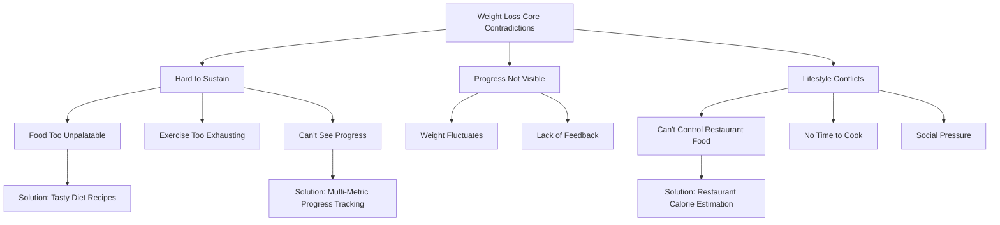

# Example: Weight Loss Domain Painpoint Analysis Report

## Research Sources
- Search keywords: `weight loss problems`, `diet frustration`, `can't lose weight`, `weight loss complaints`, `diet too hard`
- Data sources: Reddit r/loseit, Quora, Twitter, fitness forums, health blogs
- Research date: 2026-03-04

---

## Painpoint 1: Calorie Control When Eating Out/Takeout

### Scenario Description
Office workers order takeout or eat out on workdays, want to control calories but:
- Restaurants don't display nutritional information
- Same dish varies wildly between restaurants
- Too tedious to look up "how many calories in kung pao chicken" for every meal

### Core Problem
**It's not about not wanting to control—it's that the control cost is too high** — Requires too much time and effort to estimate

### Target Audience
- White-collar workers in tier 1-2 cities
- Age 25-40
- Have fat loss goals but busy schedules
- Market size: Tens of millions

### Existing Solutions & Gaps
| Solution | Gaps |
|----------|------|
| Calorie tracking apps (MyFitnessPal, etc.) | Requires manual input, hard to estimate restaurant food accurately |
| Meal prep at home | High time cost, many people can't maintain |
| Only eat salads/light meals | Tastes bad, expensive, can't sustain beyond a week |

### Solution Recommendation
**Recommended Format**: 📱 Mobile App/Mini-program

**Why**:
- High-frequency usage (3x daily)
- Needs quick response (use while ordering)
- Mobile is most convenient

**MVP Approach**:
1. Photo of receipt/menu → AI recognizes dishes → Auto-estimate calorie range
2. Integrate with major delivery platforms, display estimated calories directly
3. User corrections ("this place uses more oil"), build personalized database

### Business Value Assessment
- **Market Size**: Large - Hundreds of millions of delivery users, tens of millions trying to lose weight
- **Competition**: Medium - Apps exist, but restaurant food estimation is still a gap
- **Entry Barrier**: Medium - Requires AI recognition + data accumulation
- **Willingness to Pay**: Medium - Freemium model, premium features subscription
- **Recommendation**: ⭐⭐⭐⭐

---

## Painpoint 2: "Tasty vs Healthy" False Dichotomy in Diet Food

### Scenario Description
Want to lose weight but:
- Boiled chicken breast and broccoli is genuinely unpalatable
- Ingredients for tasty diet recipes are hard to find
- Give up after a week and binge eat, rebound

### Core Problem
**No one solves the core contradiction of "tasty AND still losing"** — Existing solutions all ask users to "endure"

### Target Audience
- People who've failed at dieting multiple times
- Have taste requirements
- Willing to pay for "tasty"
- Proportion: 70%+ of dieting population

### Existing Solutions & Gaps
| Solution | Gaps |
|----------|------|
| Diet recipe apps | Hard-to-find ingredients, complex preparation, not tasty |
| Meal replacements/diet foods | Expensive, limited choices, feels like "medicine" |
| Fitness influencer recipes | Professional but high barrier, average people can't replicate |

### Solution Recommendation
**Recommended Format**: 📱 App + 📦 Ingredient Delivery

**Why**:
- Core issue is "taste", requires real user validation
- Can combine content community + e-commerce monetization

**MVP Approach**:
1. Interview 100 people who failed at dieting: "When do you give up?"
2. Collect "tasty AND still losing" recipes (from users themselves)
3. Core feature: Input dish you want → Get "fat-loss version" recipe
4. Optional: One-click ingredient kit purchase

### Business Value Assessment
- **Market Size**: Large - Weight loss is evergreen demand
- **Competition**: High - Cookpad, MyFitnessPal, Keep all doing this
- **Entry Barrier**: Low - But differentiation is hard
- **Willingness to Pay**: Medium - Content free, ingredients/premium recipes paid
- **Recommendation**: ⭐⭐⭐

---

## Painpoint 3: "Can't See Progress, So I Quit"

### Scenario Description
- Scale number fluctuates wildly (water weight, menstrual cycle)
- No change after a week of work, so give up
- Actually losing body fat, but scale weight isn't moving

### Core Problem
**It's not that there's no progress—it's that progress is invisible, leading to quitting** — Lacks immediate feedback and multi-dimensional metrics

### Target Audience
- Diet beginners (first 3 months most likely to quit)
- Anxiety-prone individuals
- Women (weight fluctuates more noticeably)

### Existing Solutions & Gaps
| Solution | Gaps |
|----------|------|
| Standard scale | Single metric, high fluctuation, causes anxiety |
| Body fat scale | Inaccurate, varies by time of day |
| Photo comparison | Tedious, subtle changes not noticeable |

### Solution Recommendation
**Recommended Format**: 📱 Mobile App

**Why**:
- Requires continuous tracking and feedback
- Can apply behavioral psychology design (gamification, achievement systems)

**MVP Approach**:
1. "Non-scale progress tracking": waist circumference, energy levels, sleep quality, clothing fit
2. Daily check-in + visual progress bars
3. AI analysis: "Weight unchanged this week, but waist -1cm, you're losing fat"
4. Community feature: Find accountability partners at same stage

### Business Value Assessment
- **Market Size**: Medium - Focused on vertical audience of progress trackers
- **Competition**: Medium - Keep, MyFitnessPal exist, but few focused on "progress feedback"
- **Entry Barrier**: Low - But user retention is key
- **Willingness to Pay**: Low - Mostly free tools, could consider premium analytics
- **Recommendation**: ⭐⭐⭐

---

## Painpoint Knowledge Graph

---

## Next Steps & Recommendations

### Validation Priority
**Recommend validating Painpoint 1 (Restaurant Calorie Estimation) first**, because:
1. Largest market (most delivery users)
2. Weakest existing solutions (almost空白)
3. Relatively higher willingness to pay (time savings = money savings)

### Validation Methods

1. **Qualitative Interviews**: Find 10 people currently trying to lose weight, ask:
   - "Do you consider calories when ordering takeout?"
   - "If a tool could estimate takeout calories, would you use it? How much would you pay?"
   
2. **Quantitative Validation**: Create simple landing page, track signups

3. **MVP Test**: Manually serve 20 users (they send takeout photos, you estimate manually), measure retention

### Risk Reminders
⚠️ **Data Accuracy**: Calorie estimation can't be 100% accurate, need to manage user expectations
⚠️ **Compliance**: Health-related advice, need disclaimers
⚠️ **Customer Acquisition Cost**: Weight loss space is competitive, CAC may be high

---

*Report generated by: painpoint-discovery skill*
*Research date: 2026-03-04*
