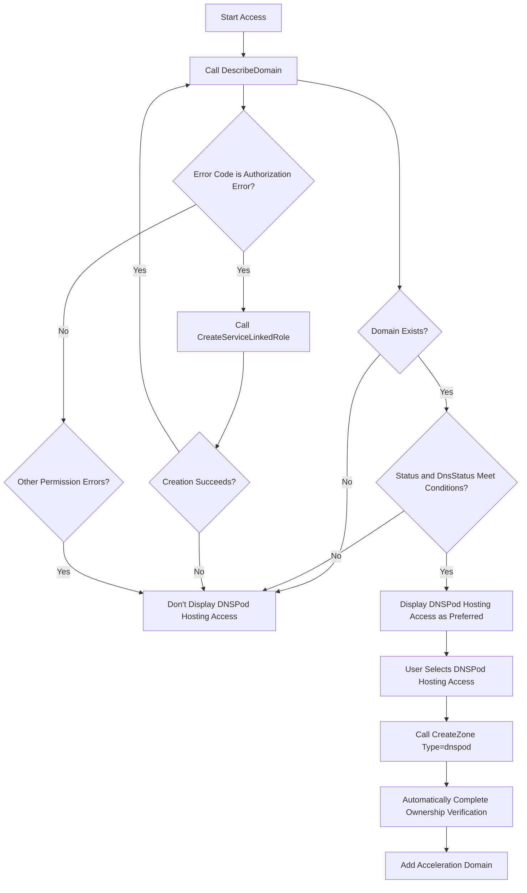

# DNSPod Integration API Reference

EdgeOne supports DNSPod hosting access mode, enabling one-click domain onboarding and automated configuration. This document explains how to call related APIs.

## Query Domain Hosting Status

### DescribeDomain (DNSPod)

**Purpose**: Query whether domain is hosted in DNSPod and if hosting status meets EdgeOne access conditions.

**Invocation Example**:

```bash
tccli dnspod DescribeDomain --Domain "example.com"
```

**Key Response Fields**:

```json
{
  "DomainInfo": {
    "Domain": "example.com",
    "DomainId": 12345678,
    "Status": "ENABLE",        // Domain status: ENABLE(normal), PAUSE(paused), SPAM(blocked)
    "DnsStatus": "",           // DNS status: empty string(normal), "dnserror"(abnormal)
    "Grade": "DP_Pro",         // Plan level
    "DnspodNsList": [          // DNSPod's NS list
      "ns1.dnspod.net",
      "ns2.dnspod.net"
    ],
    "ActualNsList": [          // Actual NS used by domain
      "ns1.dnspod.net",
      "ns2.dnspod.net"
    ]
  }
}
```

**EdgeOne Access Condition Determination**:

Domain can use DNSPod hosting access when meeting all of the following conditions:

1. ✅ Domain exists (interface call succeeds)
2. ✅ `Status` field is `"ENABLE"` or `"LOCK"`
3. ✅ `DnsStatus` field is empty string `""`

**Common Error Handling**:

| Error Code | Description | Handling Method |
|--------|------|----------|
| `ResourceNotFound.NoDataOfDomain` | Domain doesn't exist in DNSPod | Don't display DNSPod hosting access option |
| `OperationDenied.DNSPodUnauthorizedRoleOperation` | Missing service authorization | Try to automatically create service authorization role |
| `UnauthorizedOperation` | User lacks DNSPod interface permission | Don't display DNSPod hosting access option |

## Create Service-Linked Role

### CreateServiceLinkedRole (CAM)

**Purpose**: Create service authorization role for EdgeOne to access DNSPod for user.

**Trigger Scenario**: When calling `DescribeDomain` interface returns `OperationDenied.DNSPodUnauthorizedRoleOperation` error.

**Invocation Example**:

```bash
tccli cam CreateServiceLinkedRole \
  --QCSServiceName '["DnspodaccesEO.TEO.cloud.tencent.com"]' \
  --Description "This role is a service-linked role for Tencent EdgeOne Platform (TEO). This role will query your domain status and related DNS records in DNSPod within the permission scope of associated policies, and help you quickly complete DNS modification to switch acceleration service to EO in one-click DNS modification scenarios"
```

**Response Example**:

```json
{
  "RoleId": "4611686018428516331",
  "RequestId": "abcd1234-5678-90ef-ghij-klmnopqrstuv"
}
```

**Follow-up Actions**:

- ✅ If creation succeeds: Retry calling `DescribeDomain` to detect domain status
- ❌ If creation fails: Enable fallback mode, don't display DNSPod hosting access option

## DNSPod Hosting Access Process

### Complete Invocation Flow



### Access Mode Parameters

When calling `CreateZone`, optional values for `Type` parameter:

- `dnspod`: DNSPod hosting access
- `full`: NS access
- `partial`: CNAME access

**Recommendation Strategy**:

1. Prioritize detecting if DNSPod hosting access conditions are met
2. If met, display `dnspod` as **preferred recommendation** to user
3. Always provide `full` and `partial` as alternative options

## Best Practices

### 1. Silent Detection, Smart Recommendation

```python
# Pseudo-code example
def get_available_access_types(domain):
    access_types = []
    
    # Try to detect DNSPod hosting status
    try:
        response = dnspod.DescribeDomain(Domain=domain)
        domain_info = response['DomainInfo']
        
        # Determine if conditions are met
        if (domain_info['Status'] in ['ENABLE', 'LOCK'] and 
            domain_info['DnsStatus'] == ''):
            access_types.append({
                'type': 'dnspod',
                'name': 'DNSPod Hosting Access',
                'recommended': True,
                'description': 'No manual configuration needed, automatically completes validation'
            })
    
    except DNSPodUnauthorizedRoleOperation:
        # Try automatic authorization
        try:
            cam.CreateServiceLinkedRole(...)
            # Retry detection
            return get_available_access_types(domain)
        except:
            pass  # Authorization failed, use fallback plan
    
    except:
        pass  # Other errors, use fallback plan
    
    # Fallback: Always provide NS and CNAME access
    access_types.extend([
        {'type': 'full', 'name': 'NS Access'},
        {'type': 'partial', 'name': 'CNAME Access'}
    ])
    
    return access_types
```

### 2. User Experience Optimization

**Suggested Wording When Displaying to User**:

✅ **When DNSPod Hosting Conditions Are Met**:

> Detected that your domain `example.com` is hosted in DNSPod. Recommend using **DNSPod Hosting Access** mode, which can automatically complete validation and configuration without manual DNS operations.
> 
> You can also choose other access modes:
> - NS Access: Need to modify domain's NS record
> - CNAME Access: Need to add TXT record to verify ownership

❌ **When DNSPod Hosting Conditions Are Not Met**:

> Please select access mode:
> - NS Access: EdgeOne fully takes over DNS resolution
> - CNAME Access: Only configure CNAME record, NS unchanged

### 3. Error Handling Suggestions

| Scenario | User Prompt | Technical Handling |
|------|----------|----------|
| Domain Not in DNSPod | No prompt, directly provide NS/CNAME options | Handle silently |
| Missing Service Authorization | "Configuring service authorization for you..." | Automatically call CreateServiceLinkedRole |
| Authorization Creation Failed | No prompt, directly provide NS/CNAME options | Silently fall back to fallback plan |
| Domain Status Abnormal | No prompt, directly provide NS/CNAME options | Handle silently |

## Reference Materials

- [DNSPod API Documentation](https://cloud.tencent.com/document/product/1427)
- [CAM Service-Linked Roles](https://cloud.tencent.com/document/product/598/19388)
- [EdgeOne CreateZone Interface](https://cloud.tencent.com/document/product/1552/80719)
