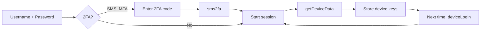

# Hive API reference

Condensed reference for the unofficial Hive (UK) API as used by Pyhiveapi. The API is **not** public; Hive can change or restrict it at any time.

## Auth flow

- **First login:** `Hive(username, password)` → `login()` → if `ChallengeName == "SMS_MFA"` call `sms2fa(code, login)` → `startSession()` → `auth.getDeviceData()` and store for later.
- **Later logins:** `Hive(..., deviceGroupKey, deviceKey, devicePassword)` → `deviceLogin()` → `startSession()`.

## Session device lists

After `session.startSession()`:

| Key             | Content                          |
|-----------------|----------------------------------|
| `climate`       | Heating / thermostat zones       |
| `water_heater`  | Hot water devices                |
| `light`         | Lights                           |
| `switch`        | Switches (e.g. plugs)            |
| `sensor`        | Sensors                          |
| `binary_sensor` | Binary sensors                   |

## Heating (`session.heating`)

| Method | Notes |
|--------|--------|
| `getOperationModes()` | Returns list of modes (e.g. SCHEDULE, HEAT, OFF) |
| `getMode(device)` | Current mode |
| `getState(device)` | Current state |
| `getCurrentTemperature(device)` | Current temp |
| `getTargetTemperature(device)` | Target temp |
| `getMinTemperature(device)` / `getMaxTemperature(device)` | Min/max allowed |
| `getBoostStatus(device)` | Whether boost is on |
| `getBoostTime(device)` | Boost time left |
| `getScheduleNowNextLater(device)` | Schedule windows |
| `setMode(device, mode)` | e.g. "SCHEDULE", "HEAT", "OFF" |
| `setTargetTemperature(device, temp)` | Integer °C |
| `setBoostOn(device, mins, temp)` | Boost heating (mins: str or int, temp: float) |
| `setBoostOff(device)` | Cancel boost |
| `getCurrentOperation(device)` | Current operation state |

## Hot water (`session.hotwater`)

| Method | Notes |
|--------|--------|
| `getOperationModes()` | Modes (e.g. OFF, SCHEDULE) |
| `getMode(device)` | Current mode |
| `getState(device)` | State |
| `getBoost(device)` | Boost on/off |
| `getBoostTime(device)` | Time remaining |
| `getScheduleNowNextLater(device)` | Schedule |
| `setMode(device, mode)` | e.g. "OFF", "SCHEDULE" |
| `setBoostOn(device, mins)` | Boost hot water (mins: int) |
| `setBoostOff(device)` | Cancel boost |

## Lights (`session.light`)

| Method | Notes |
|--------|--------|
| `getState(device)` | On/off |
| `getBrightness(device)` | Brightness |
| `getMinColorTemp(device)` / `getMaxColorTemp(device)` | Colour temp range |
| `getColorTemp(device)` | Current colour temp |
| `getColor(device)` | Colour |
| `getColorMode(device)` | Colour mode |

Set methods depend on Pyhiveapi version; see the [Session examples](https://pyhass.github.io/pyhiveapi.docs/docs/examples/session/) for exact names.

## Backend and history

- **Base URL:** The app uses endpoints such as `https://beekeeper.hivehome.com/` and `https://api.prod.bgchprod.info/`; Pyhiveapi encapsulates these.
- **Original reverse-engineering:** [James Kirby – Hive Home REST API](https://jedkirby.com/blog/hive-home-rest-api) (simple login no longer works; 2FA is required).
- **Sniffing the app:** To discover new endpoints, use browser DevTools on [my.hivehome.com](https://my.hivehome.com) (Network tab) or mitmproxy for the mobile app. Prefer the web app first.

## Links

- [Pyhiveapi (GitHub)](https://github.com/Pyhass/Pyhiveapi)
- [Pyhiveapi Session examples](https://pyhass.github.io/pyhiveapi.docs/docs/examples/session/)
- [Home Assistant – Hive integration](https://www.home-assistant.io/integrations/hive/)
- [Hive Home – James Kirby](https://jedkirby.com/blog/hive-home-rest-api)
