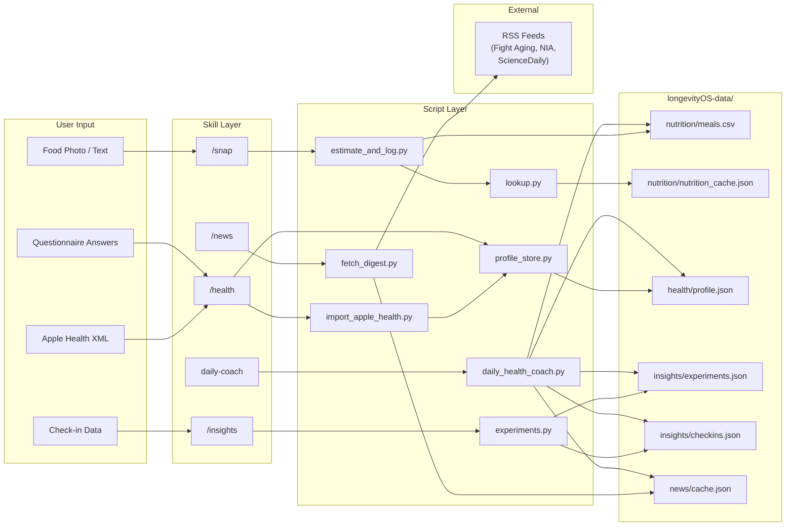

<a id="top"></a>

# compound-clawskill

OpenClaw skill bundle for a personal health companion.

It currently provides:

- `/snap` for meal logging from food photos or meal text, using ingredient/portion inference plus deterministic nutrition enrichment
- `/health` for Apple Health XML import and structured health profile updates
- `/news` for a curated health/longevity digest
- `/insights` for structured self-experiments and gap-aware recommendations
- a cron-driven daily health coach that combines local health data, experiment context, and relevant curated news into personalized daily guidance

All skills respond to natural language as well as slash commands. You can say "had salmon with rice for lunch" instead of invoking `/snap`, or ask "how did I sleep this week?" instead of `/health`. The slash commands remain available as shortcuts.

The bundle is designed for OpenClaw + Telegram and installs as a managed bundle under `~/.openclaw/bundles/compound-clawskill`.

## Core Features

- `/snap` turns food photos or meal descriptions into structured meal logs. The agent identifies likely ingredients and portions, asks for confirmation when confidence is low, and records an ingredient-level meal entry instead of a vague free-text note.
- Nutrition logging is backed by deterministic enrichment code rather than fully model-invented numbers. Ingredient names are normalized to canonical forms, nutrient values are filled from a local catalog of 50+ ingredients with full micronutrient profiles, and the stored rows record where those values came from. A weekly summary aggregates 7-day intake against RDA reference values and highlights gaps and strengths.
- `/health` builds a reusable health profile from Apple Health exports and structured questionnaire-style inputs. That profile becomes shared context for future recommendations instead of forcing the user to restate the same baseline every time.
- `/news` produces a curated digest focused on health, longevity, nutrition, sleep, exercise, and related research, using predefined sources instead of generic open-ended news search.
- `/insights` is designed for structured self-experimentation. It tracks hypotheses, interventions, check-ins, and follow-up analysis, and it is intentionally allowed to say “not enough data yet” instead of pretending to know the answer.
- Morning automation is supported through separate cron-driven health brief, news digest, and daily coach messages, so the system can proactively summarize, curate, and coach instead of waiting for the user to ask each time.
- Everything is local-first. Runtime state lives under `longevityOS-data/`, which keeps meal logs, health profile data, experiment state, and cached news separate from unrelated OpenClaw workspace data.

[Back to top](#top)

## Table Of Contents

- [Core Features](#core-features)
- [Architecture](#architecture)
- [Copy And Paste To Your OpenClaw To Install (Recommended)](#copy-and-paste-to-your-openclaw-to-install-recommended)
- [Install](#install)
- [Install Verification](#install-verification)
- [Fresh Session Required](#fresh-session-required)
- [Telegram Command Note](#telegram-command-note)
- [Apple Health Import](#apple-health-import)
- [Cron Setup](#cron-setup)
- [Smoke Test](#smoke-test)
- [Copy And Paste To Your OpenClaw To Uninstall](#copy-and-paste-to-your-openclaw-to-uninstall)
- [Uninstall](#uninstall)
- [Runtime Data](#runtime-data)
- [Data Shapes](#data-shapes)
- [Development](#development)
- [Repo Layout](#repo-layout)
- [Docs](#docs)

## Architecture

How data moves between subsystems during daily operation.



Each user input flows through its skill, into the deterministic script layer, and lands in a specific data store. The daily coach reads across all stores to produce its aggregated output.

[Back to top](#top)

## Copy And Paste To Your OpenClaw To Install (Recommended)

Use the following block as a copy-paste instruction for an OpenClaw agent that should install this bundle on the user's device:

```text
1. Clone `https://github.com/compound-life-ai/longClaw` to a stable local path.
2. Change into the cloned repository.
3. Run `python3 scripts/install_bundle.py`.
4. Run `python3 scripts/install_bundle.py --verify`.
5. Confirm that `~/.openclaw/openclaw.json` includes the installed bundle `skills/` path inside `skills.load.extraDirs`.
6. Tell the user to start a new OpenClaw session.
7. Tell the user to verify that `/snap`, `/health`, `/news`, and `/insights` are available and usable.
8. Tell the user to verify that `daily-coach` is loaded with `openclaw skills info daily-coach`.
9. If needed, tell the user to configure the cron templates from the installed `cron/` directory with their Telegram DM chat id, including `cron/daily-health-coach.example.json` for proactive daily coaching.
10. Ask the user if they would like to seed sample data into `longevityOS-data/` so they can explore the system immediately. If they say yes, run `cp -r seed/* longevityOS-data/` from the cloned repository root. If they decline, skip this step.
```

[Back to top](#top)

## Install

Preview the install:

```bash
python3 scripts/install_bundle.py --dry-run
```

Install into the default OpenClaw home:

```bash
python3 scripts/install_bundle.py
```

Install into a custom OpenClaw home:

```bash
python3 scripts/install_bundle.py --openclaw-home /path/to/.openclaw
```

Verify the installed bundle:

```bash
python3 scripts/install_bundle.py --verify
```

Optionally seed sample data so you can explore immediately:

```bash
cp -r seed/* longevityOS-data/
```

The installer:

- copies `skills/`, `scripts/`, `cron/`, and `docs/`
- initializes `longevityOS-data/`
- registers the installed `skills/` directory in `skills.load.extraDirs`

[Back to top](#top)

## Install Verification

Checking `openclaw.json` is necessary, but not sufficient.

After install, verify config:

```bash
python3 - <<'PY'
import json, pathlib
p = pathlib.Path.home()/'.openclaw'/'openclaw.json'
obj = json.loads(p.read_text())
print(obj.get('skills', {}).get('load', {}).get('extraDirs', []))
PY
```

Then verify OpenClaw sees the skills as real ready skills:

```bash
openclaw skills info snap
openclaw skills info health
openclaw skills info news
openclaw skills info insights
openclaw skills info daily-coach
```

Expected result:

- each skill shows `Ready`

[Back to top](#top)

## Fresh Session Required

OpenClaw snapshots eligible skills at session start. After installation, start a fresh OpenClaw session before testing commands. Staying in an older session can make command behavior look stale or inconsistent.

[Back to top](#top)

## Telegram Command Note

With `commands.native = "auto"` and `commands.nativeSkills = "auto"`, OpenClaw should expose user-invocable skills as native Telegram commands.

Two separate things can happen:

- typed commands like `/snap` work
- commands appear in Telegram's slash picker/menu

Telegram may hide some commands when the menu is crowded. If a command does not appear in the picker, try typing it manually first.

[Back to top](#top)

## Apple Health Import

The health importer accepts either:

- `export.xml`
- `export.zip`

If Apple Health gives you `export.zip`, you can import the zip directly now, or extract `apple_health_export/export.xml` first.

Examples:

```bash
python3 scripts/health/import_apple_health.py --input-zip ~/Downloads/export.zip
python3 scripts/health/import_apple_health.py --input-xml /path/to/apple_health_export/export.xml
```

[Back to top](#top)

## Cron Setup

The templates are not usable until you replace `__TELEGRAM_DM_CHAT_ID__`.

Files:

- `cron/health-brief.example.json`
- `cron/news-digest.example.json`
- `cron/daily-health-coach.example.json`

Then create the jobs:

```bash
openclaw cron add --from-file cron/health-brief.example.json
openclaw cron add --from-file cron/news-digest.example.json
openclaw cron add --from-file cron/daily-health-coach.example.json
```

[Back to top](#top)

## Smoke Test

After install:

1. Start a new OpenClaw session.
2. Run `/news`.
3. Test `/snap` with a food photo.
4. Run `/health`.
5. Run `/insights`.
6. Configure and enable `cron/daily-health-coach.example.json` if you want the personalized daily coach message.

[Back to top](#top)

## Copy And Paste To Your OpenClaw To Uninstall

Use the following block as a copy-paste instruction for an OpenClaw agent that should uninstall this bundle from the user's device:

```text
1. List active cron jobs with `openclaw cron list` and remove any that reference `health-brief`, `news-digest`, or `daily-health-coach`.
2. Open `~/.openclaw/openclaw.json` and remove the `~/.openclaw/bundles/compound-clawskill/skills` entry from `skills.load.extraDirs`.
3. Delete the installed bundle directory: `rm -rf ~/.openclaw/bundles/compound-clawskill`.
4. Tell the user to start a new OpenClaw session so the removed skills are no longer loaded.
5. Confirm that `/snap`, `/health`, `/news`, `/insights`, and `daily-coach` are no longer available.
```

## Uninstall

To remove the installed bundle manually:

1. Remove any cron jobs you created from `cron/health-brief.example.json`, `cron/news-digest.example.json`, and `cron/daily-health-coach.example.json`.
2. Remove `~/.openclaw/bundles/compound-clawskill/skills` from `skills.load.extraDirs` in `~/.openclaw/openclaw.json`.
3. Delete `~/.openclaw/bundles/compound-clawskill` to remove the installed skills, copied files, and `longevityOS-data/`.
4. Start a fresh OpenClaw session.

[Back to top](#top)

## Runtime Data

Runtime data is namespaced under:

```text
longevityOS-data/
  nutrition/
  health/
  insights/
  news/
```

This keeps the bundle’s state separate from unrelated workspace data.

[Back to top](#top)

## Data Shapes

There is no separate schema file yet. The current storage contract is defined by the Python scripts in `scripts/`.

### Nutrition

Path:

- `longevityOS-data/nutrition/meals.csv`

This is ingredient-centric, not meal-centric. One meal can produce multiple rows that share the same `meal_id`.

CSV columns:

- `timestamp`
- `date`
- `meal_id`
- `meal_type`
- `source`
- `ingredient_name`
- `normalized_name`
- `amount_g`
- `portion_text`
- `calories_kcal`
- `protein_g`
- `carbs_g`
- `fat_g`
- `fiber_g`
- `micronutrients_json`
- `nutrient_source`
- `ingredient_confidence`
- `meal_confidence`
- `notes`
- `photo_ref`

`micronutrients_json` is a JSON object serialized into a CSV cell, for example:

```json
{
  "selenium_mcg": 54,
  "vitamin_d_mcg": 16.35
}
```

`normalized_name` stores the canonical ingredient key used by the deterministic lookup layer.

`amount_g` stores the explicit or inferred gram amount used to scale per-100g nutrient values.

`nutrient_source` currently records where the row’s nutrients came from:

- `provided`
- `catalog`
- `cache`

Current `/snap` flow:

- the model identifies likely ingredients and rough portions from meal text or a food photo
- the nutrition script normalizes ingredient names to canonical keys
- the script enriches macros and micronutrients deterministically from the local nutrition catalog or cache when explicit nutrient values are not provided
- if the user supplies trustworthy label-style values or an exact recipe, those values are preserved with `nutrient_source = provided`

Current limitations:

- live USDA FoodData Central lookup is not implemented yet
- live Open Food Facts fallback is not implemented yet
- recipe-library-first reuse is not implemented yet

### Health Profile

Path:

- `longevityOS-data/health/profile.json`

Top-level shape:

```json
{
  "updated_at": "2026-03-19T05:22:15+00:00",
  "goals": ["better sleep"],
  "constraints": ["no late caffeine"],
  "preferences": {
    "language": "bilingual"
  },
  "questionnaire": {
    "sleep_notes": "wake up once",
    "training_notes": "hard sessions on Tue/Thu",
    "diet_notes": "more protein"
  },
  "apple_health": {},
  "imports": [
    {
      "source": "apple_health_export_xml",
      "imported_at": "2026-03-19T05:22:15+00:00",
      "file_name": "export.xml"
    }
  ]
}
```

`apple_health` stores the normalized importer summary, currently shaped like:

```json
{
  "imported_at": "2026-03-19T05:22:15+00:00",
  "source": "apple_health_export_xml",
  "file_name": "export.xml",
  "counts": {
    "records": 3170057,
    "workouts": 544,
    "days_with_steps": 1745,
    "days_with_sleep": 1338
  },
  "activity": {
    "daily_steps_avg": 9740,
    "daily_active_energy_kcal_avg": 393.53,
    "daily_basal_energy_kcal_avg": 1686.23,
    "daily_exercise_minutes_avg": 31.94,
    "daily_walking_running_distance_avg_km": 6.91,
    "daily_cycling_distance_avg_km": 2.93,
    "step_days": 1745
  },
  "sleep": {
    "daily_sleep_hours_avg": 6.32,
    "sleep_days": 1338,
    "daily_sleep_hours_values": [5.95, 5.09, 7.46]
  },
  "heart": {
    "resting_heart_rate_avg": 63.17,
    "heart_rate_avg": 92.12,
    "walking_heart_rate_avg": 99.29,
    "heart_rate_variability_sdnn_avg": 42.91,
    "oxygen_saturation_avg": 0.96,
    "respiratory_rate_avg": 15.9,
    "vo2_max_avg": 45.6,
    "sample_count": 734625
  },
  "workouts": {
    "workout_count": 544,
    "average_workout_minutes": 27.03,
    "by_type": {
      "HKWorkoutActivityTypeRunning": 66,
      "HKWorkoutActivityTypeCycling": 117
    }
  }
}
```

### Insights

Paths:

- `longevityOS-data/insights/experiments.json`
- `longevityOS-data/insights/checkins.json`

`experiments.json` shape:

```json
{
  "active_experiment_id": "uuid",
  "items": [
    {
      "id": "uuid",
      "title": "Earlier caffeine cutoff",
      "domain": "sleep",
      "hypothesis": "Stopping caffeine at noon improves sleep quality.",
      "null_hypothesis": "Stopping caffeine at noon does not change sleep quality.",
      "intervention": "No caffeine after 12:00.",
      "primary_outcome": "sleep_quality",
      "secondary_outcomes": [],
      "baseline_window": "7d",
      "intervention_window": "14d",
      "checkin_questions": [],
      "status": "active",
      "created_at": "2026-03-19T05:22:15+00:00",
      "started_at": "2026-03-19T05:22:15+00:00",
      "ended_at": null,
      "analysis_summary": "",
      "next_action": ""
    }
  ]
}
```

`checkins.json` shape:

```json
[
  {
    "id": "uuid",
    "experiment_id": "uuid",
    "timestamp": "2026-03-19T05:22:15+00:00",
    "compliance": 1,
    "primary_outcome_scores": {
      "sleep_quality": 7
    },
    "confounders": ["late workout"],
    "note": "Fell asleep faster than usual."
  }
]
```

### News Cache

Path:

- `longevityOS-data/news/cache.json`

Shape:

```json
{
  "fetched_at": "2026-03-19T05:22:15+00:00",
  "sources": [
    {
      "name": "Fight Aging!",
      "feed": "https://www.fightaging.org/feed/",
      "site": "https://www.fightaging.org/"
    }
  ],
  "errors": [],
  "items": [
    {
      "source": "Fight Aging!",
      "title": "Example title",
      "url": "https://example.com/article",
      "summary": "Example summary",
      "published_at": "Tue, 18 Mar 2026 10:00:00 GMT",
      "score": 6
    }
  ]
}
```

[Back to top](#top)

## Development

Run the deterministic test suite:

```bash
python3 -m unittest discover -s tests -v
```

The Apple Health importer was tested against a real Apple Health export and now uses streaming XML parsing so large `export.xml` files remain practical.

[Back to top](#top)

## Repo Layout

```text
skill.md            Root meta skill index (natural language routing table)
skills/             OpenClaw-facing skill definitions
scripts/            Deterministic Python helpers used by the skills
cron/               Example cron job configs
seed/               Optional fixture data for all four data stores
longevityOS-data/   Runtime data directories
tests/              Deterministic unit and CLI tests
docs/               Architecture, install, and design notes
website/            Next.js landing page
```

[Back to top](#top)

## Docs

Start with:

- [docs/install.md](docs/install.md)
- [docs/openclaw-extension-survey.md](docs/openclaw-extension-survey.md)
- [docs/proposed-health-companion-architecture.md](docs/proposed-health-companion-architecture.md)

Reference notes:

- [docs/longevity-os-reference-notes.md](docs/longevity-os-reference-notes.md)
- [docs/news-sources.md](docs/news-sources.md)

[Back to top](#top)
