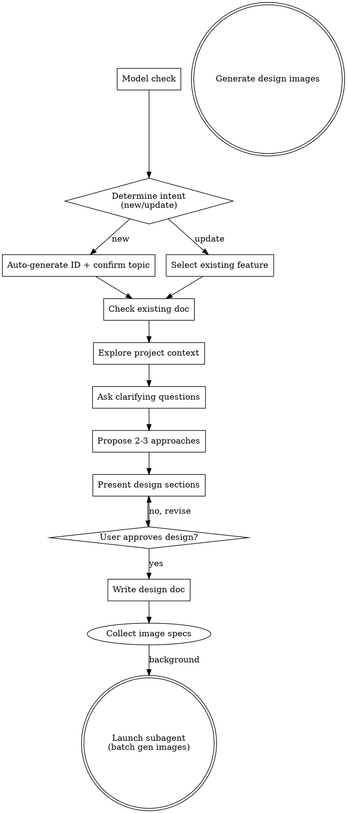

# SDD Brainstorming — 头脑风暴与设计

## Overview

通过协作对话使用 AskUserQuestionTool 将想法转化为完整的设计和规格说明。

首先检查模型，然后确定意图（新建或更新），了解当前项目背景，提出问题（每次最多 2 个相关问题）以完善想法。理解要构建的内容后，展示设计并获取用户批准，然后撰写设计文档。

## 关键概念

- **工作区 (Workspace)：** 通过 `.sdd-workspace` 配置文件中 `workspace_path` 指定的根目录
- **Spec 目录：** 所有 SDD 文档存储在 `{workspace}/spec/` 下

## Step 0: 读取工作区配置

在任何操作之前，必须读取工作区配置：

1. 检查当前 OpenClaw workspace 中是否存在 `.sdd-workspace`
2. 如果存在，读取 `workspace_path` 作为工作区根目录 `{workspace}`
3. 如果不存在，显示错误："请先运行 `/sdd-global-init` 初始化工作区。" 并**停止**

验证工作区目录存在，如果不存在提示用户重新初始化。

<HARD-GATE>
在展示设计并获得用户批准之前，**不要**调用任何实现技能、编写任何代码、搭建任何项目或采取任何实现行动。这适用于每个项目，无论看似多么简单。
</HARD-GATE>

## 反模式: "这太简单不需要设计"

每个项目都要经过这个过程。待办事项列表、单功能工具、配置更改——都是如此。"简单"项目是未经审视的假设造成最多浪费工作的地方。设计可以很短（对于真正简单的项目只需几句话），但你**必须**展示并获得批准。

## 清单

你**必须**为每个项目创建任务并按顺序完成：

0. **模型检查** — 检测当前模型是否为 Opus（检查 system prompt 中的模型信息）；如果不是 Opus，输出纯文本建议（非阻塞：无论如何都继续）
1. **确定意图** — 使用 AskUserQuestionTool 询问："新建需求" 或 "更新已有需求"
   - **新建需求**: 扫描 `{workspace}/spec/` 中与今天日期匹配的现有 `feature_YYYYMMDD_*` 文件夹，找到最大序列号，自动生成下一个 `YYYYMMDD_F{NNN}`，然后 AI 生成 kebab-case 主题（最多 5 个词）并通过 AskUserQuestionTool 让用户确认/修改
   - **更新已有需求**: 扫描 `{workspace}/spec/` 中所有 `feature_*` 文件夹；如果 ≤4 个，作为 AskUserQuestionTool 选项列出；如果 >4 个，显示最近的 3-4 个作为选项（用户可通过 "Other" 输入）
2. **检查现有文档** — 检查 `{workspace}/spec/feature_YYYYMMDD_FNNN_topic/spec-design.md` 是否存在；如果存在，读取它
3. **探索项目背景** — 检查文件、文档、最近的提交
   - 如果 `{workspace}/spec/global/` 存在:
     a. 读取 `{workspace}/spec/global/constraints.md` 了解架构约束（新功能必须遵守）
     b. 读取 `{workspace}/spec/global/index.md` 了解已完成功能的全貌
     c. 读取相关的 `{workspace}/spec/global/domains/*.md` 了解该领域的现有决策
   - 将约束信息作为新功能设计的先决条件
4. **提出澄清问题** — 每次最多 2 个相关问题，通过 AskUserQuestionTool，了解目的/约束/成功标准
5. **提出 2-3 种方案** — 包含权衡和你的推荐
6. **展示设计** — 分部分展示，通过 AskUserQuestionTool 获取每个部分的批准
7. **撰写设计文档** — 保存到 `{workspace}/spec/feature_YYYYMMDD_FNNN_topic/spec-design.md`
   - 新文档：直接写入
   - 现有文档：显示变更摘要，通过 AskUserQuestionTool 确认，然后覆盖
8. **生成设计配图** — 撰写文档时，收集需要视觉说明的部分的配图规格（使用下面的两层触发规则）；写完后，启动一个后台子代理批量生成所有配图 via `/gen-image`；保存到 `{workspace}/spec/feature_YYYYMMDD_FNNN_topic/images/`，在 spec-design.md 中用 `` 引用

## 流程图



**终止状态是在写完设计文档后启动后台子代理生成配图。** 主流程**不等待**子代理完成。立即向用户输出纯文本消息（中文），建议下一步：`/sdd-writing-plans`。**不要自动 git commit**。

## 过程详解

**模型检查:**
- 检查 system prompt 中的模型信息（例如 "powered by the model named Opus" 或包含 "opus" 的模型 ID）
- 如果不是 Opus：输出以下纯文本消息并立即继续（非阻塞）：
  ```
  ⚠️ 当前模型不是 Opus，建议切换到 Opus 以获得最佳头脑风暴质量。输入 /model 切换模型。
  ```

**确定意图并生成 feature ID:**
- 使用 AskUserQuestionTool 询问：新建需求 or 更新已有需求
- **新建需求流程:**
  1. 获取今天的日期，格式为 `YYYYMMDD`
  2. 扫描 `spec/` 目录中匹配 `feature_YYYYMMDD_F*`（相同日期）的文件夹
  3. 找到最高的序列号，加 1（如果没有则从 F001 开始）
  4. AI 根据用户描述生成 kebab-case 英文主题标签（最多 5 个词）
  5. 使用 AskUserQuestionTool 展示生成的 ID 和主题让用户确认（例如 "feature_20260302_F001_auth-system"）
- **更新已有需求流程:**
  1. 扫描 `spec/` 中所有 `feature_*` 目录
  2. 如果 ≤4 个 feature：作为 AskUserQuestionTool 选项列出全部
  3. 如果 >4 个 feature：显示最近的 3-4 个作为选项；用户可通过 "Other" 输入完整名称
  4. 对于更新，保留文件夹名称中的原始 `YYYYMMDD` 日期
- 确定 feature 文件夹后，检查 `{workspace}/spec/feature_YYYYMMDD_FNNN_topic/spec-design.md` 是否已存在
- 如果存在，读取现有文档——稍后你将与新的头脑风暴结果进行智能合并

**理解想法:**
- 首先查看当前项目状态（文件、文档、最近提交）
- 如果 `{workspace}/spec/global/` 存在，读取 `{workspace}/spec/global/constraints.md`、`{workspace}/spec/global/index.md` 和相关的 `{workspace}/spec/global/domains/*.md` 了解现有架构约束和已完成功能——新设计必须与这些约束保持一致；如果需要新的/更改的约束，在设计文档中明确标注
- 通过 AskUserQuestionTool 提问以完善想法
- 每次最多 2 个相关问题——将密切相关的问题分组
- 尽量使用多项选择问题，但也接受开放式问题
- 聚焦于理解：目的、约束、成功标准

**探索方案:**
- 提出 2-3 个不同的方案，包含权衡
- 对话式展示选项，包含你的推荐和理由
- 先说出你的推荐选项并解释原因

**展示设计:**
- 一旦你认为理解了要构建的内容，就展示设计
- 每个部分的内容量根据复杂程度调整：如果直接则几句话，如果细微则多达 200-300 词
- 每个部分后使用 AskUserQuestionTool 询问是否看起来正确
- 如果有不清楚的地方，准备好回去澄清

**写文档:**
- 用中文写设计文档到 `{workspace}/spec/feature_YYYYMMDD_FNNN_topic/spec-design.md`
- 使用下面的设计文档模板
- 如果更新现有文档：首先向用户展示变更摘要，使用 AskUserQuestionTool 获得确认，然后用智能合并的内容覆盖文件
- 如果创建新文档：直接写入
- **不要 git commit**。

**生成设计配图:**

两层触发系统——AI 决定哪些部分需要配图，不需要用户确认，配图数量无上限：

**强制（必须生成）:**
- UI/UX 内容：页面布局、交互流程、线框图
- 数据流：多系统或多模块数据流图
- 状态机：状态转换图
- 系统架构：组件/服务架构图

**建议（AI 根据信息密度判断）:**
- 3 个以上实体交互，或存在条件分支/状态转换
- 8-10 行以上纯文本描述的概念，无视觉辅助
- 嵌套列表、多层表格或其他复杂结构化数据

配图类型 style mapping：

| 配图类型 | Style prefix | 宽高比 |
|-----------|-------------|-------------|
| UI 交互流 | Clean flat flowchart, minimal | `16:9` |
| 页面布局/线框图 | Figma-style wireframe | `3:4` 或 `9:16`（竖屏）/ `16:9`（横屏） |
| 架构/数据流 | Technical diagram, vector style | `16:9` |
| 概念图示 | Flat design, soft pastel | `1:1` 或 `16:9` |
| 状态机/状态转换 | Clean flat state diagram, rounded nodes with arrows, minimal | `16:9` |
| 实体关系图 | Technical ER diagram, vector style, standard entity notation | `16:9` |

配图生成工作流：
1. **撰写** spec-design.md 时，在需要配图的位置（根据上述触发规则）插入 `` 占位符引用
2. **收集配图规格** —— 撰写时为每个占位符记录：描述、配图类型、style prefix、宽高比
3. **写完文档后**，启动一个**单独的后台子代理**（使用 Agent tool，`run_in_background: true`），通过为每个规格调用 `/gen-image` 批量生成所有配图
4. **不要等待**子代理完成——立即继续到完成消息

子代理 prompt 模板：
> Generate the following design images for `{workspace}/spec/feature_YYYYMMDD_FNNN_topic/images/`. For each image, call `/gen-image` with the specified parameters. Images: [list of {filename, description, style_prefix, aspect_ratio}]

通用配图参数：
- 配图中的文字：添加约束 `Text labels in Simplified Chinese unless technical English terms`
- 分辨率：`1K`（草稿质量）
- 宽高比：AI 根据上表根据内容类型选择
- 命名：`NN-type.png`（例如 `01-flow.png`, `02-wireframe.png`, `03-state.png`, `04-er.png`）
- 输出路径：`{workspace}/spec/feature_YYYYMMDD_FNNN_topic/images/NN-type.png`

启动子代理后，向用户输出（中文）："✅ 设计文档已写入 `{workspace}/spec/feature_YYYYMMDD_FNNN_topic/spec-design.md`，配图正在后台生成中（完成后会通知）。\n\n**建议下一步：** 运行 `/sdd-writing-plans` 生成执行计划。"

## 设计文档模板

设计文档用**中文**撰写。"方案设计" 部分没有固定的子部分——根据功能需要动态组织（例如架构、API 设计、数据模型、用户场景、交互流程等）。

```markdown
# Feature: YYYYMMDD_FNNN - topic

## 需求背景
描述当前的问题或动机，为什么需要这个 feature。

## 目标
- 核心目标 1
- 核心目标 2

## 方案设计
（根据需求项目情况，动态增加子章节，如架构设计、接口设计、数据模型、用户场景与交互流程等）

> 在适合的章节中插入设计配图：``

## 实现要点
关键技术决策、难点、依赖。

## 约束一致性
说明本方案与 `{workspace}/spec/global/constraints.md` 中架构约束的一致性。如有新增或变更约束，在此标注。
（如 `{workspace}/spec/global/` 不存在则省略此章节）

## 验收标准
- [ ] 标准 1
- [ ] 标准 2
```

## 关键原则

- **开始时检测模型** - 检查模型，如果不是 Opus，输出纯文本建议；非阻塞，始终继续
- **所有交互使用 AskUserQuestionTool** - 永远不要用纯文本提问；始终使用结构化工具
- **自动生成 feature ID** - 日期 + 零填充序列号 + AI 生成的主题；用户通过 AskUserQuestionTool 确认
- **每次最多 2 个相关问题** - 将密切相关的问题分组，但不要让人应接不暇
- **尽量使用多项选择** - 比开放式问题更容易回答
- **设计文档用中文** - 设计文档始终用中文撰写
- **现有文档智能合并** - 读取旧文档，将新头脑风暴内容合并，用合并内容重写整个文档
- **两层配图触发规则 + 后台生成** — 强制配图针对 UI/UX、数据流、状态机、架构；建议配图当信息密度高时（3 个以上实体交互、8 行以上文本、复杂结构）；撰写时收集规格，然后启动单个后台子代理通过 `/gen-image` 批量生成所有配图，不阻塞主流程
- **彻底 YAGNI** - 从所有设计中删除不必要的功能
- **探索替代方案** - 在确定之前总是提出 2-3 个方案
- **增量验证** - 分部分展示设计，获得批准后再继续
- **保持灵活** - 有不清楚的地方回去澄清
