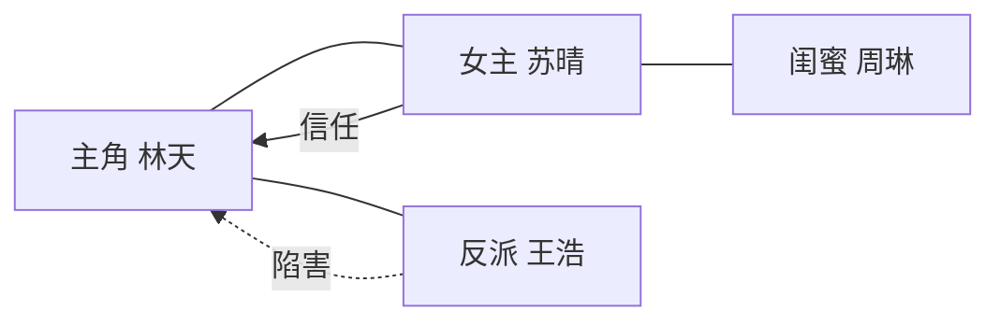
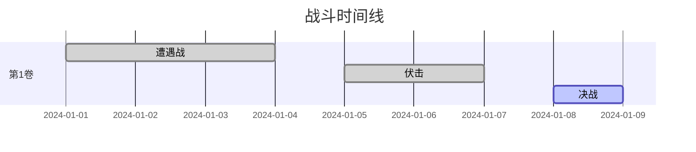
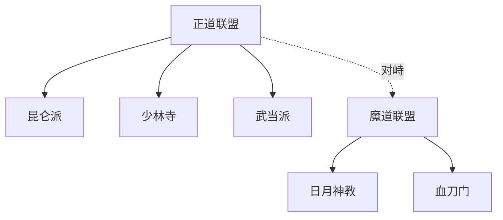
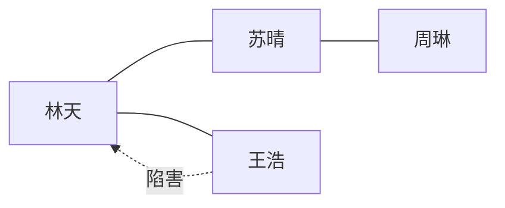

# /novel diagram - 情节图解

## 触发方式

```
/novel diagram [类型]
/novel diagram character
/novel diagram battle
/novel diagram faction
```

或对话式：
```
生成关系图
生成战斗图
生成势力图
```

---

## 功能

基于 tracking JSON 数据，自动生成 Mermaid 格式的情节可视化图。

---

## 图类型

### 1. 人物关系图（character）

读取 `spec/tracking/relationships.json`，生成关系网络图。



---

### 2. 关键战斗图（battle）

读取 `plot-tracker.json` 中类型为 `battle` 的事件，生成时间线战斗图。



---

### 3. 势力分布图（faction）

读取 `spec/tracking/plot-tracker.json`，生成势力/阵营关系图。



---

## 输出位置

```
stories/<story-name>/
└── diagrams/
    ├── relationships.md      # 人物关系图
    ├── battles.md            # 战斗时间线
    └── factions.md           # 势力分布图
```

---

## 触发时机

1. **手动触发**：用户执行 `/novel diagram` 时
2. **自动触发**：每完成5章或关键情节时，AI 自动更新关系图

---

## 示例输出

```
✅ 人物关系图已生成

📄 保存：stories/她是我唯一的异常值/diagrams/relationships.md


```

---

## 更新逻辑

- 如果文件已存在，追加新版关系（不覆盖）
- 每次更新在文件头部追加时间戳和更新原因
- 重大转折（伏笔揭晓、关系破裂）自动触发更新提醒
