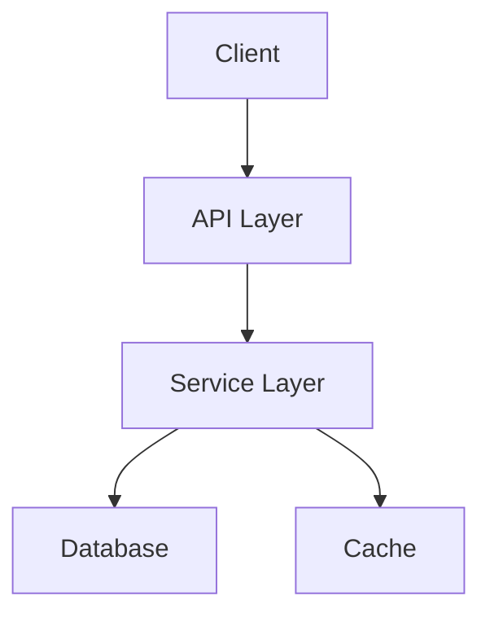

# Documentation Generator

从代码自动生成文档，保持文档与代码同步。

**Version**: 1.1  
**Features**: API 文档生成、README 更新、架构图生成、文档同步检查、C/C++ 支持 (NEW)

---

## Quick Start

### 1. 生成 API 文档

```bash
# 为整个项目生成 API 文档
python3 scripts/main.py api --source src/ --output docs/api.md

# 为特定模块生成
python3 scripts/main.py api --source src/utils/ --output docs/api-utils.md
```

### 2. 更新 README

```bash
# 自动更新 README 中的 API 列表
python3 scripts/main.py readme --update-toc

# 生成功能列表
python3 scripts/main.py readme --generate-features
```

### 3. 生成架构图

```bash
# 生成 Mermaid 架构图
python3 scripts/main.py diagram --output docs/architecture.md
```

### 4. 检查文档同步

```bash
# 检查文档是否过期
python3 scripts/main.py check

# 自动修复过期的文档
python3 scripts/main.py check --fix
```

---

## Commands

| 命令 | 说明 | 示例 |
|------|------|------|
| `api` | 生成 API 文档 | `api --source src/ --output docs/api.md` |
| `readme` | 更新 README | `readme --update-toc` |
| `diagram` | 生成架构图 | `diagram --format mermaid` |
| `check` | 检查同步 | `check --fix` |

---

## API 文档生成

### Python 支持

```python
# src/calculator.py
def calculate_discount(price: float, rate: float = 0.1) -> float:
    """
    Calculate discounted price.
    
    Args:
        price: Original price
        rate: Discount rate (0-1), default 0.1 (10%)
    
    Returns:
        Discounted price
    
    Raises:
        ValueError: If price is negative
    
    Example:
        >>> calculate_discount(100.0, 0.2)
        80.0
    """
    if price < 0:
        raise ValueError("Price cannot be negative")
    return price * (1 - rate)
```

生成的文档：

```markdown
## calculate_discount

```python
def calculate_discount(price: float, rate: float = 0.1) -> float
```

Calculate discounted price.

**Args:**
- `price` (float): Original price
- `rate` (float): Discount rate (0-1), default 0.1 (10%)

**Returns:**
- `float`: Discounted price

**Raises:**
- `ValueError`: If price is negative

**Example:**
```python
>>> calculate_discount(100.0, 0.2)
80.0
```
```

### JavaScript 支持

```javascript
/**
 * Calculate total price with tax
 * @param {number} price - Original price
 * @param {number} taxRate - Tax rate (0-1)
 * @returns {number} Total price with tax
 * @throws {Error} If price is negative
 */
function calculateTotal(price, taxRate = 0.08) {
  if (price < 0) throw new Error('Price cannot be negative');
  return price * (1 + taxRate);
}
```

---

## README 更新

### 自动生成目录

```bash
python3 scripts/main.py readme --update-toc
```

自动在 README 中插入/更新目录：

```markdown
## Table of Contents

- [Installation](#installation)
- [Usage](#usage)
- [API Reference](#api-reference)
- [Contributing](#contributing)
```

### 生成功能列表

```bash
python3 scripts/main.py readme --generate-features --source src/
```

从代码中提取所有公开函数，生成功能列表。

---

## 架构图生成

### Mermaid 图

```bash
python3 scripts/main.py diagram --format mermaid --output docs/arch.md
```

生成：
```markdown

```

### DOT 图 (Graphviz)

```bash
python3 scripts/main.py diagram --format dot --output docs/arch.dot
```

---

## 文档同步检查

### 检查过期文档

```bash
$ python3 scripts/main.py check

🔍 Documentation Check
======================
⚠️  Out of sync: docs/api.md (source modified 2 days ago)
✅ Up to date: README.md
⚠️  Missing: docs/utils.md (module src/utils/ has no docs)
```

### 自动修复

```bash
$ python3 scripts/main.py check --fix

🔄 Fixing documentation...
✅ Regenerated: docs/api.md
✅ Created: docs/utils.md
```

---

## Configuration

`.doc-gen.json`:

```json
{
  "source_dir": "src",
  "output_dir": "docs",
  "readme": "README.md",
  "formats": ["markdown", "html"],
  "include_private": false,
  "include_examples": true,
  "toc_depth": 3,
  "exclude": [
    "tests/**",
    "vendor/**"
  ]
}
```

---

## CI/CD 集成

```yaml
# .github/workflows/docs.yml
name: Documentation
on:
  push:
    branches: [main]

jobs:
  docs:
    runs-on: ubuntu-latest
    steps:
      - uses: actions/checkout@v3
      
      - name: Check Documentation
        run: python3 skills/documentation-generator/scripts/main.py check
      
      - name: Generate API Docs
        run: python3 skills/documentation-generator/scripts/main.py api --source src/ --output docs/api.md
      
      - name: Commit Changes
        run: |
          git config user.name github-actions
          git config user.email github-actions@github.com
          git add docs/
          git diff --staged --quiet || git commit -m "docs: update API documentation"
          git push
```

---

## Examples

### 场景 1：新项目初始化文档

```bash
# 1. 生成 API 文档
python3 main.py api --source src/ --output docs/api.md

# 2. 更新 README 目录
python3 main.py readme --update-toc

# 3. 生成架构图
python3 main.py diagram --output docs/architecture.md
```

### 场景 2：保持文档同步

```bash
# 每次提交前检查
python3 main.py check

# 如果发现过期，自动修复
python3 main.py check --fix
```

### 场景 3：发布前生成完整文档

```bash
# 生成所有文档
python3 main.py api --source src/ --output docs/api.md
python3 main.py readme --update-toc --generate-features
python3 main.py diagram --format mermaid --output docs/arch.md

# 打包文档
zip -r docs.zip docs/
```

---

## Supported Languages

| 语言 | API 文档 | 类型推断 | 示例提取 |
|------|----------|----------|----------|
| Python | ✅ | ✅ | ✅ |
| JavaScript | ✅ | ⚠️ | ✅ |
| TypeScript | ✅ | ✅ | ✅ |
| Go | ⚠️ | ⚠️ | ⚠️ |

---

## Files

```
skills/documentation-generator/
├── SKILL.md                    # 本文件
└── scripts/
    ├── main.py                 # ⭐ 统一入口
    ├── api_generator.py        # API 文档生成
    ├── readme_updater.py       # README 更新
    └── diagram_generator.py    # 架构图生成
```

---

## Roadmap

- [x] Python API 文档生成
- [x] README 目录更新
- [x] 文档同步检查
- [ ] JavaScript/TypeScript 完整支持
- [ ] HTML 输出格式
- [ ] 模板自定义
