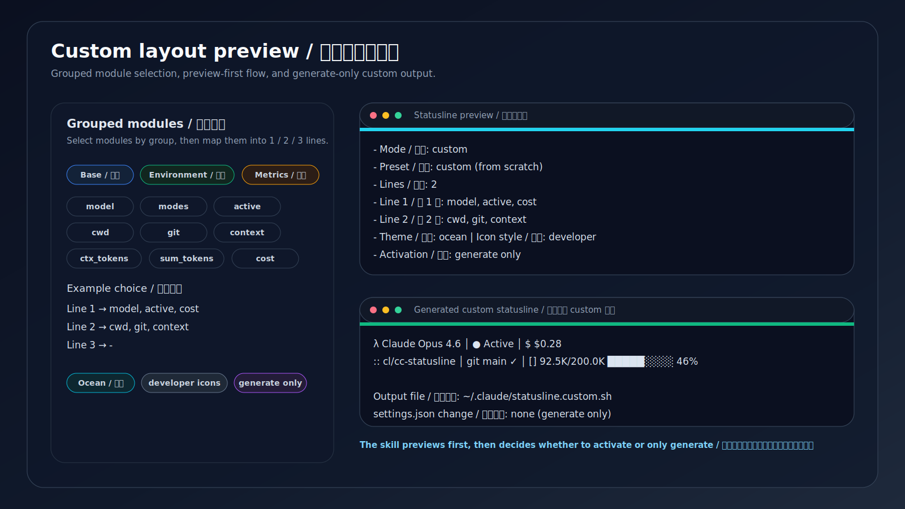
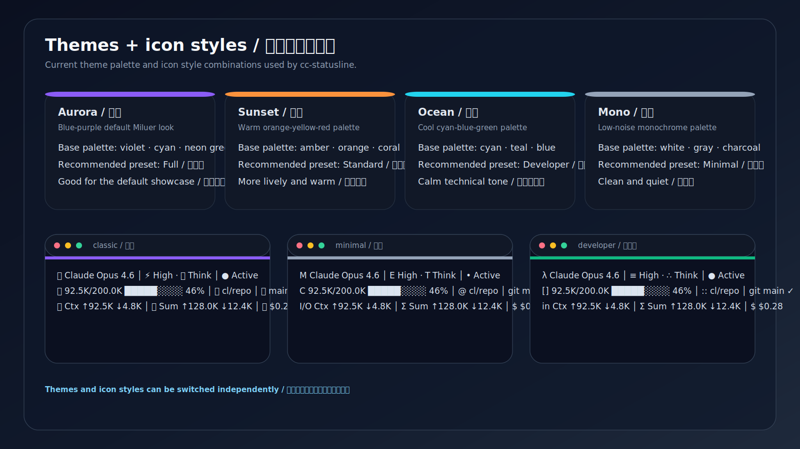
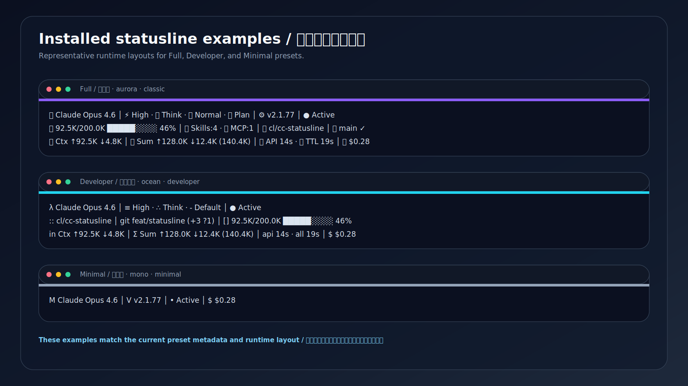
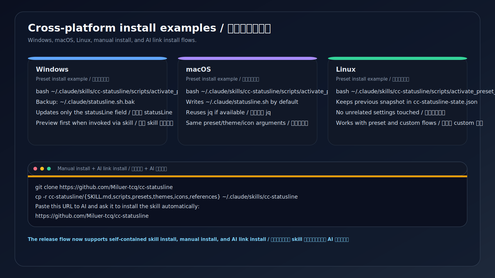

# cc-statusline

> Claude Code 状态栏助手
>
> English README: [README.en.md](README.en.md)

## 项目描述 / Project Description
- 中文：`cc-statusline` 是一个面向 Claude Code 的状态栏 skill，用来安装、切换、预览、微调和恢复状态栏，支持双语触发、预设安装、自定义布局、主题 / 图标切换，以及 Windows / macOS / Linux 三平台。
- English: `cc-statusline` is a Claude Code statusline skill for installing, switching, previewing, fine-tuning, and restoring statuslines with bilingual triggering, preset installs, custom layouts, theme / icon switching, and Windows / macOS / Linux support.

一个支持中英文触发的 Claude Code 状态栏 skill，提供预设安装、先预览后启用、交互式自定义、主题 / 图标切换，以及 Windows、macOS、Linux 三平台支持。

## 安装这个 skill

### 方式 1：把 GitHub 链接发给 AI，让它自动安装（推荐给普通用户）
把下面这个仓库链接直接发给支持 Claude Code 文件操作的 AI，然后让它安装这个 skill：

```text
https://github.com/Miluer-tcq/cc-statusline
```

可直接复制的提示词：

```text
请帮我安装这个 Claude Code skill：
https://github.com/Miluer-tcq/cc-statusline

安装目标：~/.claude/skills/cc-statusline
安装完成后告诉我如何触发它。
```

说明：
- 安装目标是 `~/.claude/skills/cc-statusline`
- 安装的是 **skill 目录**，不是 plugin
- 安装完成后，Claude Code 就能按自然语言触发这个 skill

### 方式 2：通过 GitHub 仓库手动安装
当前仓库已经扁平化，**仓库根目录就是 skill 根目录**。手动安装时，把运行所需文件复制到 `~/.claude/skills/cc-statusline`：

```bash
git clone https://github.com/Miluer-tcq/cc-statusline
mkdir -p ~/.claude/skills/cc-statusline
cp -r cc-statusline/SKILL.md cc-statusline/scripts cc-statusline/presets cc-statusline/themes cc-statusline/icons cc-statusline/references ~/.claude/skills/cc-statusline/
```

## 安装后如何使用
安装完成后，可以直接在 Claude Code 里输入：

- `帮我一键安装 Full / 完整版 状态栏`
- `帮我切换到 Developer / 开发者版 状态栏`
- `帮我生成一个 2 行自定义状态栏，主题用 ocean，图标用 developer`
- `卸载状态栏，恢复默认状态栏`

如果当前会话还没识别到新 skill，重开一次 Claude Code 会话即可。

## 功能特性
- 覆盖中英文触发表达
- 支持一键安装预设状态栏
- 支持按模块分组生成自定义布局
- 支持从零自定义或从预设微调
- 支持 1 / 2 / 3 行布局
- 支持主题与图标风格切换
- 覆盖安装前会将目标脚本备份到 `<目标路径>.bak`
- 会把旧的 `statusLine` 快照保存到 `~/.claude/cc-statusline-state.json`
- 只修改 `~/.claude/settings.json` 里的 `statusLine` 字段
- 卸载时只移除 `statusLine`，默认保留已生成脚本

## 当前仓库结构
当前仓库已经收敛为扁平结构：
- 根目录就是可安装的 `cc-statusline` skill 根目录
- `SKILL.md` 是 skill 入口
- `scripts/`、`presets/`、`themes/`、`icons/`、`references/` 是运行时资源
- `assets/screenshots/` 是 GitHub 展示资源，不影响 skill 运行
- `.skill` 打包文件可按需生成并作为 release 附件分发，不需要常驻仓库

## 手动调用 skill 内脚本
如果你已经安装了 skill，也可以直接调用 skill 目录里的脚本。

### 1. 启用预设状态栏
```bash
bash ~/.claude/skills/cc-statusline/scripts/activate_preset_statusline.sh full aurora classic
```

预设安装流程会：
- 安装或复用 `jq`
- 将目标脚本备份到 `<目标路径>.bak`
- 把旧的 `statusLine` 值保存到 `~/.claude/cc-statusline-state.json`
- 默认把运行时脚本写入 `~/.claude/statusline.sh`
- 仅修改 `~/.claude/settings.json` 里的 `statusLine` 字段
- 如果检测到外部已有 `statusLine` 配置，会先询问再覆盖

### 2. 生成自定义状态栏
生成三行自定义布局：

```bash
bash ~/.claude/skills/cc-statusline/scripts/generate_custom_statusline.sh \
  "$HOME/.claude/statusline.custom.sh" \
  "model,modes,active" \
  "cwd,git,context" \
  "ctx_tokens,sum_tokens,duration,cost" \
  "ocean" \
  "developer"
```

生成单行自定义布局：

```bash
bash ~/.claude/skills/cc-statusline/scripts/generate_custom_statusline.sh \
  "$HOME/.claude/statusline.custom.sh" \
  "model,active,cost" \
  "-" \
  "-" \
  "mono" \
  "minimal"
```

说明：
- 每一行使用逗号分隔的模块 id
- 不使用的行传 `-`
- 生成器会输出一份简洁的最终布局摘要

启用生成好的自定义脚本：

```bash
bash ~/.claude/skills/cc-statusline/scripts/activate_custom_statusline.sh "$HOME/.claude/statusline.custom.sh" ocean developer
```

后续如需切回预设：

```bash
bash ~/.claude/skills/cc-statusline/scripts/activate_preset_statusline.sh full aurora classic
```

### 3. 卸载 / 恢复默认行为
```bash
bash ~/.claude/skills/cc-statusline/scripts/uninstall_statusline.sh
```

该脚本只会移除 `~/.claude/settings.json` 中的 `statusLine` 字段。
除非用户明确要求，否则不会删除已生成的脚本文件。

### 4. `.skill` 打包
当前仓库已经支持以 skill 为核心的分发方式：
- 把仓库根目录中的 skill 文件复制到 `~/.claude/skills/cc-statusline`
- 需要发 release 时，再从当前仓库根目录临时打包为 `.skill`
- `.skill` 成品不需要常驻仓库，可作为 release 附件单独分发

## 预设
- `Full / 完整版` — 最接近当前 Miluer 风格的完整布局
- `Standard / 标准版` — 适合日常使用的均衡布局
- `Minimal / 极简版` — 视觉干扰最低
- `Developer / 开发者版` — 强调 Git 状态与 Token 可见性

## 主题
- `Aurora / 极光`
- `Sunset / 日落`
- `Ocean / 海洋`
- `Mono / 单色`

## 图标风格
- `classic / 经典`
- `minimal / 极简`
- `developer / 开发者`

## 自定义方式
这个 skill 支持：
- 直接选择预设
- 从零开始按分组选择模块
- 先选预设再微调模块
- 选择 1 / 2 / 3 行布局
- 优先选择现有主题，再做颜色微调
- 切换图标风格
- 先生成 `~/.claude/statusline.custom.sh`，再决定是否启用

标准模块分组见 `references/modules.md`。
触发词示例见 `references/trigger-phrases.md`。

## 截图

### 预设选择 / Preset selection


### 自定义布局预览 / Custom layout preview


### 主题与图标风格 / Themes and icon styles


### 安装后的状态栏示例 / Installed statusline examples


### 三平台安装示例 / Cross-platform install examples

