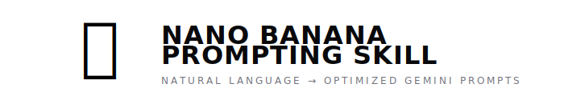

<p align="center">
  
</p>

<p align="center">
  <a href="https://clawhub.ai/skills/nano-banana-prompting"></a>
  <a href="https://github.com/minilozio/nano-banana-prompting-skill/blob/main/LICENSE"></a>
  
  
</p>

---

Your AI agent's image prompts are mid. This skill fixes that.

**Transform natural language into optimized structured prompts** for Gemini image generation. Works with [OpenClaw](https://openclaw.ai) and [Claude Code](https://code.claude.com).

You say *"a gecko eating pizza on a skateboard"* → the skill builds a detailed JSON prompt with camera specs, lighting, materials, composition → Gemini produces a cinematic masterpiece instead of AI slop.

## Before / After

Same model (Gemini 3 Pro). Same subject. Different prompting.

| Plain Prompt | With This Skill |
|:---:|:---:|
|  |  |
| *"a gecko in a hoodie by a barrel fire"* | *Structured JSON with Sony A7IV, 35mm f/1.4, Kodak Portra 400, chiaroscuro lighting...* |

| Plain Prompt | With This Skill |
|:---:|:---:|
|  |  |
| *"sunflowers in watercolor"* | *Structured JSON with cold press paper, wet-on-wet technique, limited palette...* |

## How It Works

```
You: "generate a gecko coding at night"
         │
         ▼
    ┌──────────────────────┐
    │  Skill detects style │ → Cinematic / Photorealistic
    │  Builds JSON prompt  │ → Camera, lens, lighting, film stock, mood...
    └──────────┬───────────┘
               │
               ▼
    Gemini 3 Pro Image generates with the structured prompt
               │
               ▼
    🖼️ Cinematic quality output
```

The skill doesn't add new scripts or dependencies. It teaches your agent **how to prompt** — using structured JSON templates optimized for each visual style.

## Supported Styles

Your agent **auto-detects** the right style from your request, or you can specify one:

| Style | Example Request |
|-------|----------------|
| 🎬 **Cinematic / Photo** | "a portrait of an old fisherman at golden hour" |
| 📸 **Product / Studio** | "product shot of a perfume bottle on marble" |
| 🖌️ **Illustration** | "concept art of a floating city" |
| 🌸 **Anime / Manga** | "anime girl on a train, Makoto Shinkai style" |
| 🧸 **3D / Pixar** | "cute robot character, Pixar style" |
| 🎨 **Watercolor** | "paint me some sunflowers, watercolor" |
| ✏️ **Minimalist** | "flat design icon of a mountain" |
| 🌀 **Surreal** | "a clock melting over a desert, Dalí style" |

## Install

### ClawHub (recommended)
```bash
clawhub install nano-banana-prompting
```

### OpenClaw (manual)
```bash
cd ~/.openclaw/workspace/skills
git clone https://github.com/minilozio/nano-banana-prompting-skill.git
```

### Claude Code

```bash
mkdir -p .claude/skills
cd .claude/skills
git clone https://github.com/minilozio/nano-banana-prompting-skill.git
```

### Setup

1. Get a [Gemini API key](https://aistudio.google.com/apikey) (free tier available)
2. Set the environment variable:
```bash
export GEMINI_API_KEY="your-key-here"
```

**Requires:** The `nano-banana-pro` skill (bundled with OpenClaw) or any Gemini image generation script.

## Usage

Just talk to your agent naturally:

- *"Generate a photo of a cat in a coffee shop"*
- *"Draw me a dragon in watercolor style"*
- *"Make a Pixar-style robot holding a flower"*
- *"Create an anime scene of a girl reading in the rain"*
- *"Product shot of headphones on a dark background"*
- *"Surreal painting of a whale flying through clouds"*

The agent reads `SKILL.md`, detects the style, builds the optimized JSON, and generates the image. Zero manual prompting needed.

## Why Structured Prompts?

Plain text prompts leave too much to chance. The model fills in blanks with generic defaults.

Structured JSON prompts specify:
- **Camera & lens** (for photorealistic — Sony A7IV, 85mm f/1.8)
- **Film stock** (Kodak Portra 400, CineStill 800T)
- **Lighting setup** (three-point, golden hour, chiaroscuro)
- **Art technique** (wet-on-wet, cel shading, impasto)
- **Render engine** (Pixar RenderMan, Blender Cycles)
- **Composition** (rule of thirds, leading lines, negative space)
- **Color palette** (specific colors, not "colorful")
- **Negative prompt** (what to avoid — text, artifacts, wrong style)

The result: consistent, professional-quality images every time.

## Examples

See the [SKILL.md](SKILL.md) for full JSON examples for every style.

## License

MIT — do whatever you want with it.

---

Built by [@minilozio](https://x.com/minilozio) 🦎
