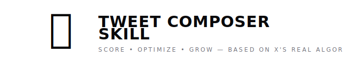

<p align="center">
  
</p>

<p align="center">
  <a href="https://clawhub.com/skills/tweet-composer"></a>
  <a href="https://github.com/minilozio/tweet-composer-skill/blob/main/LICENSE"></a>
  
  
</p>

---

An OpenClaw skill that scores and optimizes your tweets based on **X's actual open-source ranking algorithm** — not generic growth-hacker tips.

We read all ~21,000 lines of X's official open-source recommendation algorithm (released February 2026) and extracted the real ranking rules into a scoring engine your agent can use.

## 🧠 How It Works

X's "For You" feed is ranked by a **Grok-based transformer** (codename Phoenix) that predicts **19 engagement actions** for every candidate tweet. The final ranking score is:

```
score = Σ(weight_i × P(action_i))
```

This skill encodes the structural rules from that pipeline — what actions exist, how they're weighted, what gets filtered, what gets penalized — into a practical scoring system.

## ⚡ What It Does

### 📊 Tweet Scoring (0-100)

Give your agent a draft tweet and get a detailed score:

```
🐦 Tweet Composer — Score: 84/100

✅ Length: 142 chars (sweet spot 100-200)
✅ No links in body
✅ Native image attached (+P(photo_expand) boost)
✅ Ends with question (drives P(reply))
⚠️ No video (missing P(video_quality_view) signal)
❌ Posted at 22:00 CET (off-peak for EU audience)

📊 Predicted Action Boost:
├─ P(reply): HIGH — question drives discussion
├─ P(favorite): HIGH — visual + clear value
├─ P(share_via_dm): MEDIUM — niche but shareable
├─ P(dwell): HIGH — image makes people stop
└─ P(not_interested): LOW ✅

💡 Suggestions:
→ Post at 16:00 CET for peak EU engagement
→ Consider a short video walkthrough instead of screenshot

✏️ Optimized version:
"Built a doctor for my Mac. One command: health score,
security audit, cleanup suggestions. Open source.
What would you add to the checklist? 🩺"
→ Reply with: GitHub link
```

### 🧵 Thread Optimization

The algorithm's `DedupConversationFilter` keeps only the highest-scored tweet per conversation. The skill ensures your first tweet is the strongest hook.

### 📐 19-Action Analysis

For each draft, the skill estimates impact on all 19 predicted actions:
- **15 positive** (favorite, reply, repost, quote, share, share_via_dm, share_via_copy_link, click, profile_click, video_quality_view, photo_expand, dwell, dwell_time, quoted_click, follow_author)
- **4 negative** (not_interested, block_author, mute_author, report)

### 🎯 Content Strategy

Built-in content mix guidance based on empirical analysis:
- 40% entertaining, 30% educational, 20% inspirational, 10% promotional

## 🔬 Key Algorithm Insights

Discoveries from reading the actual source code:

| Finding | Details |
|---------|---------|
| **19 actions predicted simultaneously** — not just "engagement" | Each tweet gets 19 separate probability scores |
| **Author Diversity Scorer** — your 2nd tweet gets ~55% score, 3rd ~33% | Exponential decay per author in a single feed |
| **Candidate Isolation** — each tweet scored independently | Candidates can't see each other in the attention mask |
| **Video duration gate** — short clips don't get VQV weight | Video must exceed minimum duration threshold |
| **Deep reply chains filtered** — only first-level replies survive | In-network store drops reply-to-reply-to-reply |
| **Share via DM has its own weight** — separate from generic share | 3 separate share signals: generic, DM, copy link |
| **dwell_time is continuous** — not boolean, measured in seconds | Longer reading time = proportionally higher score |
| **Signed action encoding** — model knows what you did AND didn't do | Actions encoded as +1 (did) / -1 (didn't) |

## 📦 Install

### ClawHub (recommended)
```bash
clawhub install tweet-composer
```

### Manual
```bash
git clone https://github.com/minilozio/tweet-composer-skill.git
# Copy to your OpenClaw skills directory
```

## 🗂️ Skill Structure

```
tweet-composer-skill/
├── SKILL.md              # Main skill instructions + scoring rubric
├── references/
│   └── algorithm-rules.md # Complete algorithm rules engine (19 actions, filters, scorers)
├── assets/
│   └── banner.svg
├── LICENSE
└── README.md
```

## 💡 Usage Examples

```
"Score this tweet: Just shipped a new feature. Check it out!"

"Optimize this thread for maximum reach"

"What's wrong with this tweet? Why did it get low engagement?"

"Write me a tweet about [topic] that maximizes reply potential"

"Should I post this now or wait for peak hours?"
```

## 📚 Algorithm Source

All rules are derived from X's official open-source recommendation algorithm, released February 2026. We read every file — ~21K lines of Rust + Python/JAX.

## 📄 License

MIT — see [LICENSE](LICENSE)

---

<p align="center">
  Built by <a href="https://x.com/minilozio">@minilozio</a> 🦎
</p>
