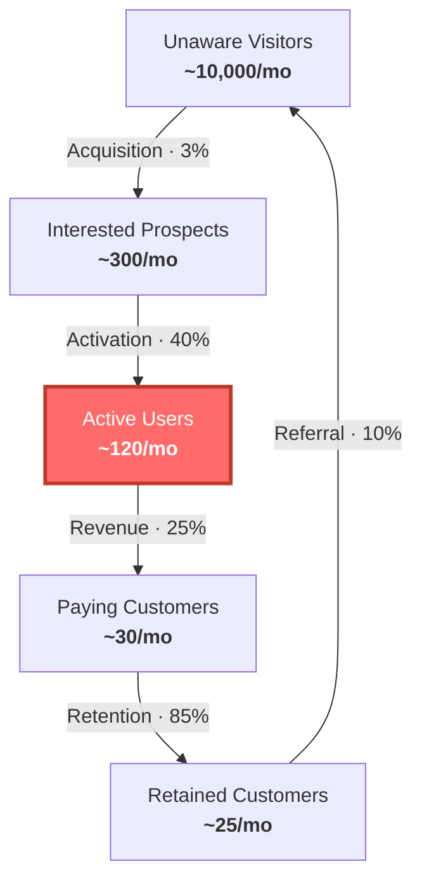

# Weekly Review Diagram

One diagram for the weekly constraint review. Write it as a `.mmd` file, then
render with `scripts/render-diagram.mjs`.

## Customer Factory Funnel

Visualize the five macro steps with conversion rates. Highlight the constraint
node in red.



**Rules:**
- Replace numbers with the startup's actual (or estimated) metrics.
- Apply the red highlight (`fill:#ff6b6b,stroke:#c0392b,stroke-width:3px,color:#fff`)
  to the node representing the current constraint.
- If the constraint is between steps (a conversion rate), highlight both adjacent
  nodes.
- Add a note below identifying the constraint in plain language.

## Rendering

Install dependencies once:
```bash
cd scripts && npm install
```

Render:
```bash
node scripts/render-diagram.mjs funnel.mmd funnel.svg
node scripts/render-diagram.mjs funnel.mmd funnel.svg --theme brand-light
```

**Themes:**
- `brand-dark` — dark palette (violet/indigo). Default when no `--theme` flag.
- `brand-light` — white background with violet accents. Use for docs or slides.
- Others: `zinc-dark`, `tokyo-night`, `catppuccin-mocha`, `nord`, `dracula`,
  `github-dark`, `zinc-light`, `tokyo-night-light`, `catppuccin-latte`, `github-light`.
