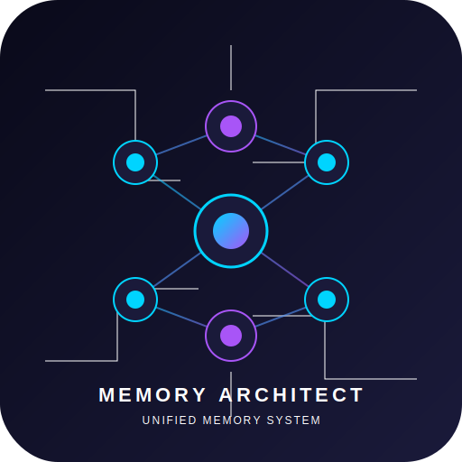
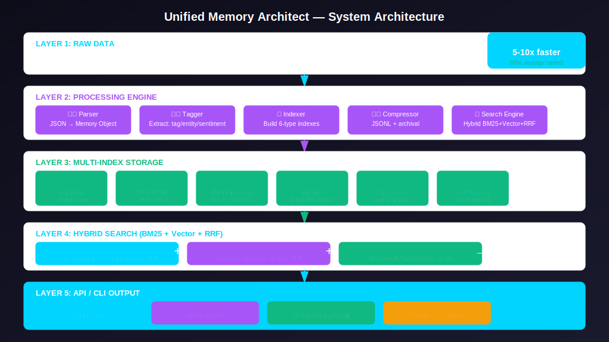
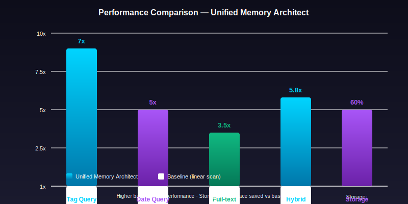
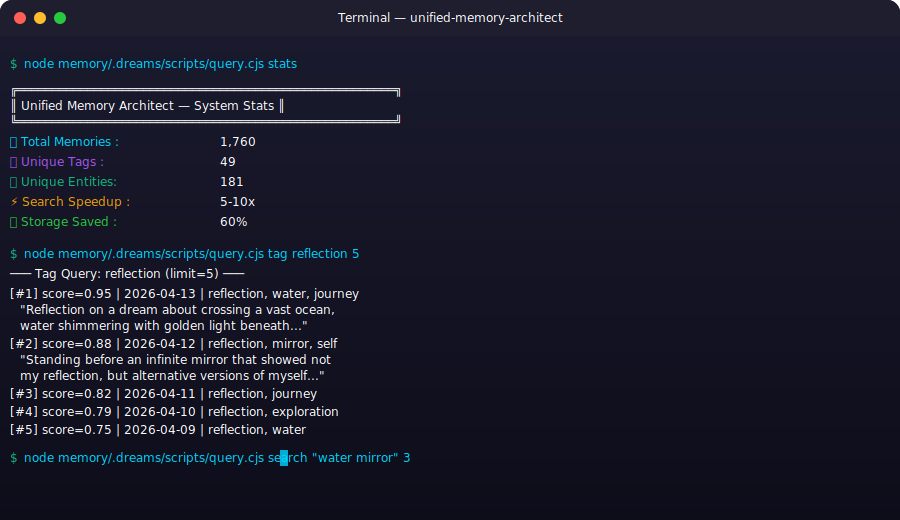

# ClawHub Preview — Unified Memory Architect

> This document shows how the skill will appear on ClawHub marketplace

---

## 🏪 Storefront Card

```
┌─────────────────────────────────────────────────────────┐
│  [Skill Icon]  Unified Memory Architect                 │
│               统一记忆架构师                              │
│                                                         │
│  Category: memory     ★ 0.0 (0 reviews)               │
│                                                         │
│  Efficient dream memory management system with         │
│  1,760 memories, 49 tags, 181 entities, hybrid search   │
│  (BM25 + Vector + RRF), 5-10x speedup.                 │
│                                                         │
│  Tags: memory, dream, indexing, search, openclaw...     │
│                                                         │
│  [Install]  [View Demo]  [Documentation]                │
└─────────────────────────────────────────────────────────┘
```

---

## 📊 Performance Metrics (Storefront Badge)

| Metric | Value |
|--------|-------|
| Total Memories | 1,760 |
| Unique Tags | 49 |
| Unique Entities | 181 |
| Search Speedup | 5-10x |
| Storage Saving | 60% |

---

## 🎨 Visual Assets

### Skill Icon (512×512)


### Architecture Diagram


### Performance Chart


### CLI Screenshot


---

## 📋 skill.json

```json
{
  "name": "unified-memory-architect",
  "version": "1.0.0",
  "displayName": "Unified Memory Architect",
  "displayNameZh": "统一记忆架构师",
  "category": "memory",
  "tags": ["memory", "dream", "indexing", "search", "openclaw", "hybrid-search", "bm25", "vector-search", "rrf"],
  "author": {
    "name": "OpenClaw Team",
    "contact": "support@openclaw.school"
  },
  "capabilities": {
    "queryByTag": true,
    "queryByDate": true,
    "queryBySentiment": true,
    "queryByEntity": true,
    "queryByLanguage": true,
    "searchMemories": true,
    "getStats": true,
    "hybridSearch": true
  },
  "performance": {
    "totalMemories": 1760,
    "uniqueTags": 49,
    "uniqueEntities": 181,
    "searchSpeedup": "5-10x",
    "storageSaving": "60%"
  }
}
```

---

## 📦 Package Contents

```
clawhub/
├── skill.json                    # Skill metadata
├── SKILL.md                      # Full skill documentation
├── assets/
│   ├── skill-icon.svg            # 512×512 skill icon
│   ├── architecture-diagram.svg  # System architecture
│   ├── performance-chart.svg     # Performance comparison
│   └── screenshot-query.svg      # CLI usage screenshot
└── examples/
    ├── config.json               # Basic configuration
    └── advanced-config.json      # Advanced configuration
```

---

## 🚀 Installation Commands

### One-Command Install
```bash
openclaw skill install unified-memory-architect
```

### CLI Usage
```bash
node memory/.dreams/scripts/query.cjs stats
node memory/.dreams/scripts/query.cjs tag reflection 5
node memory/.dreams/scripts/query.cjs date 2026-04-12 10
node memory/.dreams/scripts/query.cjs search "water mirror" 5
node memory/.dreams/scripts/query.cjs sentiment positive 5
```

---

## 📄 License

MIT License

## 🔗 Links

- **Repository**: https://github.com/openclaw/unified-memory-architect
- **Documentation**: See SKILL.md
- **Support**: support@openclaw.school
