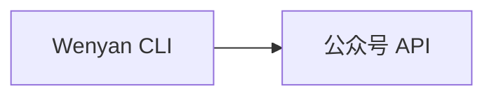
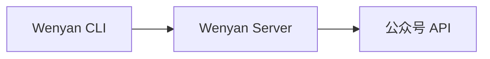

<div align="center">
    
</div>

# 文颜 CLI

[](https://www.npmjs.com/package/@wenyan-md/cli)
[](LICENSE)

[](https://hub.docker.com/r/caol64/wenyan-cli)
[](https://github.com/caol64/wenyan-cli)

## 简介

**[文颜（Wenyan）](https://wenyan.yuzhi.tech)** 是一款多平台 Markdown 排版与发布工具，支持将 Markdown 一键转换并发布至：

-   微信公众号
-   知乎
-   今日头条
-   以及其它内容平台（持续扩展中）

文颜的目标是：**让写作者专注内容，而不是排版和平台适配**。

## 文颜的不同版本

文颜目前提供多种形态，覆盖不同使用场景：

-   [macOS App Store 版](https://github.com/caol64/wenyan) - MAC 桌面应用
-   [跨平台桌面版](https://github.com/caol64/wenyan-pc) - Windows/Linux
-   👉[CLI 版本](https://github.com/caol64/wenyan-cli) - 本项目
-   [MCP 版本](https://github.com/caol64/wenyan-mcp) - AI 自动发文

## 特性

- 一键发布 Markdown 到微信公众号草稿箱
- 支持删除草稿、提交正式发布、查询正式发布状态
- 自动上传本地图片与封面
- 支持远程 Server 发布（绕过 IP 白名单限制）
- 内置多套精美排版主题
- 支持自定义主题
- 可作为 CI/CD 自动发文工具
- 可集成 AI Agent 自动发布

## 快速开始

```bash
# 安装
npm install -g @wenyan-md/cli
# 发布文章到公众号
wenyan publish -f article.md
```

## 命令概览

```bash
wenyan <command> [options]
```

| 命令      | 说明        |
| ------- | --------- |
| [publish](docs/publish.md) | 渲染并上传文章到草稿箱 |
| `draft get` | 获取单篇公众号草稿详情 |
| `draft list` | 分页获取草稿列表 |
| `draft count` | 获取草稿总数 |
| `draft delete` | 删除公众号草稿 |
| `draft publish` | 提交草稿为正式发布任务 |
| `published list` | 分页获取已发布文章列表 |
| `published get` | 获取已发布文章详情 |
| `published delete` | 删除已发布文章 |
| `publish-status` | 查询正式发布任务状态 |
| render  | 渲染 HTML   |
| [theme](docs/theme.md)   | 管理主题      |
| [serve](docs/server.md)   | 启动 Server |

## 概念

### 内容输入

内容输入是指如何把 Markdown 文章分发给 `wenyan-cli`，支持以下四种方式：

| 方式      | 示例        | 说明        |
| ------- | --------- |--------- |
| 本地路径（推荐） | `wenyan publish -f article.md`      |`cli`直接读取磁盘上的文章      |
| URL | `wenyan publish -f http://test.md`      |`cli`直接读取网络上的文章      |
| 参数 | `wenyan publish "# 文章"`      |适用于快速发布短内容     |
| 管道 | `cat article.md \| wenyan publish`      |适用于 CI/CD，脚本批量发布      |

### 环境变量配置

> [!IMPORTANT]
>
> 请确保运行文颜的机器已配置如下环境变量，否则上传接口将调用失败。

-   `WECHAT_APP_ID`
-   `WECHAT_APP_SECRET`

### 微信公众号 IP 白名单

> [!IMPORTANT]
>
> 请确保运行文颜的机器 IP 已加入微信公众号后台的 IP 白名单，否则上传接口将调用失败。

配置说明文档：[https://yuzhi.tech/docs/wenyan/upload](https://yuzhi.tech/docs/wenyan/upload)

### 文章格式

为了正确上传文章，每篇 Markdown 顶部需要包含一段 `frontmatter`：

```md
---
title: 在本地跑一个大语言模型(2) - 给模型提供外部知识库
cover: /Users/xxx/image.jpg
author: xxx
source_url: http://
---
```

字段说明：

-   `title` 文章标题（必填）
-   `cover` 文章封面
    -   本地路径或网络图片
    -   如果正文中已有图片，可省略
-   `author` 文章作者
-   `source_url` 原文地址

**[示例文章](tests/publish.md)**

### 文内图片和文章封面

把文章发布到公众号之前，文颜会按照微信要求自动处理文章内的所有图片，将其上传到公众号素材库。目前文颜对于以下两种图片都能很好的支持：

- 本地硬盘绝对路径（如：`/Users/xxx/image.jpg`）
- 网络路径（如：`https://example.com/image.jpg`）

仅当“内容输入”方式为“本地路径”时，以下路径也能完美支持：

- 当前文章的相对路径（如：`./assets/image.png`）

## Server 模式

相较于纯本地运行的**本地模式（Local Mode）**，`wenyan-cli`还提供了 **远程客户端模式（Client–Server Mode）**。两种模式运行效果完全一致，你可以根据运行环境和网络条件选择最合适的方式。

在本地模式下，CLI 直接调用微信公众号 API 完成图片上传和草稿发布。



在远程客户端模式下，CLI 作为客户端，将发布请求发送到部署在云服务器上的 Wenyan Server，由 Server 完成微信公众号 API 调用。



**适用于：**

* 无本地固定 IP，需频繁添加IP 白名单的用户
* 需团队协作的用户
* 支持 CI/CD 自动发布
* 支持 AI Agent 自动发布

**[Server 模式部署](docs/server.md)**

客户端调用 Server 发布：

```bash
wenyan publish -f article.md --server https://api.example.com --api-key your-api-key
```

草稿管理与正式发布：

```bash
# 获取单篇草稿
wenyan draft get MEDIA_ID

# 获取草稿列表（支持 --offset / --count / --no-content）
wenyan draft list --count 10

# 获取草稿总数
wenyan draft count

# 删除草稿
wenyan draft delete MEDIA_ID

# 提交正式发布，并等待结果
wenyan draft publish MEDIA_ID --wait

# 查询某个发布任务
wenyan publish-status PUBLISH_ID

# 获取已发布文章列表
wenyan published list --count 10

# 获取已发布文章详情
wenyan published get ARTICLE_ID

# 删除已发布文章；--index 0 表示整篇删除
wenyan published delete ARTICLE_ID --index 0
```

## 赞助

如果你觉得文颜对你有帮助，可以给我家猫咪买点罐头 ❤️

[https://yuzhi.tech/sponsor](https://yuzhi.tech/sponsor)

## License

Apache License Version 2.0
