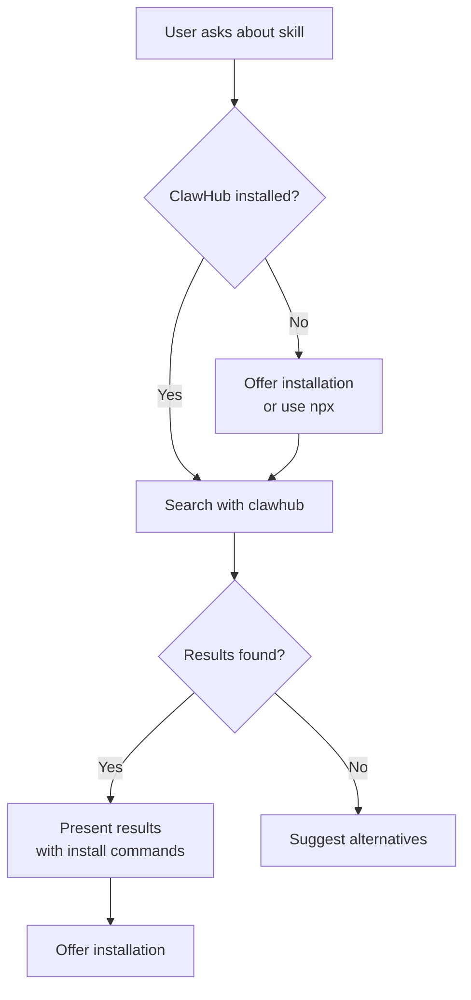

# Development Guide: find-skills-for-clawhub

This document describes how to create a ClawHub search skill for OpenClaw, similar to the existing `find-skills` skill for the skills.sh ecosystem.

## Overview

The goal is to create an OpenClaw skill that helps users discover and install skills from the ClawHub registry (https://clawhub.ai). This skill should:

1. Guide users on installing the ClawHub CLI
2. Provide search functionality for finding skills
3. Show how to install discovered skills
4. Integrate seamlessly with OpenClaw's skill system

## Prerequisites

- OpenClaw installation
- Node.js and npm (for ClawHub CLI)
- Basic understanding of OpenClaw skills structure

## Step 1: Skill Structure

A OpenClaw skill typically consists of:

```
find-skills-for-clawhub/
├── SKILL.md              # Main skill documentation
├── scripts/              # Optional helper scripts
│   ├── search-clawhub.ps1
│   └── search-clawhub.sh
└── DEVELOPMENT.md       # This file
```

## Step 2: SKILL.md Content

The `SKILL.md` file is the core of the skill. It should include:

1. **Metadata** (YAML frontmatter): Name and description
2. **When to Use**: Trigger conditions for the skill
3. **Prerequisites**: Installation requirements
4. **Usage Instructions**: How to search and install
5. **AI Assistant Guide**: Specific steps for the AI to follow
6. **Examples**: Common workflows
7. **Troubleshooting**: Common issues and solutions

## Step 3: Integration Points

### 3.1. CLI Tool Integration

The skill relies on the ClawHub CLI. You have two options:

1. **Global installation** (recommended):
   ```bash
   npm i -g clawhub
   ```

2. **npx usage** (no installation):
   ```bash
   npx clawhub search "query"
   ```

### 3.2. OpenClaw Tool Usage

When implementing this skill, the AI assistant can use OpenClaw's `exec` tool to run ClawHub commands:

```javascript
// Example tool call in AI thinking
exec({
  command: 'clawhub search "weather" --limit 5'
})
```

### 3.3. Skill Activation

The skill should activate when users ask about:
- Finding OpenClaw skills
- "How do I do X with OpenClaw?"
- Searching for capabilities
- Installing new skills

## Step 4: Search Implementation

### 4.1. Basic Search Flow



### 4.2. Command Examples

```bash
# Search
clawhub search "weather forecast" --limit 5

# Install
clawhub install weather-forecast

# List installed
clawhub list

# Update all
clawhub update --all
```

### 4.3. Output Parsing

Typical search output format:
```
Search results for "weather":

1. weather-forecast v1.2.0 (1,234 installs)
   - Provides weather forecasts using Open-Meteo API
   - Tags: weather, api, forecast
   
2. weather-alerts v0.5.1 (845 installs)
   - Sends weather alerts and notifications
   - Tags: weather, alerts, notifications
   
Install with: clawhub install <skill-slug>
```

## Step 5: Helper Scripts (Optional)

You can create helper scripts to simplify the process:

- `scripts/search-clawhub.ps1`: PowerShell script for Windows
- `scripts/search-clawhub.sh`: Bash script for Linux/macOS

These scripts handle:
- Checking if ClawHub is installed
- Falling back to npx if needed
- Error handling (rate limits, network issues)
- Formatting output

## Step 6: Testing the Skill

1. **Install ClawHub CLI**:
   ```bash
   npm i -g clawhub
   ```

2. **Test search functionality**:
   ```bash
   clawhub search "test" --limit 2
   ```

3. **Test installation** (with a real skill):
   ```bash
   clawhub install weather-forecast  # if exists
   ```

4. **Test in OpenClaw**:
   - Place skill in OpenClaw skills directory
   - Start new OpenClaw session
   - Ask "How can I find skills for weather forecasts?"

## Step 7: Publishing to ClawHub

Once your skill is ready, you can publish it to ClawHub:

1. **Login to ClawHub**:
   ```bash
   clawhub login
   ```

2. **Publish the skill**:
   ```bash
   clawhub publish ./find-skills-for-clawhub \
     --slug find-skills-for-clawhub \
     --name "Find Skills for ClawHub" \
     --version 1.0.0 \
     --tags "discovery,skills,clawhub"
   ```

3. **Or use sync** (for multiple skills):
   ```bash
   clawhub sync --all
   ```

## Step 8: Advanced Features (Optional)

### 8.1. Caching Search Results

To avoid rate limits, you could implement caching:

```bash
# Simple file-based cache
CACHE_DIR="$HOME/.cache/clawhub-searches"
mkdir -p "$CACHE_DIR"
CACHE_FILE="$CACHE_DIR/$(echo "$QUERY" | md5sum | cut -d' ' -f1).txt"
```

### 8.2. Integration with OpenClaw Memory

Store frequently searched terms in OpenClaw's memory system:
- Update `memory/YYYY-MM-DD.md` with search history
- Track which skills users install frequently

### 8.3. Skill Recommendations

Based on user queries, recommend related skills:
- If user searches for "weather", also suggest "calendar" and "travel" skills
- Maintain a skill taxonomy/tag system

## Step 9: Common Issues and Solutions

### 9.1. Rate Limiting

**Issue**: `Rate limit exceeded` error
**Solutions**:
- Log in with `clawhub login`
- Implement caching
- Use fewer searches per minute

### 9.2. ClawHub CLI Not Found

**Issue**: `clawhub: command not found`
**Solutions**:
- Install with `npm i -g clawhub`
- Use npx: `npx clawhub search`
- Check PATH environment variable

### 9.3. No Search Results

**Issue**: No skills found for query
**Solutions**:
- Try broader search terms
- Check https://clawhub.ai directly
- Consider creating the skill yourself

### 9.4. Permission Issues

**Issue**: Cannot install skills
**Solutions**:
- Check workspace permissions
- Run as administrator (if needed)
- Use `--workdir` flag to specify install location

## Step 10: Future Enhancements

1. **Web API Integration**: Direct API calls instead of CLI
2. **GUI Interface**: Browser-based skill discovery
3. **Skill Ratings**: Display user ratings and reviews
4. **Dependency Tracking**: Show skill dependencies
5. **Version Compatibility**: Check skill compatibility with OpenClaw version

## Related Resources

- [ClawHub Documentation](https://docs.openclaw.ai/tools/clawhub)
- [OpenClaw Skills Guide](https://docs.openclaw.ai/tools/skills)
- [ClawHub Website](https://clawhub.ai)
- [OpenClaw Discord](https://discord.com/invite/clawd)

## Conclusion

Creating a `find-skills-for-clawhub` skill involves:
1. Understanding ClawHub CLI capabilities
2. Designing a user-friendly search interface
3. Handling edge cases (installation, rate limits)
4. Integrating with OpenClaw's skill system

This skill helps bridge the gap between users' needs and the growing ecosystem of OpenClaw skills, making it easier for users to extend their assistant's capabilities.

---

*Last updated: $(date)*