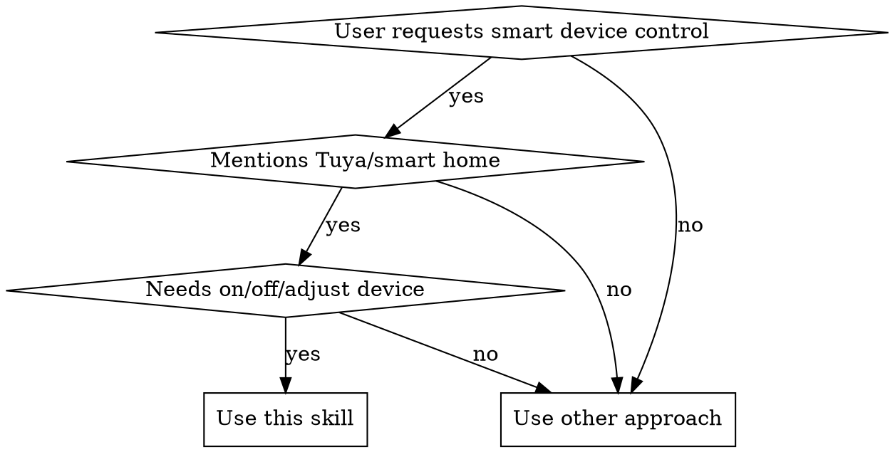
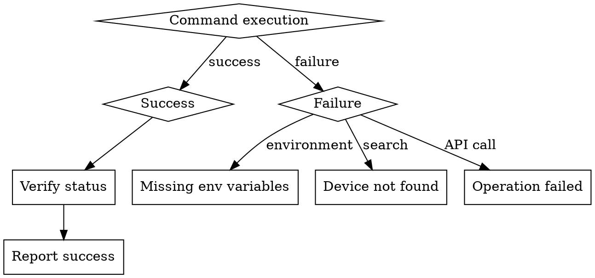

# Tuya Smart Device Control

## Overview

Control smart devices and scene automation remotely through Tuya IoT Cloud Development Platform API interfaces, supporting:

- **Device Control**: On/off control, status queries, brightness/temperature adjustment, batch operations
- **Scene Management**: Create scene automation, query scene automation
- **Device Search**: Search devices by name, get device list and status
- **Automation Rules**: Trigger device operations based on conditions, e.g., "Turn off desk lamp when socket is turned on"

## When to Use

**Use cases:**
- User says "Turn on/off smart device/lamp/AC"
- User says "Adjust light brightness" "Set temperature"
- User mentions "涂鸦" "Tuya" "smart home"
- User needs to query device status
- User needs to batch control multiple devices
- User needs to manage scene automation: "create automation", "query automation", "set automation rules"
- User mentions "场景" "scene" "自动化" "automation"

**Not applicable for:**
- Non-Tuya platform devices (Xiaomi, HomeKit, etc.)
- Pure documentation queries (use Read tool directly)
- Device firmware updates or advanced configuration

## Implementation

### Step 1: Environment Configuration ⚠️ CRITICAL: Environment Variable Management

Please read reference/config.md for detailed instructions and examples on environment variable configuration.

### Step 2: Verify Configuration

Read environment variables from config.env. If any are missing (TUYA_ACCESS_ID, TUYA_ACCESS_SECRET, TUYA_UID,TUYA_ENDPOINT), prompt the user that these configurations must be provided and stop executing subsequent operations. If configuration exists, continue with the workflow.

### Step 3: Workflow

#### 1. Device-Related Operations

If involving:
- Device search
- Device list
- Turn on device
- Turn off device
- Adjust device (brightness, temperature)
- Device control (on/off, adjust)
- Status query
- Batch operations, turn on, turn off
- Set temperature

Please read reference/device.md for detailed steps and example commands.

#### 2. Scene-Related Operations
If involving:
- When one device turns on, need to control another device
- Automatically turn on socket at 19:00 every day
- Open curtains when weather is sunny
- Scene automation
- Scene query
Please read reference/scene.md for detailed steps and example commands.

### Script File Structure and CLI Tool Design:

**Important**: Script files are located in the project root directory, with the skill directory containing symbolic links to maintain a single source of truth.

- **CLI Tool**: `scripts/tuya-cli.py`
- **Core Manager**: `scripts/tuya_manager.py`
- **Python Dependencies**: `scripts/requirements.txt`
- **Environment Variable Configuration**: Environment variables are set through the `config.env` file
- **Environment Setup**: Python scripts use venv to manage dependencies. Ensure you are executing in the correct environment. Don't forget to run `source venv/bin/activate && source config.env` when running Python scripts.

### Error Handling Flow

## Common Mistakes

| Error | Cause | Solution |
|------|------|---------|
| `Device not found` | Device not authorized to cloud project | Authorize device to cloud project in Tuya Smart App |
| `Initialization failed` | Environment variables not set | Check TUYA_ACCESS_ID, TUYA_ACCESS_SECRET, TUYA_UID |
| `Operation failed` | Device offline or DP code mismatch | Check device online status, try different --switch parameters |
| `Command not found` | Executed in wrong directory | Ensure command is executed in project root directory |
| `No search results` | Device name doesn't match | Try different keywords, or use list to view all devices |
| `Multiple devices returned` | Search term too broad | Use more specific keywords, or let user choose |

## Red Flags - STOP and Check

These signs indicate you may have skipped critical steps:

- ❌ **Executing commands directly without checking environment variables** - Must first verify TUYA_ACCESS_ID, TUYA_ACCESS_SECRET, TUYA_UID
- ❌ **Not verifying status after executing control commands** - Must use status command to confirm operation succeeded
- ❌ **Giving up after trying only one search keyword** - Should try multiple variations ("客厅灯", "客厅", "light")
- ❌ **Automatically selecting first result when device search returns multiple** - Must let user confirm which one to select
- ❌ **Ignoring API error messages and retrying directly** - Should analyze error cause and take appropriate measures
- ❌ **Executing commands in wrong directory** - Must execute in project root directory
- ❌ **Assuming device is on/off without verification** - Must use status command to confirm

**If you find yourself doing any of the above, stop and start over.**
