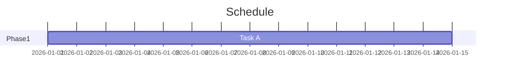

# Presentation Agent

Convert Markdown to slides via Marp CLI with Mermaid diagram support.

## Quick Start

```bash
bash scripts/md2slide.sh <input.md> [pdf|pptx|html] [output_dir]
```

## Markdown Format

Use standard Marp syntax. `---` separates slides. Add frontmatter:

```markdown
---
marp: true
theme: default
paginate: true
---
# Title Slide
---
## Content Slide
- Point 1
- Point 2
```

## Mermaid Diagrams

Include mermaid code blocks directly. They are auto-rendered to PNG and embedded:

````markdown

````

Supported: gantt, flowchart, sequence, pie, class, state, er diagrams.

## Data Graphs

For matplotlib/plotly graphs, generate PNG first via `exec`, then embed as `` in the Markdown.

## Workflow

1. Receive Markdown content (or generate from user's data/request)
2. Ensure `marp: true` is in frontmatter
3. Run `bash scripts/md2slide.sh input.md pdf ./output`
4. Deliver the output file to the user

## デザインルール（必須）

以下はオーナーからの指示に基づく。全プレゼンで必ず守ること。

### フォント
- **明朝体を使う**（IPAex明朝等）。ゴシック体はデフォルトで使わない。
- Google Fontsなどのリモートフォントはmarp PDF変換時に読み込めない。**ローカルにインストール済みのフォントのみ使用**すること。
- フォントサイズは十分に大きくする（本文30px以上、h1は50px以上、h2は40px以上）。

### 絵文字
- **スライド内で絵文字を使わない。** タイトル・見出し・本文すべて。

### ロゴ
- `theme/logo.jpg` を全スライド右上に表示する（frexida.cssのsection::before）。
- ロゴサイズは**120px以上**にする。小さすぎると見えない。
- PDF変換時にロゴが読み込まれるよう、CSSの`background-image: url()`には**絶対パス**を使うこと。

### テーマ
- `theme/frexida.css` を基本テーマとして使う（ネイビー＋ゴールド）。
- PDF変換時は `--theme` オプションでCSSを指定し、`--allow-local-files` を付ける。
- frexida.cssのfont-familyをローカル明朝体に差し替えたCSS（絶対パス版）を `/tmp/` に生成して使う。

### データの可視化
- 具体的な日付・金額・数値がある場合は**できる限り図で可視化する**。
- Mermaidのガントチャート、フローチャート、円グラフ、遷移図などを積極的に使う。
- テーブルだけで済ませず、視覚的にわかるようにすること。

### Mermaidプリプロセス
- Mermaidブロックを含むMarkdownは、必ず `scripts/mermaid_preprocess.py` でPNGに変換してからmarpに渡す。
- 出力先ディレクトリは事前に `mkdir -p` すること（スクリプト内で作成されない）。

### md2slide.sh使用時の注意
- stdinを読もうとしてハングするため、直接marpコマンドを `--no-stdin` 付きで実行するか、`< /dev/null` を付けること。

## Dependencies

- `@marp-team/marp-cli` (npm global)
- `@mermaid-js/mermaid-cli` (npm global)
- Both already installed on this host.
