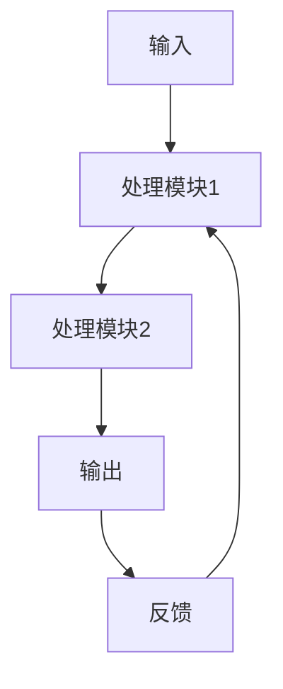

# {{Title}}

> **核心定义**：一句话精准定义，基于第一性原理

## 问题起源与第一性原理分析

> **第一性原理**：从最基本的物理/数学/经济原理出发，推导出该概念的本质

从【领域基本原理】出发，该现象的本质是：

1. 基本原理1：{{基本原理}}
2. 基本原理2：{{基本原理}}
3. 基本原理3：{{基本原理}}

基于这些基本原理，我们可以推导出：

- {{推导1}}
- {{推导2}}
- {{推导3}}

## 历史演进与关键突破

### 前驱理论

- {{理论1}}：{{贡献}}，{{局限}}
- {{理论2}}：{{贡献}}，{{局限}}

### 核心突破

{{核心突破}} 在 {{时间}} 由 {{提出者}} 提出，其革命性在于：

1. **突破点1**：解决了 {{旧理论}} 的 {{关键局限}}
2. **突破点2**：引入了 {{新机制}}，实现了 {{质的飞跃}}
3. **突破点3**：建立了 {{新范式}}，改变了 {{领域}} 的 {{核心问题}}

## 机制详解与数学表达

### 核心机制

{{机制描述}}

### 数学模型

$$
{{公式}}
$$

**符号说明**：

- {{符号1}}：{{含义}}
- {{符号2}}：{{含义}}
- {{符号3}}：{{含义}}

### 系统架构

## 与其他理论的比较与辩证分析

| 维度 | {{理论A}} | {{理论B}} | {{当前理论}} |
|---|---|---|---|
| **假设前提** | {{假设}} | {{假设}} | {{假设}} |
| **数学形式** | {{形式}} | {{形式}} | {{形式}} |
| **计算复杂度** | {{复杂度}} | {{复杂度}} | {{复杂度}} |
| **可解释性** | {{水平}} | {{水平}} | {{水平}} |
| **适用场景** | {{场景}} | {{场景}} | {{场景}} |

### 辩证分析

- **优势**：
  1. {{优势1}}
  2. {{优势2}}
  3. {{优势3}}

- **局限**：
  1. {{局限1}}
  2. {{局限2}}
  3. {{局限3}}

- **综合评价**：
  {{综合评价}}

## 实证验证与实验结果

### 实验设计

- **数据集**：{{数据集}}
- **评估指标**：{{指标1}}，{{指标2}}
- **基线方法**：{{基线1}}，{{基线2}}

### 结果分析

| 方法 | {{指标1}} | {{指标2}} | {{指标3}} |
|---|---|---|---|
| {{基线1}} | {{值}} | {{值}} | {{值}} |
| {{基线2}} | {{值}} | {{值}} | {{值}} |
| {{当前方法}} | {{值}} | {{值}} | {{值}} |

**统计显著性**：p-value = {{值}}，p < 0.01

## 应用场景与行业影响

### 主要应用

- {{场景1}}：{{描述}}
- {{场景2}}：{{描述}}
- {{场景3}}：{{描述}}

### 行业影响

- **经济影响**：{{影响}}
- **技术影响**：{{影响}}
- **社会影响**：{{影响}}

## 当前挑战与未来方向

### 当前挑战

1. {{挑战1}}：{{描述}}
2. {{挑战2}}：{{描述}}
3. {{挑战3}}：{{描述}}

### 未来方向

1. {{方向1}}：{{描述}}
2. {{方向2}}：{{描述}}
3. {{方向3}}：{{描述}}

## 相关页面

- [[RelatedPage]] — 关系描述
- [[AnotherPage]] — 关系描述

## 来源

- [来源名称](../sources/FILENAME)

## 变更日志

- YYYY-MM-DD: 初始创建