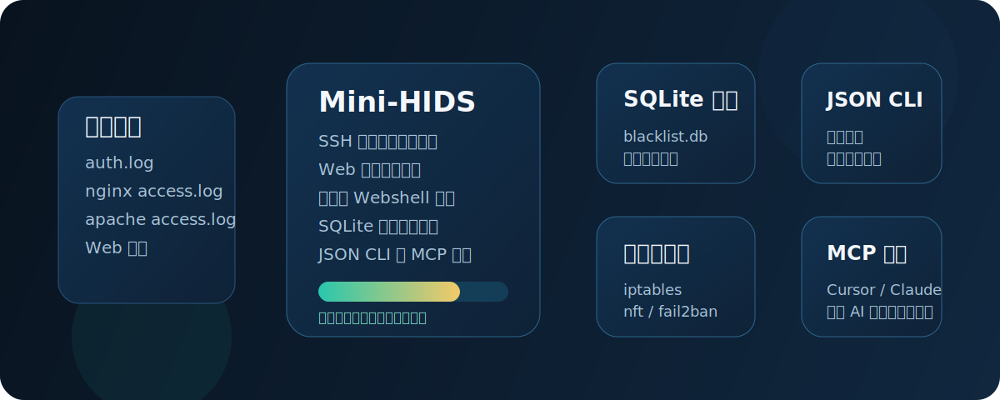

# Mini-HIDS

几分钟内就在小型 Linux 服务器上拦住 SSH 爆破和可疑 Web 攻击，不需要先上完整 SIEM 或沉重的 EDR。



Mini-HIDS 是一个基于 Python 标准库实现的轻量级 Linux 主机入侵检测工具，核心目标很直接：

- 用滑动时间窗口检测 SSH 登录失败爆破
- 从访问日志识别明显的 Web 攻击载荷
- 对常见脚本文件做增量式 Webshell 扫描

现在仓库同时提供 JSON CLI 和一个最小可用的 MCP 服务端，因此 Cursor、Claude Desktop 一类支持 MCP 的 Agent 客户端可以直接把它当成安全工具来调用。

## 这个项目适合谁

这个项目更像“可嵌入 Agent 工作流的单机安全工具”，不是“大而全的安全平台”。

适合的场景：

- VPS、小型业务机、个人运维节点
- 希望保留简单、可审计、可脚本化的检测逻辑
- 希望让 AI Agent 直接查询状态、读告警、查黑名单、做封禁动作

不适合的场景：

- 多主机关联分析
- 需要内核级遥测或高强度终端防护
- 对误报率和规则精细化要求很高的生产安全平台

## 架构

- `mini_hids.py`：后台守护进程，负责日志跟踪、滑动窗口统计、自动封禁和周期性 Webshell 扫描
- `hids_cli.py`：控制面 CLI，适合 Agent 或运维脚本调用，输出统一 JSON
- `hids_common.py`：共享配置、SQLite 持久化、IP 校验与防火墙后端逻辑
- `mcp_server.py`：基于 stdio 的 MCP 适配层，把 Mini-HIDS 能力暴露成标准工具
- `config.json`：daemon 和 CLI 共用的运行时配置文件
- `llms.txt`：面向 LLM 和 AI 搜索的项目总览文件

## 快速开始

```bash
git clone https://github.com/netkr/mini-hids.git
cd mini-hids
```

先调整 `config.json`，再启动 daemon：

```bash
sudo python3 mini_hids.py
```

CLI 用法：

```bash
python3 hids_cli.py --action status
python3 hids_cli.py --action get_alerts --lines 20
python3 hids_cli.py --action get_blacklist
python3 hids_cli.py --action ban --ip 192.168.1.100 --reason "手动封禁"
python3 hids_cli.py --action unban --ip 192.168.1.100
```

## Agent / MCP 集成

运行本地 MCP 服务：

```bash
python3 mcp_server.py
```

客户端配置示例：

```json
{
  "mcpServers": {
    "mini-hids": {
      "command": "python3",
      "args": ["/absolute/path/to/mini-hids/mcp_server.py"]
    }
  }
}
```

仓库里也附带了一个可直接改路径后使用的示例文件：[`examples/claude_desktop_mcp.json`](examples/claude_desktop_mcp.json)。

当前暴露的工具：

- `mini_hids_status`
- `mini_hids_get_alerts`
- `mini_hids_get_blacklist`
- `mini_hids_ban_ip`
- `mini_hids_unban_ip`

这比硬塞一个不合适的 `Vercel` 或 `Railway` 按钮更合理，因为 Mini-HIDS 依赖本地日志访问和防火墙权限，本地或服务器侧 MCP 才是对的接入方式。

## 配置说明

请直接修改 `config.json`，不要再去手改 Python 文件。

```json
{
  "LOG_PATHS": {
    "auth": ["/var/log/auth.log", "/var/log/secure"],
    "web": ["/var/log/nginx/access.log", "/var/log/apache2/access.log"],
    "mysql": ["/var/log/mysql/mysql.log", "/var/log/mysql/error.log"]
  },
  "BAN_TIME": 3600,
  "TRUSTED_IPS": ["127.0.0.1", "192.168.1.1"],
  "WEB_ROOT": ["/var/www/html", "/var/www"],
  "BLACKLIST_DB": "blacklist.db",
  "ALERT_LOG": "hids_alert.log",
  "PID_FILE": "mini_hids.pid",
  "MAX_FAILURES": 5,
  "WINDOW_SECONDS": 300,
  "CHECK_INTERVAL": 1,
  "WEBSHELL_SCAN_INTERVAL": 3600
}
```

补充说明：

- `BLACKLIST_DB`、`ALERT_LOG`、`PID_FILE` 可以配置为绝对路径；如果写相对路径，会自动落到项目目录下。
- `CHECK_INTERVAL` 控制 daemon 检查封禁过期的频率。
- `WEBSHELL_SCAN_INTERVAL` 控制 Web 目录重扫频率。
- `TRUSTED_IPS` 中的地址不会被 daemon 或 CLI 封禁。

## CLI 返回示例

所有 CLI 命令都返回 JSON，例如：

```json
{
  "success": true,
  "data": {
    "is_running": true,
    "pid": 12345,
    "firewall_backend": "iptables"
  }
}
```

## 安全提示

- 如果要真正执行防火墙封禁或读取受限日志，请用 root 权限运行 daemon。
- `TRUSTED_IPS` 要谨慎维护，避免把自己锁在服务器外面。
- Web 攻击和 Webshell 检测目前是启发式规则，告警更适合作为信号，而不是最终结论。
- MCP 客户端应被视为本地高权限集成，因为它们可以触发封禁和解封动作。

## v1.2 版本说明

- 统一从 config.json 加载运行时配置，并支持默认值合并
- 新增共享核心模块，统一处理配置、防火墙、IP 校验与黑名单持久化
- 新增基于 SQLite 的黑名单持久化，包含自动恢复和过期条目清理
- 改进封禁/解封的幂等性，降低重复防火墙规则风险
- 修复防火墙后端检测，包括完整的 nftables 支持
- 优化守护进程调度，更频繁检查封禁过期
- 新增基于文件修改时间的增量式 Webshell 扫描
- 增强日志跟踪鲁棒性，支持日志轮转
- 规范化运行时文件路径（blacklist.db、hids_alert.log、mini_hids.pid）
- 新增 JSON CLI，支持状态、告警、黑名单查看、手动封禁和解封

