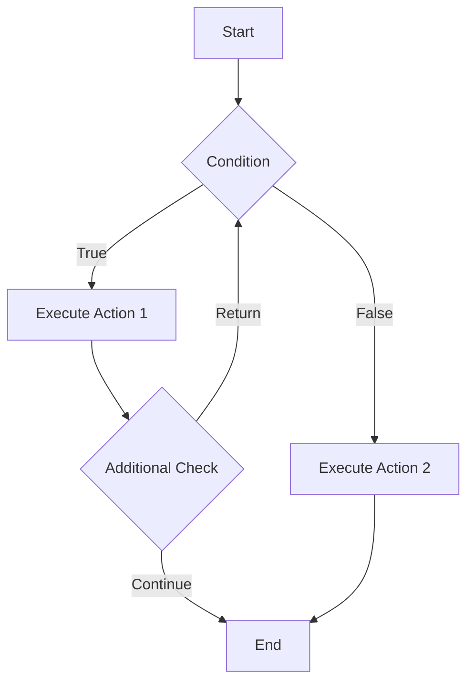
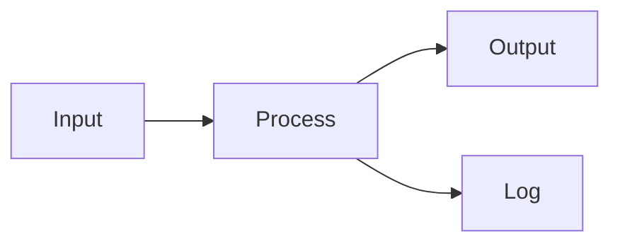
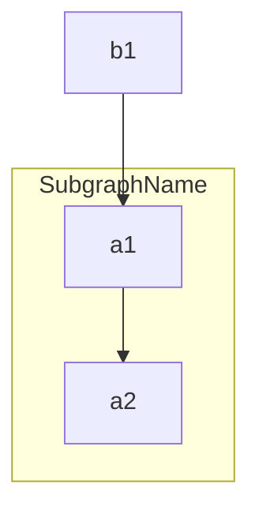

# Flowchart

## Diagram Description
A flowchart is a diagram used to represent workflows or processes, using nodes (shapes) and connectors to display program execution flow or business process progression.

## Applicable Scenarios
- Business process organization and visualization
- Program execution flow explanation
- Decision logic display
- Organizational structure presentation
- Problem-solving steps documentation

## Syntax Examples





## Syntax Reference

### Direction Settings
- `TD` / `TB` (Top-Down): Top to bottom
- `BT` (Bottom-Top): Bottom to top
- `LR` (Left-Right): Left to right
- `RL` (Right-Left): Right to left

### Node Shapes
- `[text]`: Rectangle (default)
- `([text])`: Rounded rectangle
- `([[text]])`: Cylinder (database)
- `[(text)]`: Ellipse (circle)
- `{text}`: Diamond (decision)
- `{{text}}`: Hexagon
- `[[text]]`: Rectangle with brackets
- `[(text)]`: Cylinder
- `>text]`: Flag shape

### Connection Line Styles
- `-->`: Solid arrow
- `---`: Solid line without arrow
- `-.->`: Dashed arrow
- `==>`: Bold arrow
- `--o`: Line with circle
- `--x`: Line with cross

### Link Labels
- `A -->|text| B`: Add text label on connector

### Subgraphs


## Configuration Reference

### Flowchart-Specific Configuration Options

| Option | Description | Available Values |
|--------|-------------|------------------|
| curve | Connection line curve style | linear, basis, cardinal |
| padding | Node internal padding | number |
| nodeSpacing | Node spacing | number |
| rankSpacing | Level spacing | number |
| fontFamily | Font | string |
| fontSize | Font size | number |

### Style Classes
```mermaid
flowchart TD
    A --> B
    class A style fill:#f9f,stroke:#333,stroke-width:4px
    class B classDef highlight fill:#ff9,stroke:#f66,stroke-width:2px
```
