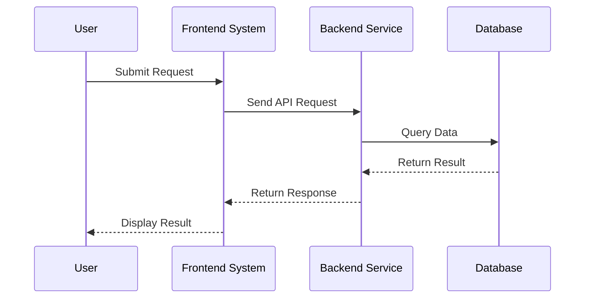
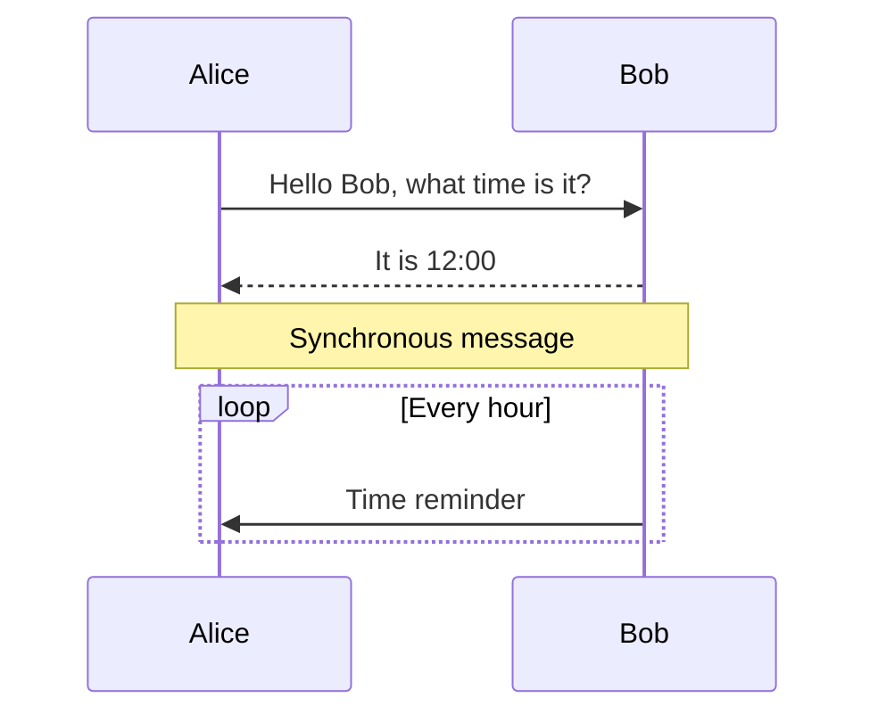
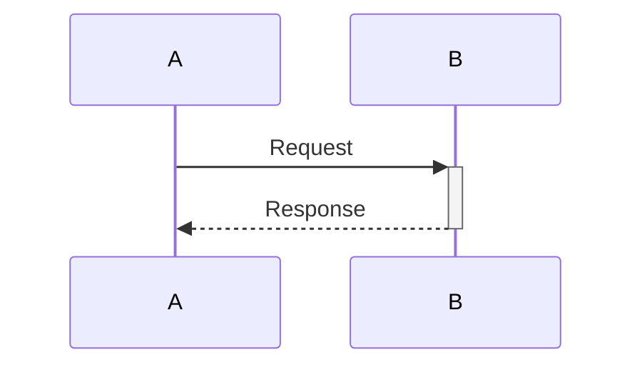

# Sequence Diagram

## Diagram Description
A sequence diagram displays interactions between objects in chronological order, commonly used to describe message passing and response sequences between different components or users in a system.

## Applicable Scenarios
- System interaction design documentation
- API call flow presentation
- User and system interaction process
- Microservice call链路
- Complex business logic explanation

## Syntax Examples





## Syntax Reference

### Basic Elements
- `participant Name`: Define participant
- `->>`: Send message (solid line with filled arrow)
- `-->>`: Return message (dashed line with filled arrow)
- `->`: Send message (solid line)
- `-->:` Return message (dashed line)

### Special Message Types
- `-)` or `--)`: Create asynchronous message
- `->>` or `-->>`: Synchronous message

### Comment Syntax
- `Note [position] [participant]: Comment content`
- Position: `over`, `left of`, `right of`
- `Note over Alice,Bob`: Comment spanning multiple participants

### Control Structures
```mermaid
loop LoopCondition
    ... messages ...
end

alt Condition1
    ... messages ...
else Condition2
    ... messages ...
else
    ... default case ...
end

opt Optional
    ... messages ...
end
```

### Activate/Deactivate Participants

Use `+` to activate participant, `-` to deactivate

## Configuration Reference

| Option | Description |
|--------|-------------|
| mirrorActors | Show participants at bottom |
| actorMargin | Participant spacing |
| messageMargin | Message spacing |
| boxMargin | Box margin |
| noteMargin | Note margin |
| activationWidth | Activation bar width |
| bottomMargin | Bottom margin |

### Style Configuration
```mermaid
sequenceDiagram
    sequenceStyle hand
    autoNumber on
```
