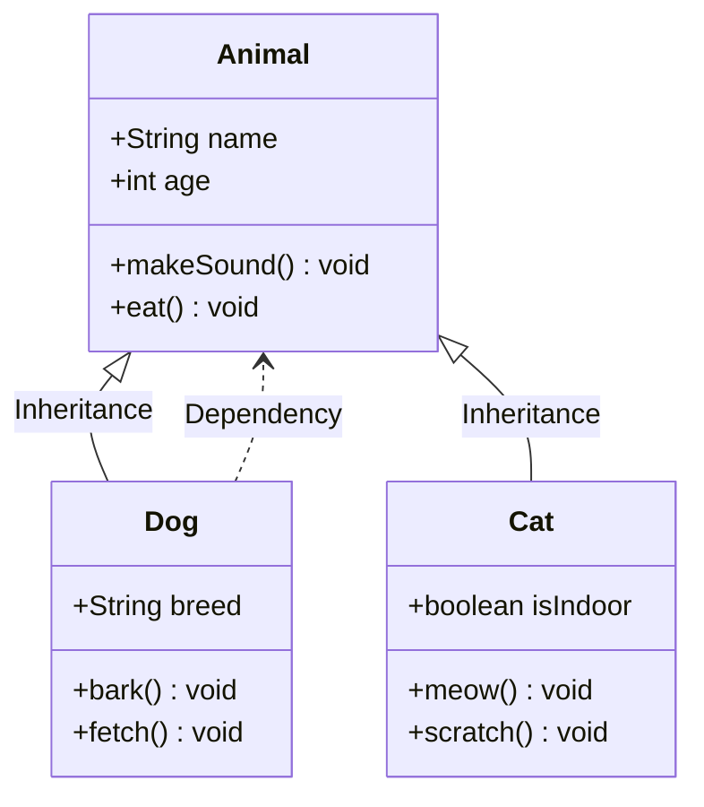
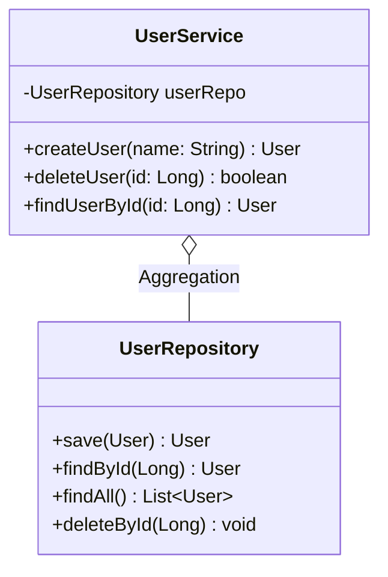
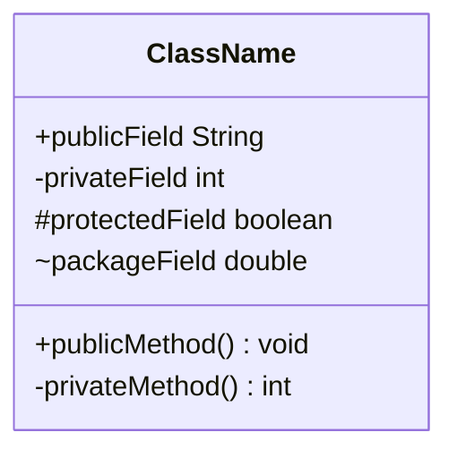
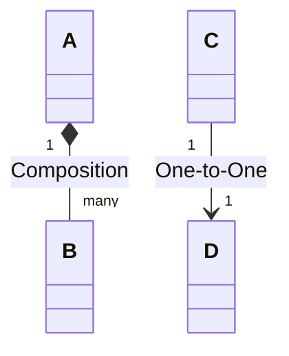
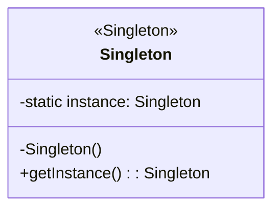

# Class Diagram

## Diagram Description
A class diagram is a diagram in object-oriented programming used to display classes, class attributes, methods, and relationships between classes. It is one of the most commonly used diagrams in UML (Unified Modeling Language).

## Applicable Scenarios
- Software architecture design
- Code structure documentation
- Object relationship modeling
- API interface design
- Database table structure design

## Syntax Examples





## Syntax Reference

### Class Declaration


### Access Modifiers
- `+`: public
- `-`: private
- `#`: protected
- `~`: package-level

### Relationship Types
- `<|--`: Inheritance (generalization)
- `*--`: Composition
- `o--`: Aggregation
- `-->`: Association
- `..>`: Dependency
- `..|>`: Implementation (interface)

### Relationship Labels


### Interfaces and Abstract Classes
```mermaid
classDiagram
    interface Printable {
        <<interface>>
        +print() void
    }

    class Document {
        <<abstract>>
        +print() void
    }

    Document ..|> Printable : Implementation
```

### Class Annotations


## Configuration Reference

| Option | Description |
|--------|-------------|
| showClassMembers | Show class members |
| defaultMemberAlignment | Member alignment |
| nodeSpacing | Node spacing |
| rankSpacing | Level spacing |

### Relationship Styles
```mermaid
classDiagram
    style A fill:#f9f,stroke:#333,stroke-width:2px
```
