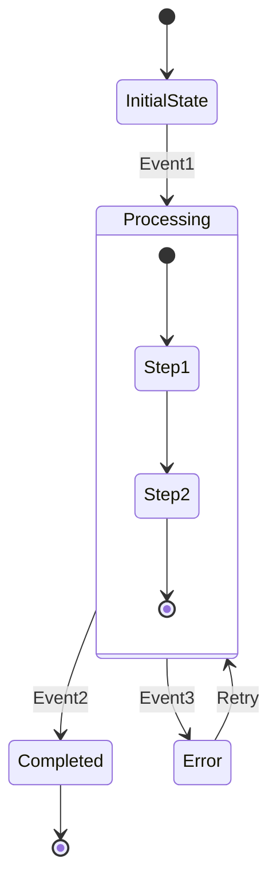
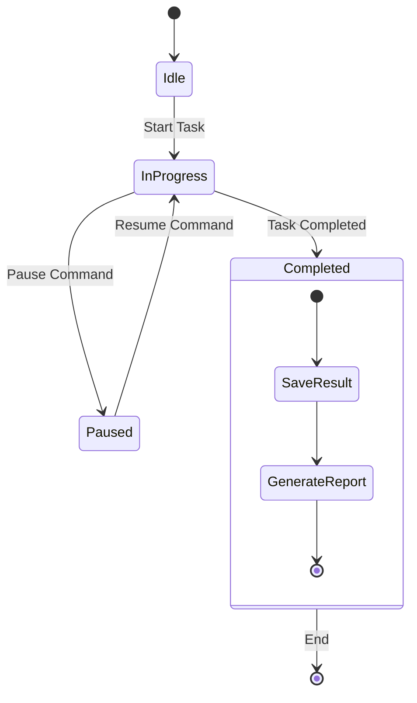
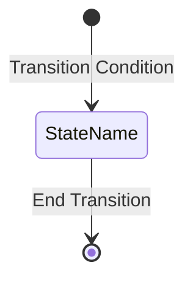
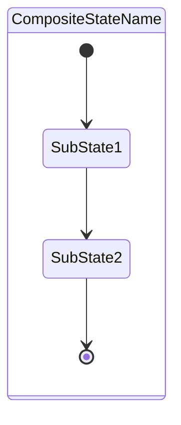
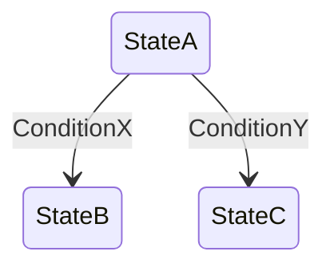
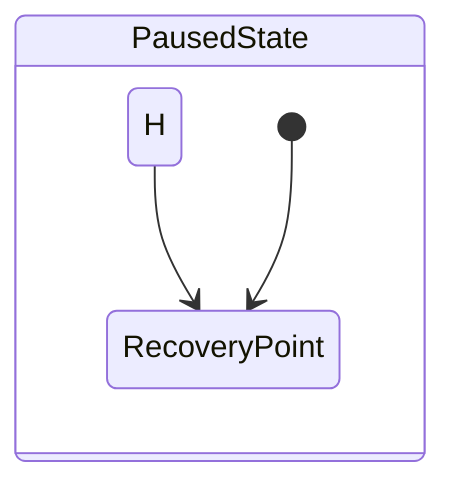
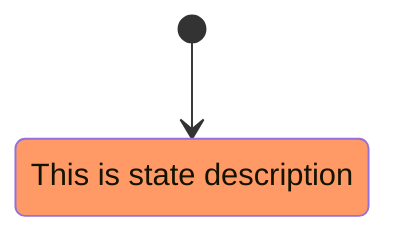

# State Diagram

## Diagram Description
A state diagram describes the various states an object or system undergoes during its lifecycle, along with events or conditions that cause state transitions.

## Applicable Scenarios
- Object state management design
- State machine modeling
- Business process state flow
- Protocol state machines
- UI component state management

## Syntax Examples

## Syntax Reference

### Basic Syntax

### Composite States

### Conditional Branching

### Special Markers
- `[*]`: Start or end state
- `state xxx`: Normal state definition
- `state xxx { ... }`: Composite state

### History States

## Configuration Reference

| Option | Description |
|--------|-------------|
| showNullElements | Show null elements |
| hideEmptyDescription | Hide empty descriptions |
| fork/join | Fork/join support |

### Styles

