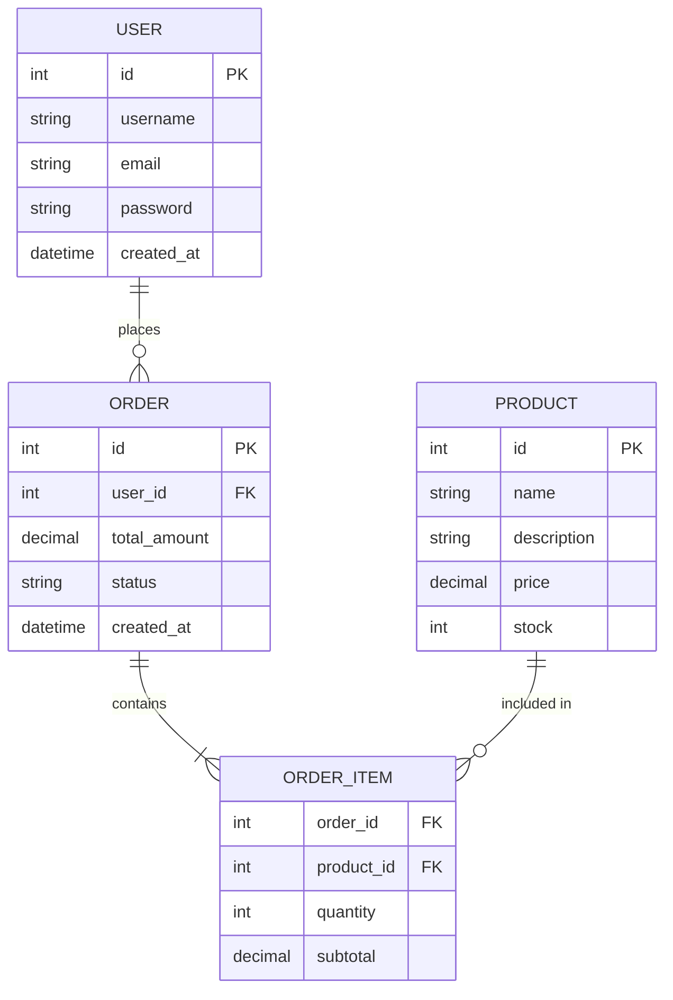
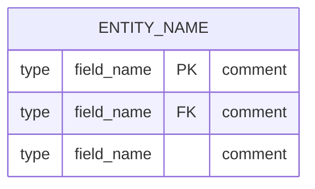
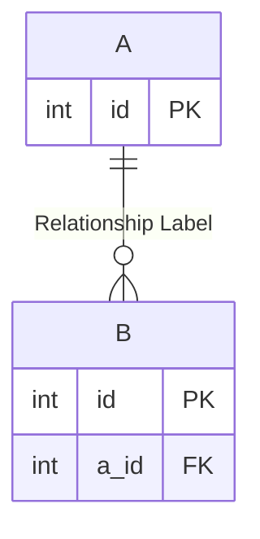
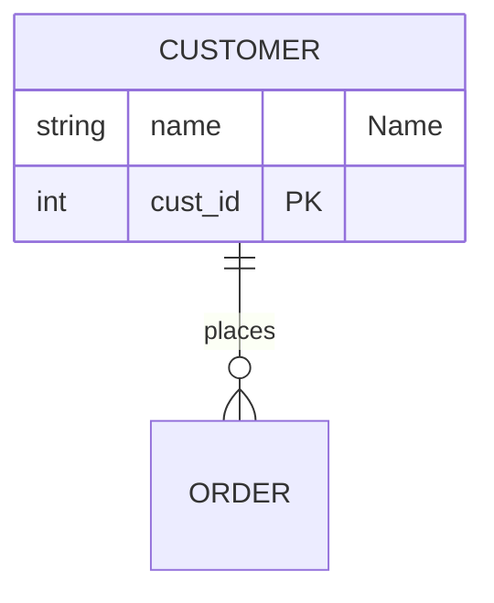

# Entity Relationship Diagram (ER Diagram)

## Diagram Description
An entity relationship diagram represents entities in a database, their attributes, and relationships between entities. It is an important tool for database design and modeling.

## Applicable Scenarios
- Database design
- Data modeling
- Business data relationship organization
- API data structure design
- System integration data mapping

## Syntax Examples

## Syntax Reference

### Basic Syntax

### Field Types
- `int`, `string`, `boolean`, `datetime`, `decimal`, `float`

### Field Modifiers
- `PK`: Primary Key
- `FK`: Foreign Key
- `UK`: Unique Key
- `NN`: Not Null

### Relationship Symbols

| Symbol | Description |
|--------|-------------|
| `||` | Exactly one |
| `o|` | Zero or one |
| `}|` | One or more |
| `o{` | Zero or more |
| `||--||` | One-to-one |
| `||--o{` | One-to-many |
| `}|--||` | Many-to-one |
| `}|--o{` | Many-to-many |

### Relationship Labels

## Configuration Reference

| Option | Description |
|--------|-------------|
| showEntityTypes | Show entity types |
| entitySeparation | Entity spacing |
| relationshipSeparation | Relationship spacing |

### Style Configuration

