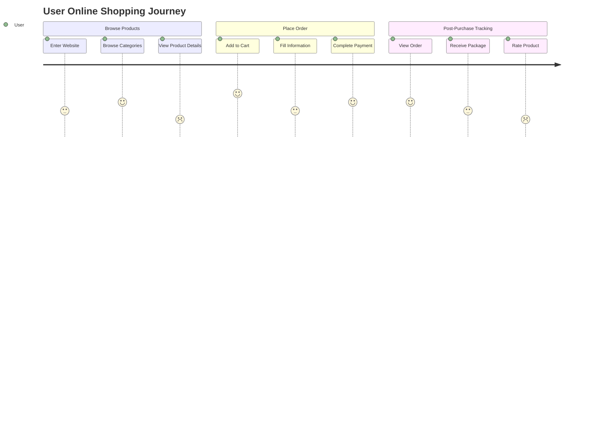
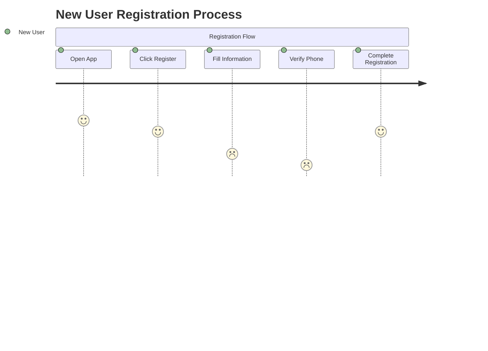
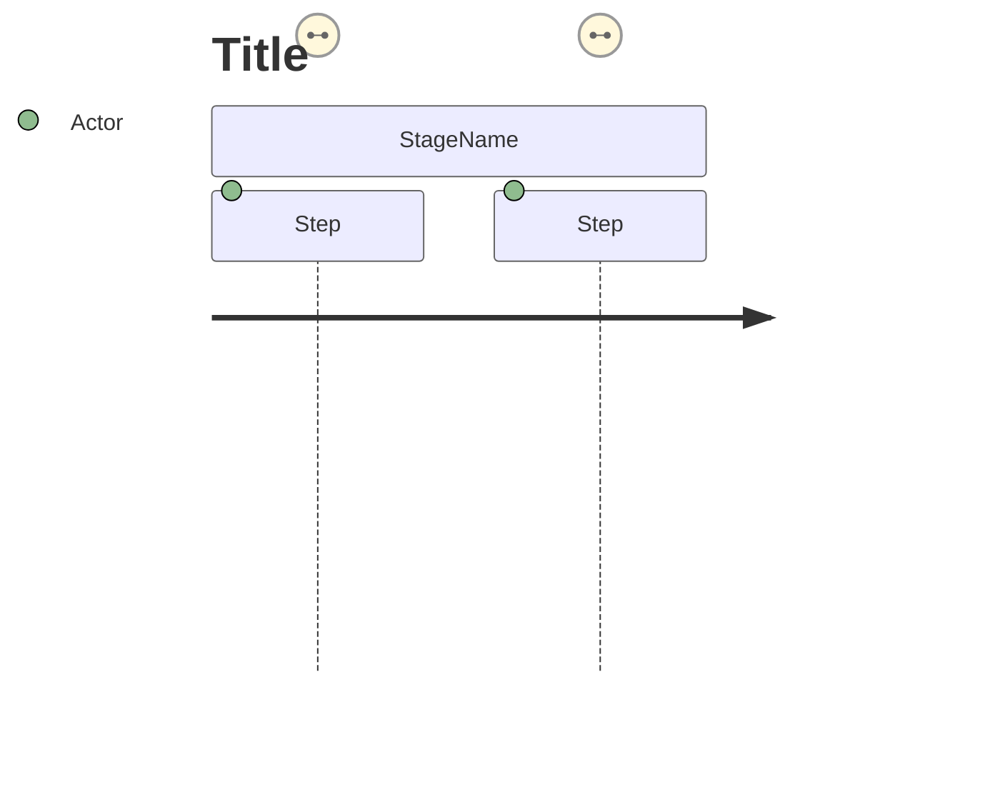
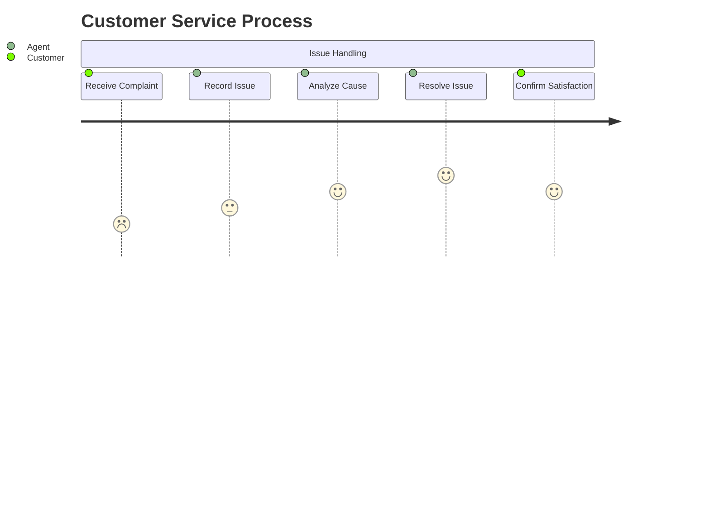

# User Journey

## Diagram Description
A user journey diagram displays the steps, emotional changes, and touchpoints a user experiences while accomplishing a goal. It helps teams understand the complete process of user interaction with a product/service.

## Applicable Scenarios
- User experience design
- Business process optimization
- Customer service improvement
- Product feature planning
- User research presentation

## Syntax Examples





## Syntax Reference

### Basic Structure


### Scoring System
- Score range: 1-5
- 1: Very dissatisfied / Painful
- 2: Dissatisfied
- 3: Neutral / Average
- 4: Satisfied
- 5: Very satisfied / Pleasant

### Syntax Details
- `title`: Journey diagram title
- `section`: Define a stage/step group
- `Step Name`: Specific action description
- `Score`: Satisfaction or importance rating
- `Actor`: User role performing the action

### Multi-Actor Journey


## Configuration Reference

| Option | Description |
|--------|-------------|
| showShadow | Show shadow effects |
| journeyWrap | Step text wrapping |

### Style Customization
```mermaid
journey
    title Example
    style Step1 fill:#f9f,stroke:#333
```
