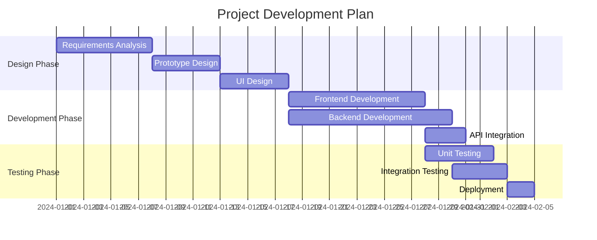
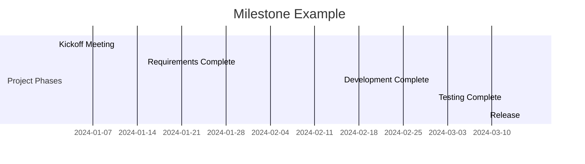
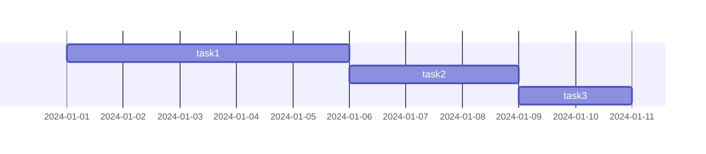
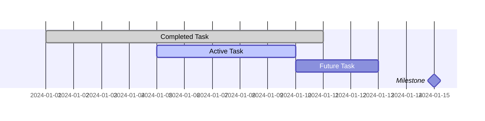

# Gantt Chart

## Diagram Description
A Gantt chart is a bar chart used to display project progress, scheduling, and task dependencies. The horizontal axis represents time, and the vertical axis represents tasks or project components.

## Applicable Scenarios
- Project management progress display
- Task scheduling
- Resource allocation visualization
- Milestone tracking
- Production planning

## Syntax Examples





## Syntax Reference

### Basic Syntax
```mermaid
gantt
    title Title
    dateFormat DateFormat
    section SectionName
        Task Name: TaskID, StartDate, Duration
```

### Date Formats
- `YYYY-MM-DD`: 2024-01-15
- `YYYY-MM-DD HH:mm`: 2024-01-15 09:00
- `DD/MM/YYYY`: 15/01/2024
- `MM-DD`: 01-15 (current year)

### Duration Representation
- `7d`: 7 days
- `3w`: 3 weeks
- `2m`: 2 months
- `10h`: 10 hours
- `30m`: 30 minutes

### Task Dependencies


### Critical Tasks and Milestones


### Task Status
- `done`: Completed (dark)
- `active`: In progress (colored)
- `crit`: Critical task (red border)
- Default: Future task (light)

## Configuration Reference

| Option | Description |
|--------|-------------|
| title | Chart title |
| dateFormat | Date format |
| axisFormat | Timeline format |
| sectionSeparator | Section separator |
| inclusiveEndDates | End date inclusiveness |

### Timeline Format
```mermaid
gantt
    dateFormat YYYY-MM-DD
    axisFormat %m/%d
```
