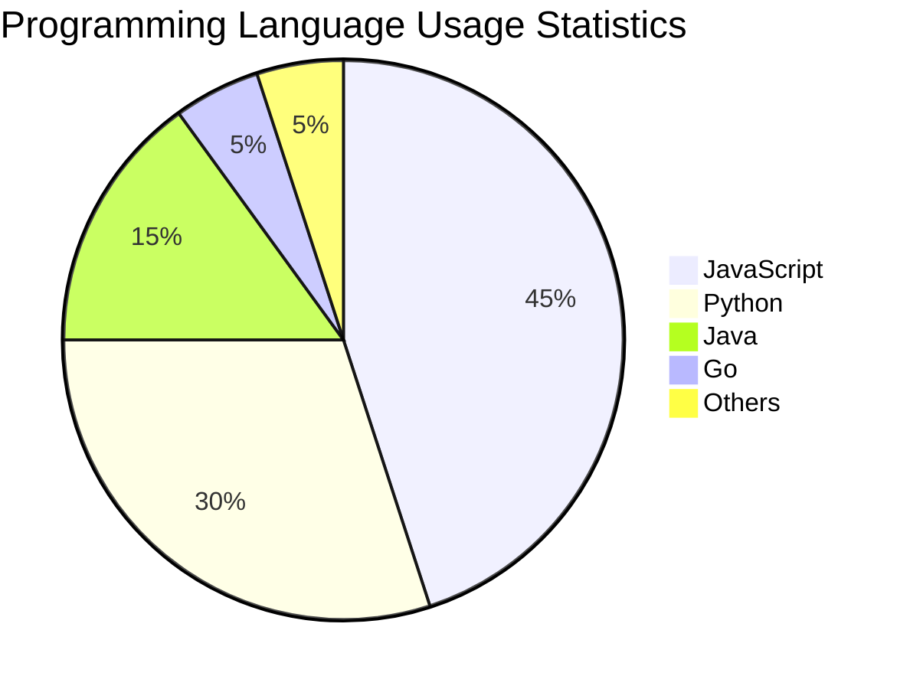
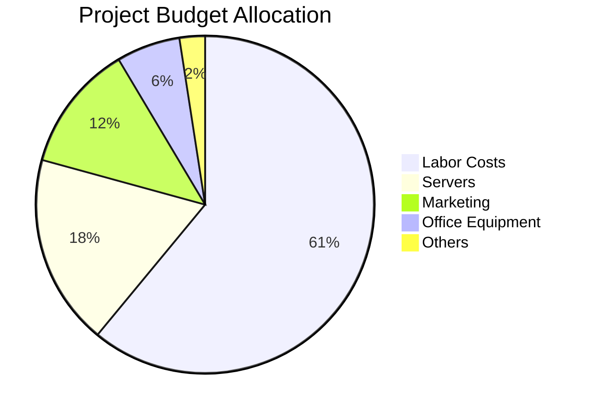
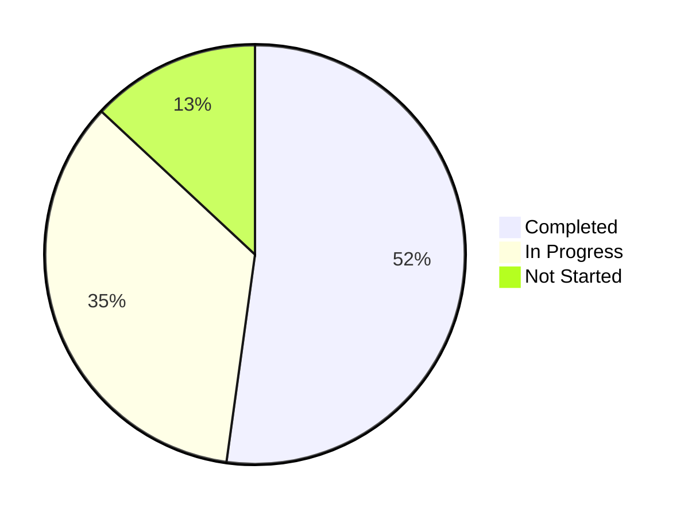
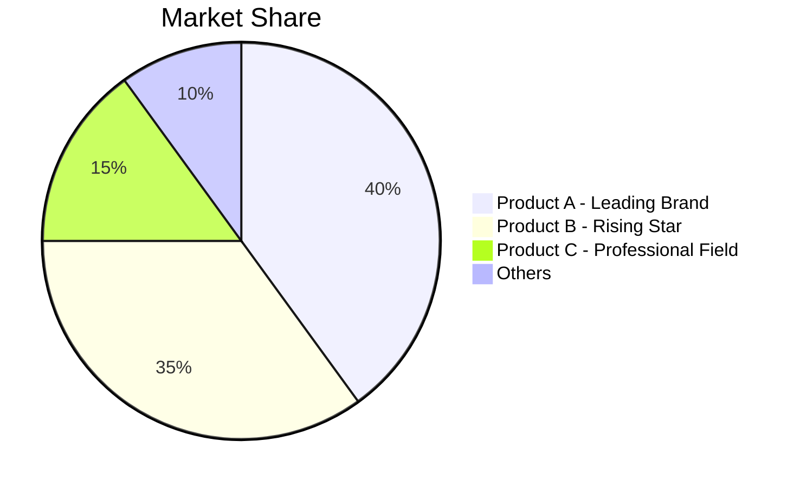

# Pie Chart

## Diagram Description
A pie chart is a circular diagram used to display the proportion of parts to the whole. The size of each sector visually represents the percentage of different categories.

## Applicable Scenarios
- Proportion analysis display
- Survey result distribution
- Resource allocation ratios
- Budget allocation
- Category statistics

## Syntax Examples

## Syntax Reference

### Basic Syntax

### Label Format
- Strings can be enclosed in quotes
- Values can be integers or decimals
- Values are automatically calculated as percentages

### Special Value Handling

### Pie Chart with Descriptions

## Configuration Reference

### Style Options

### Legend Position
Mermaid pie charts display the legend on the right by default.

### Color Customization
CSS styles or Mermaid's `style` directive can be used to set colors for each sector.

### Notes
- Pie charts are suitable for displaying a small number of categories (3-7)
- Too many categories will make it difficult to read
- All values should be positive numbers
