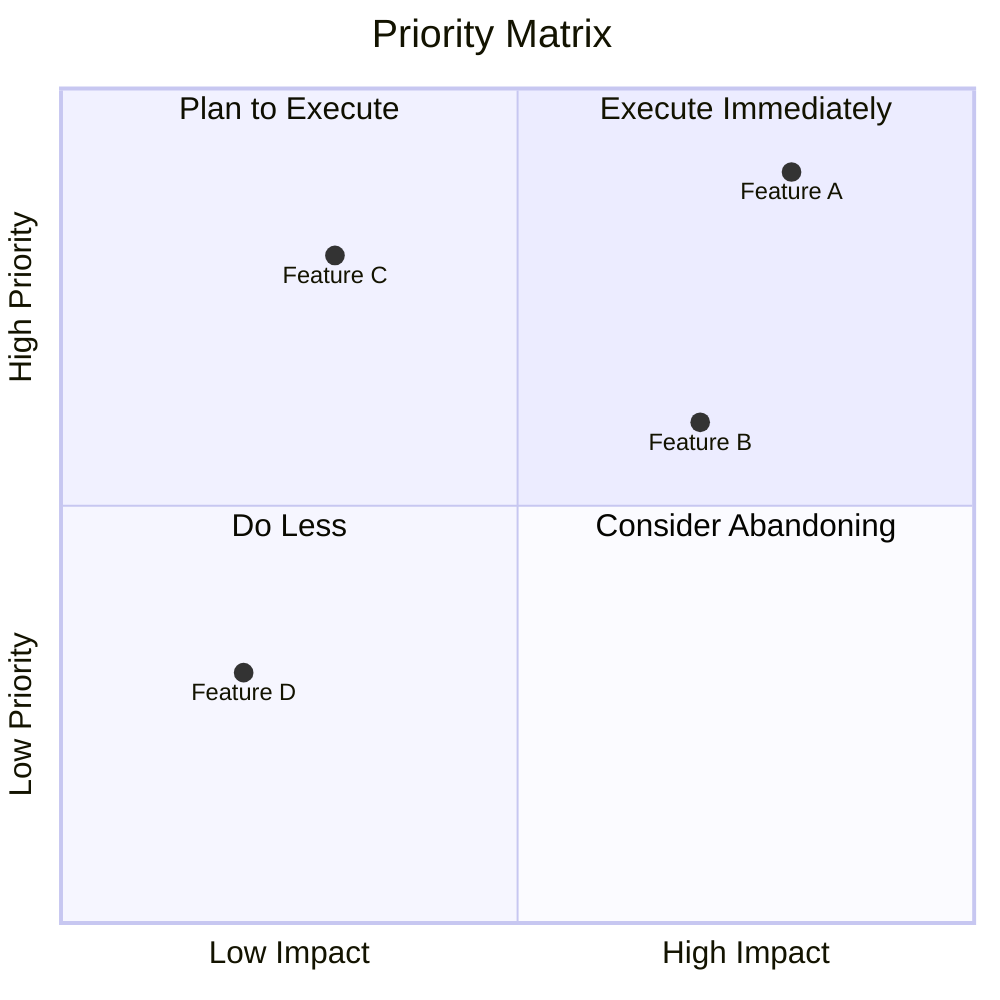
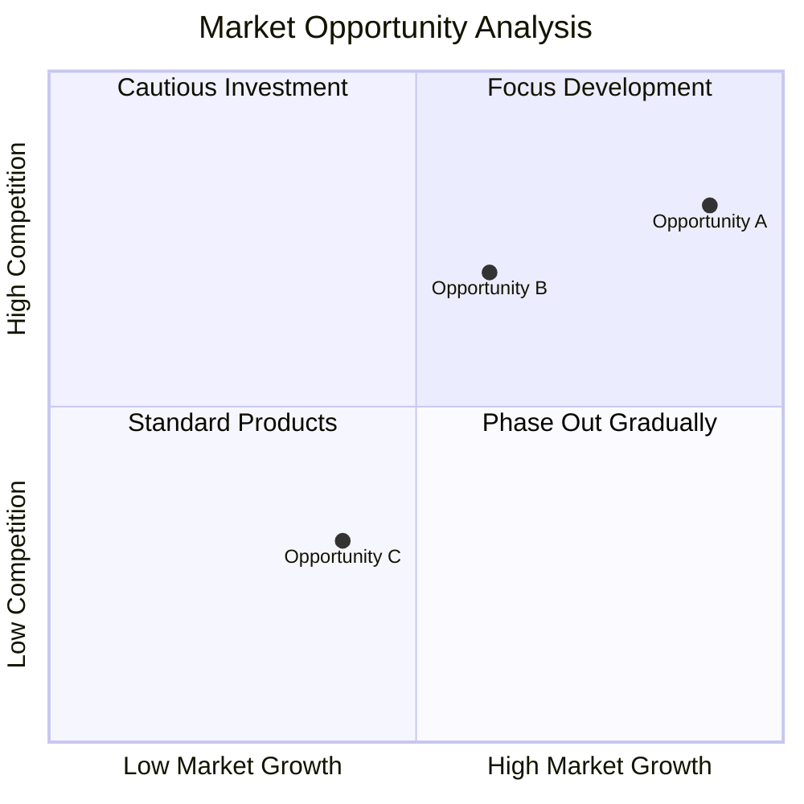

# Quadrant Chart

## Diagram Description
A quadrant chart divides a plane into four regions, used to classify and prioritize projects, ideas, or options based on scores across two dimensions.

## Applicable Scenarios
- Priority matrix analysis
- Product feature planning
- Strategy analysis
- Impact/Difficulty assessment
- SWOT analysis visualization

## Syntax Examples





## Syntax Reference

### Basic Syntax
```mermaid
quadrantChart
    title Chart Title
    x-axis Label1 --> Label2
    y-axis Label1 --> Label2
    quadrant-1 Region1Name
    quadrant-2 Region2Name
    quadrant-3 Region3Name
    quadrant-4 Region4Name
    "DataPoint1": [x_value, y_value]
    "DataPoint2": [x_value, y_value]
```

### Coordinate System
- X-axis: Left to right, values from 0 to 1
- Y-axis: Bottom to top, values from 0 to 1
- Four quadrants numbered counterclockwise:
  - Q1 (quadrant-1): Upper right
  - Q2 (quadrant-2): Upper left
  - Q3 (quadrant-3): Lower left
  - Q4 (quadrant-4): Lower right

### Axis Labels
- Use `-->` to separate two endpoints
- Left/bottom is low, right/top is high

### Data Point Format
```mermaid
quadrantChart
    "Point Name": [x_coordinate, y_coordinate]
```
- Coordinate values recommended between 0.1-0.9
- Do not use 0 or 1, as points may fall on axes

## Configuration Reference

### Quadrant Colors
Quadrant background colors can be modified through theme configuration.

### Chart Size
Use `width` and `height` parameters to control chart dimensions.

### Notes
- Moderate number of data points (recommended: no more than 12)
- Distribute data points appropriately
- Quadrant labels should be concise and clear
