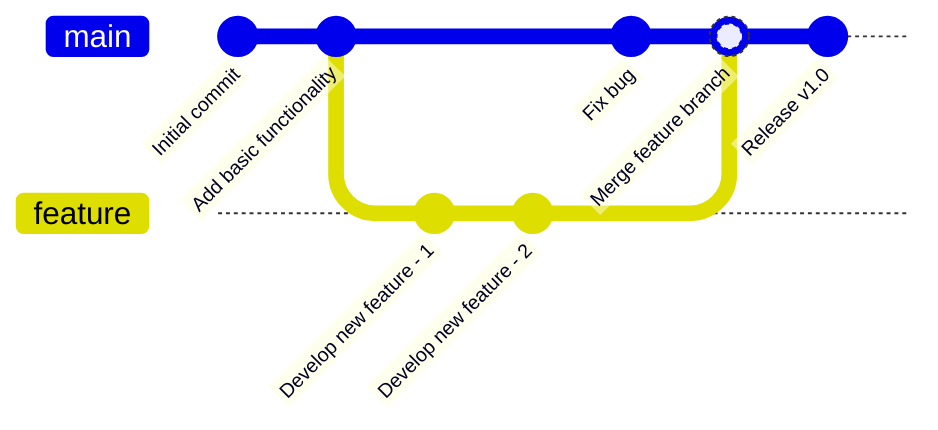
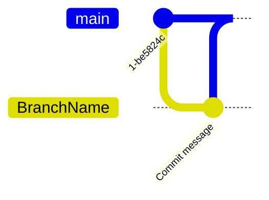
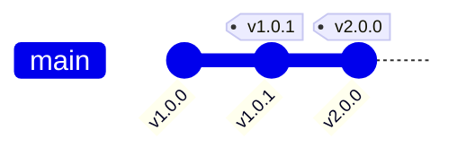

# Git Graph

## Diagram Description
A Git graph visually displays the commit history, branches, and merge situations of a Git repository. It helps understand project version evolution and branch strategies.

## Applicable Scenarios
- Git repository history display
- Branch strategy documentation
- Pull Request flow explanation
- Merge conflict analysis
- Release version tracking

## Syntax Examples



```mermaid
gitGraph
    commit id: "Initialize project"
    commit id: "Add README"
    branch develop
    checkout develop
    commit id: "Feature development - 1"
    commit id: "Feature development - 2"
    branch feature-xyz
    checkout feature-xyz
    commit id: "XYZ feature development"
    checkout develop
    merge feature-xyz id: "Merge XYZ"
    checkout main
    merge develop id: "Release version"
    commit id: "Hotfix fix"
    merge main id: "Merge fix"
```

## Syntax Reference

### Basic Syntax


### Commits
- `commit`: Create commit (with auto ID)
- `commit id: "message"`: Create commit with ID and message

### Branch Operations
- `branch Name`: Create new branch
- `checkout Name`: Switch to specified branch
- `cherry-pick CommitID`: Cherry-pick specific commit

### Merge Operations
- `merge Name`: Merge branch into current branch
- `merge Name id: "merge message"`: Merge with message

### Tags


### Rebase


## Configuration Reference

| Option | Description |
|--------|-------------|
| showCommitLabel | Show commit labels |
| mainBranchName | Main branch name |
| mainBranchOrder | Main branch order |
| showBranches | Show branches |
| mode | Graphics mode |

### Theme Configuration

