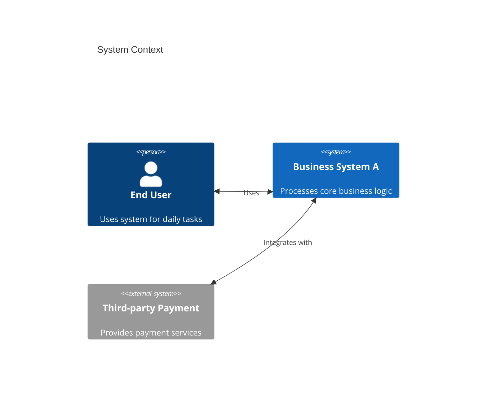
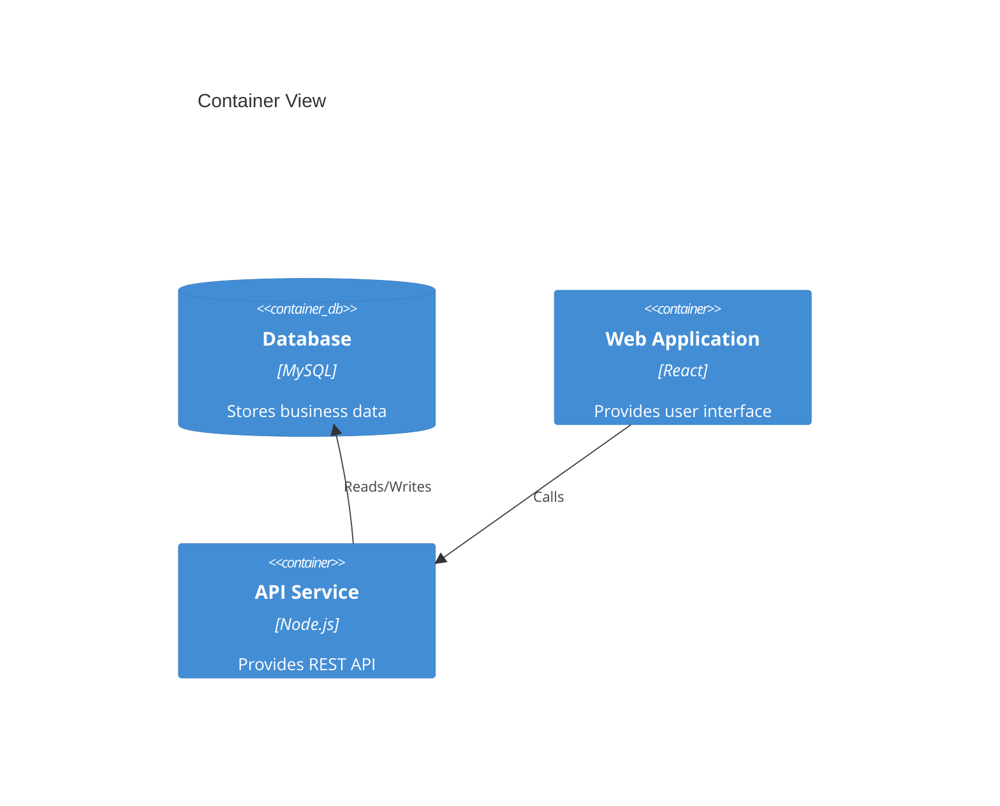

# C4 Diagram

## Diagram Description
C4 diagram is a method for visualizing software architecture, describing system architecture through different levels of abstraction (Context, Container, Component, Code).

## Applicable Scenarios
- Software architecture documentation
- System context presentation
- Container/service division
- Component design documentation
- Technology stack documentation

## Syntax Examples





## Syntax Reference

### Hierarchy Levels
1. **Context**: System-wide view
2. **Container**: Application and technology choices
3. **Component**: Components and responsibilities
4. **Code**: Specific implementation details

### Element Types
- `Person`: Person role
- `System`: Internal system
- `System_Ext`: External system
- `Container`: Container/application
- `ContainerDb`: Database container
- `Component`: Component

### Relationship Types
- `Rel`: Relationship
- `BiRel`: Bidirectional relationship (simplified)
- `Rel_U`: Upward relationship
- `Rel_D`: Downward relationship
- `Rel_L`: Leftward relationship
- `Rel_R`: Rightward relationship

### Layout Options
```mermaid
C4Context
    layout陪你
    Person(p1, "User 1")
    Person(p2, "User 2")
```

## Configuration Reference

### C4Context Configuration
```mermaid
C4Context
    title Title
    layout陪你
```

### Style Options
Supports custom border colors, background colors, and other style properties.

### Notes
- C4 is an experimental feature; syntax may change
- Recommend checking official documentation for latest syntax
