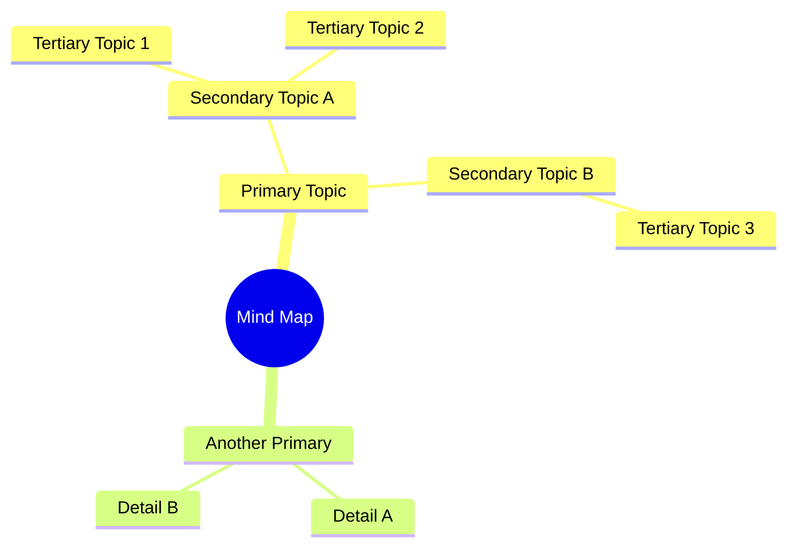
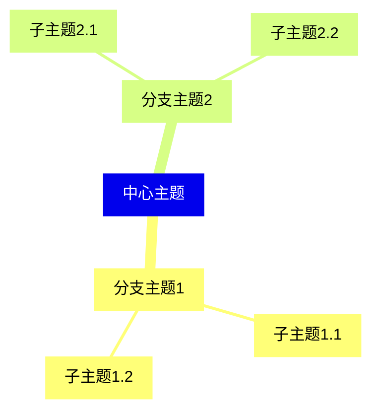
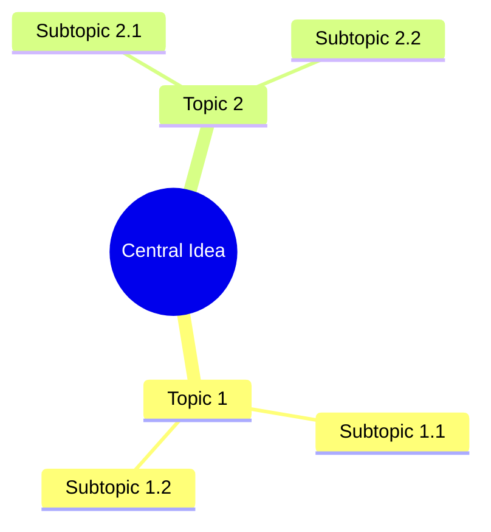
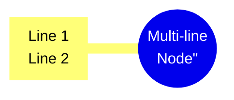
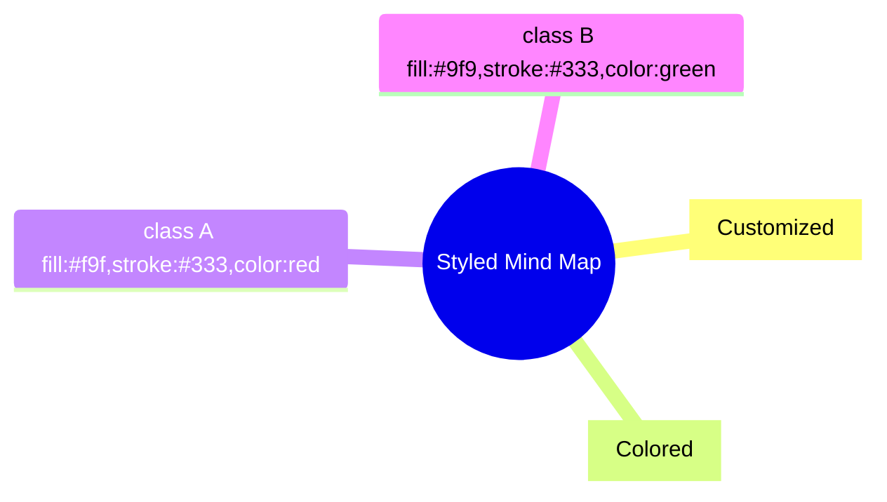

# Mind Map

## Diagram Description
A mind map is a diagram used for brainstorming, organizing thoughts, and visualizing relationships between concepts. It starts with a central idea and radiates outward with related topics.

## Applicable Scenarios
- Brainstorming and idea organization
- Knowledge structure visualization
- Study notes organization
- Project planning
- Decision making

## Syntax Examples





## Syntax Reference

### Basic Syntax


### Node Shapes
- `((text))`: Central node (circle with double parentheses)
- `text`: Standard topic
- `["text"]`: Square bracket topic

### Hierarchy
- Root node: Central concept (only one)
- Level 2: Primary topics
- Level 3: Secondary topics
- Level 4: Tertiary topics (typically maximum depth)

### Multi-line Text
Use `<br>` for line breaks within nodes:


## Configuration Reference

### Theme Customization
```mermaid
mindmap
    %%{init: {'theme': 'base'}}%%
    root((Theme Example))
        Topic
```

### Style Classes


### Notes
- Mind maps work best with a clear central concept
- Limit depth to 4-5 levels for readability
- Use concise labels for better visualization
- Consider using Chinese text directly (Mermaid supports Chinese)
