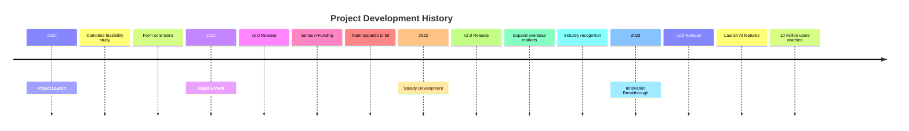
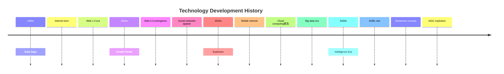
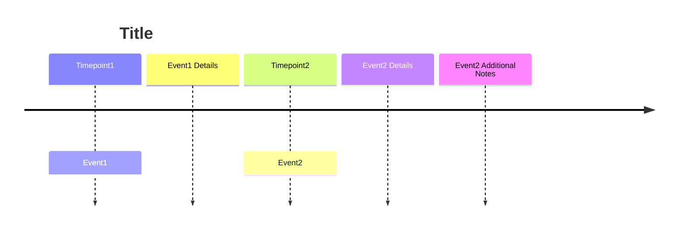
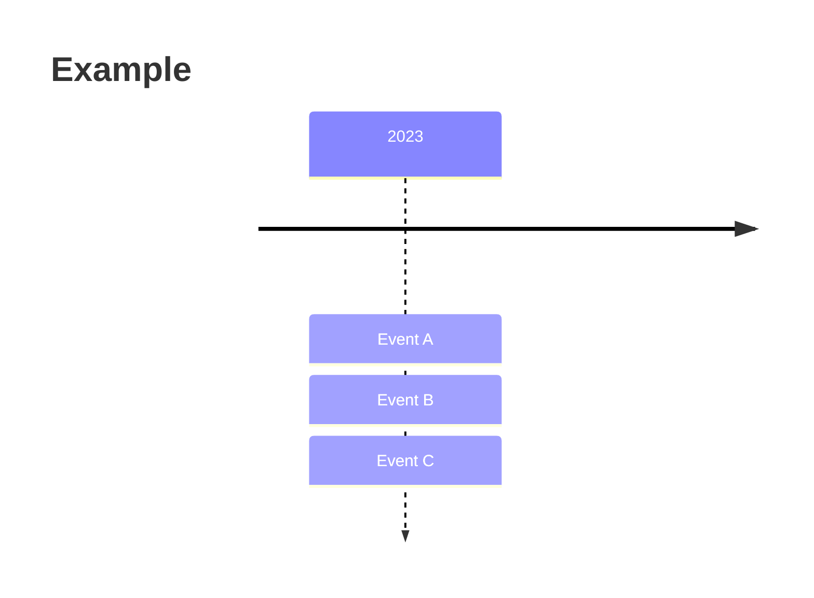

# Timeline

## Diagram Description
A timeline displays events in chronological order, suitable for showing historical development, project progress, or event chronology.

## Applicable Scenarios
- Historical event display
- Project development history
- Company/product milestones
- Personal resume/CV
- Project retrospective

## Syntax Examples





## Syntax Reference

### Basic Syntax


### Timepoint Formats
- Year: `2020`
- Year-month: `2020-03`
- Specific date: `2020-03-15`
- Era: `1990s`

### Event Hierarchy
- Main event: First line after colon
- Sub-event: Indented detailed description

### Multiple Events in Parallel


## Configuration Reference

### Style Options
```mermaid
timeline
    title Example
    sectionStyle 1 fill:#eaf
    sectionStyle 2 fill:#efe
```

### Theme Support
Can use Mermaid theme configuration for colors and styles.

### Notes
- Timeline order is important
- Moderate number of events
- Labels should be concise and clear
