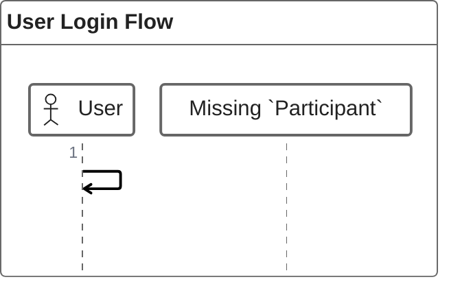
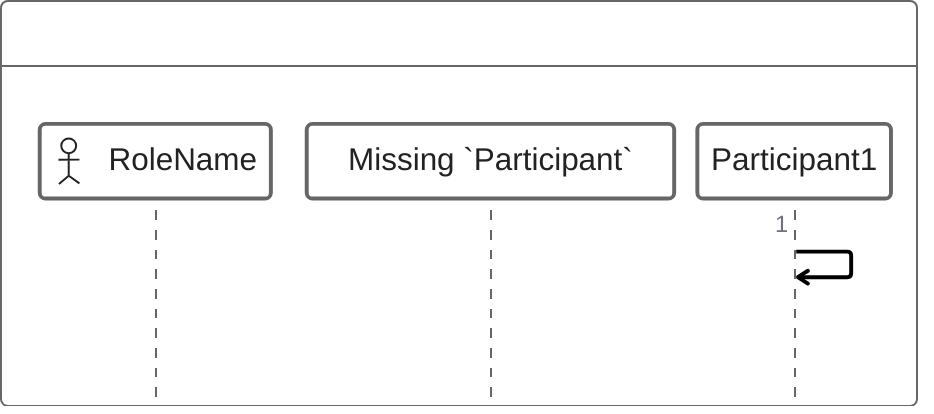
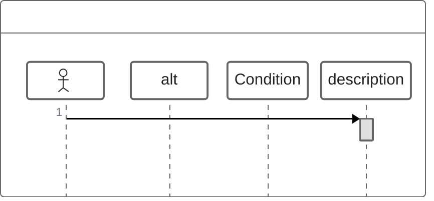
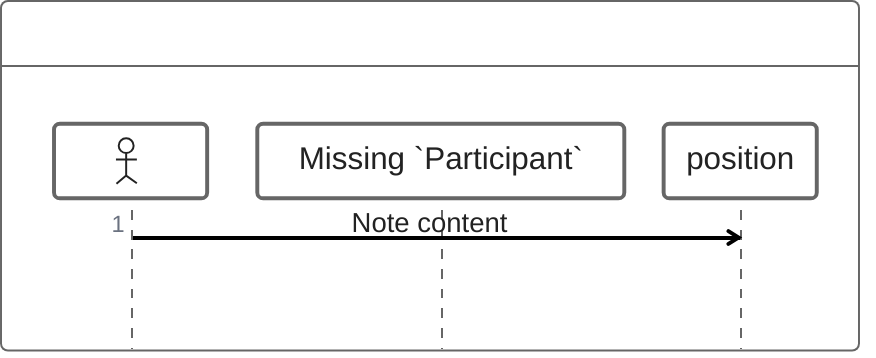

# ZenUML

## Diagram Description
ZenUML is a diagram type for drawing sequence diagrams using concise text descriptions to generate professional sequence diagrams, with special emphasis on consistency between code and diagrams.

## Applicable Scenarios
- Core process description
- API call demonstration
- Technical documentation
- Architecture design documentation
- Teaching demonstrations

## Syntax Examples

## Syntax Reference

### Basic Syntax

### Participant Declaration
- `@Actor`: Define actor
- `@Participants`: Start defining participants

### Message Types
- `->>`: Synchronous message (solid arrow)
- `-->>`: Return message (dashed arrow)
- `->"Participant"`: Send message to specified participant

### Control Structures

### Notes

### Position Options
- `over Participant`: Above participant
- `left of Participant`: Left of participant
- `right of Participant`: Right of participant

## Configuration Reference

### Style Configuration
ZenUML supports custom colors, fonts, and other styles.

### Notes
- ZenUML is an experimental feature
- Syntax may differ from standard sequence diagrams
- Recommend checking official documentation for latest information
