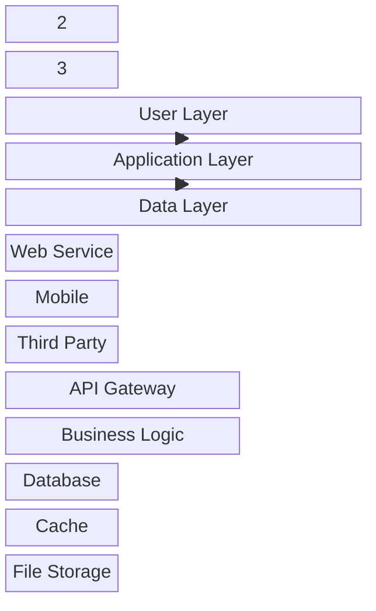
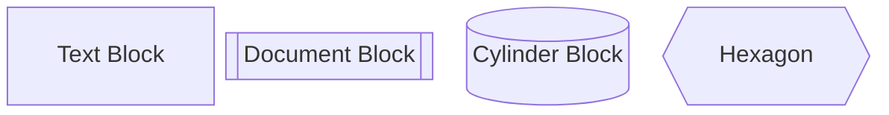
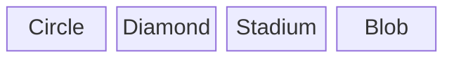

# Block Diagram

## Diagram Description
A block diagram is a diagram type used to display system architecture or organizational structure, using blocks and connecting lines to represent relationships and hierarchies between components.

## Applicable Scenarios
- System architecture presentation
- Organizational structure
- Hardware architecture
- Network topology
- Module relationships

## Syntax Examples



```mermaid
block-beta
    title Cloud Computing Architecture

    cloud["Cloud Service"]:::cloudBox
    compute["Compute Service"]
    storage["Storage Service"]
    network["Network Service"]

    cloud --> compute
    cloud --> storage
    cloud --> network

    style cloud fill:#f9f,stroke:#333
    classDef cloudBox fill:#e1f5fe
```

## Syntax Reference

### Basic Syntax
```mermaid
block-beta

    A["Label"]: WidthRatio
    B["Label"]
    C["Label"]

    A --> B
    B --> C
```

### Layout
- `columns`: Define number of columns and ratios
- Can set different widths for blocks

### Block Types


### Block Shapes
- `[]`: Rectangle
- `[[]]`: Document shape
- `[()]`: Cylinder
- `{{}}`: Hexagon

### Special Blocks


## Configuration Reference

### Style Classes

```mermaid
block-beta
    A["Label"]

    classDef custom fill:#f9f,stroke:#333,stroke-width:2px
    class A custom
```


### Comments and Labels
```mermaid
block-beta
    A["Component A"]
    B["Component B"]

    A -.- B: Dependency
```

### Notes
- Block is a relatively new diagram type
- Some syntax may still be evolving
