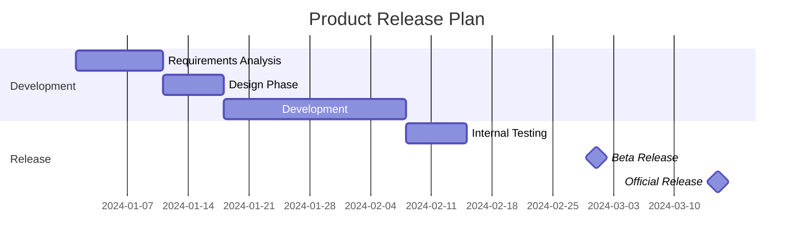
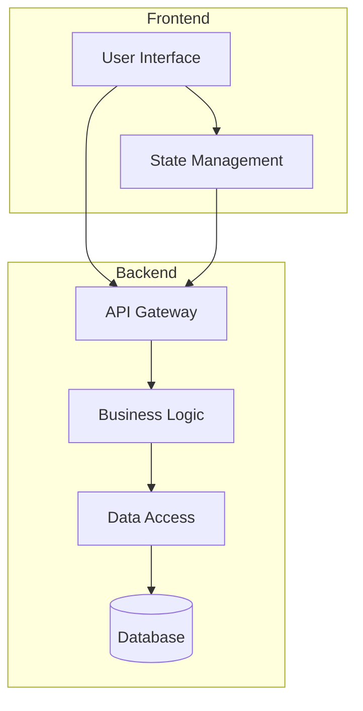
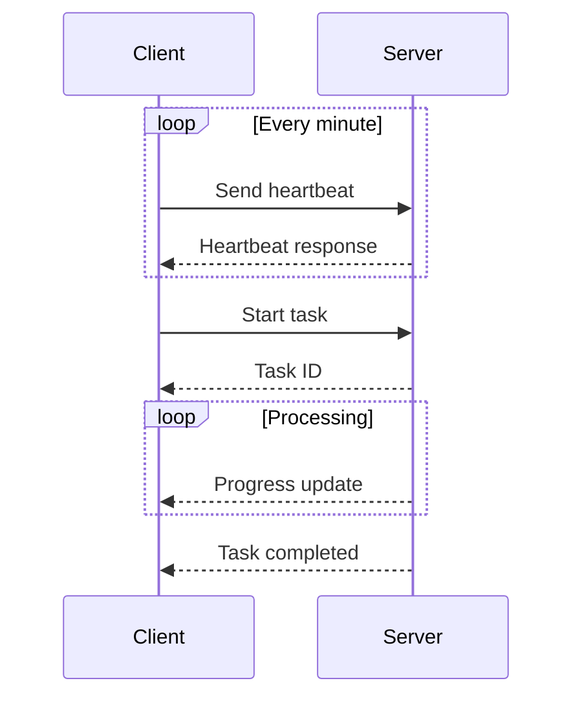
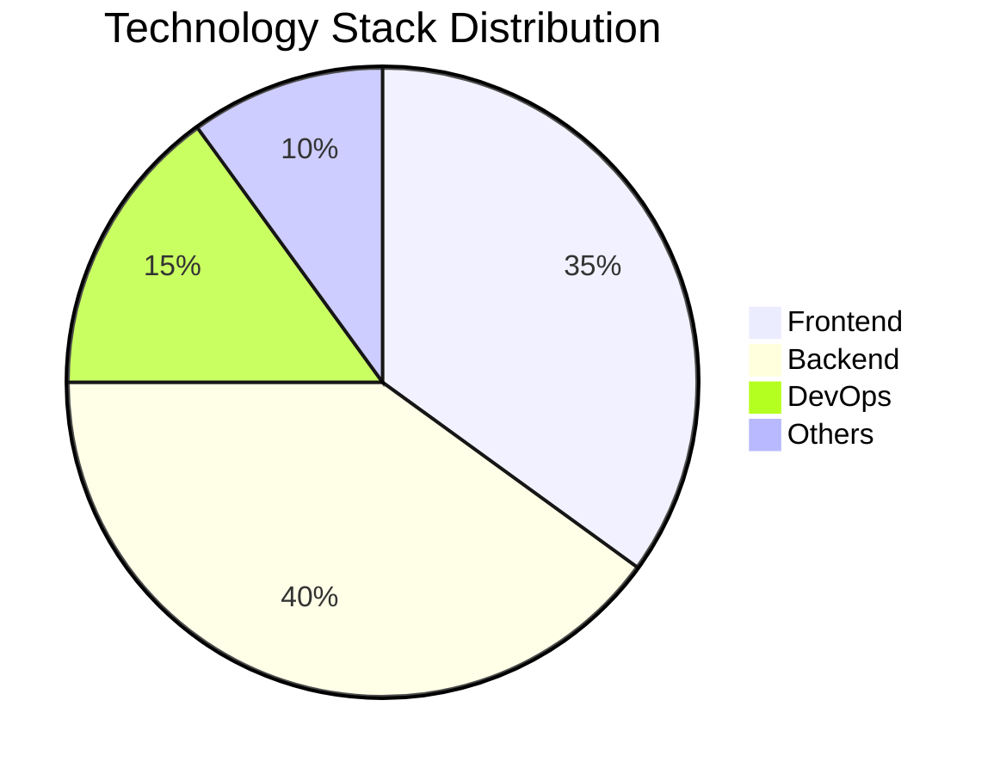
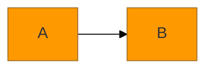
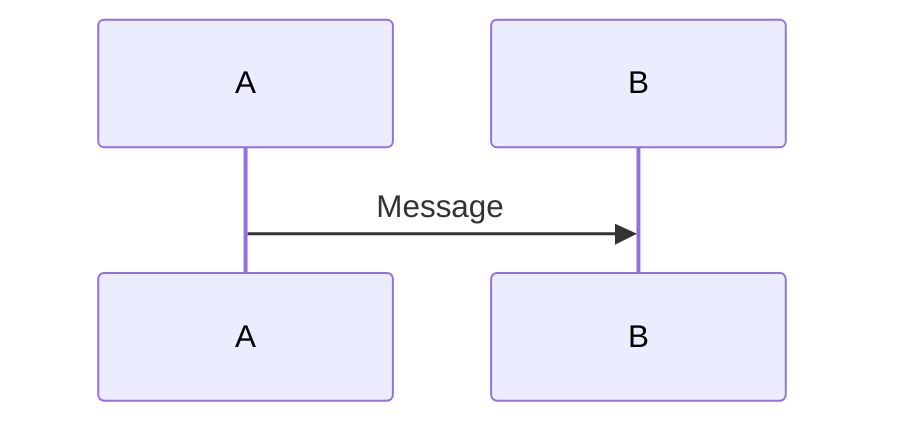
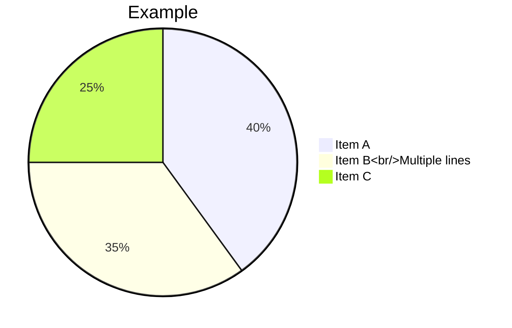
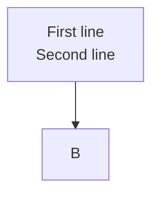
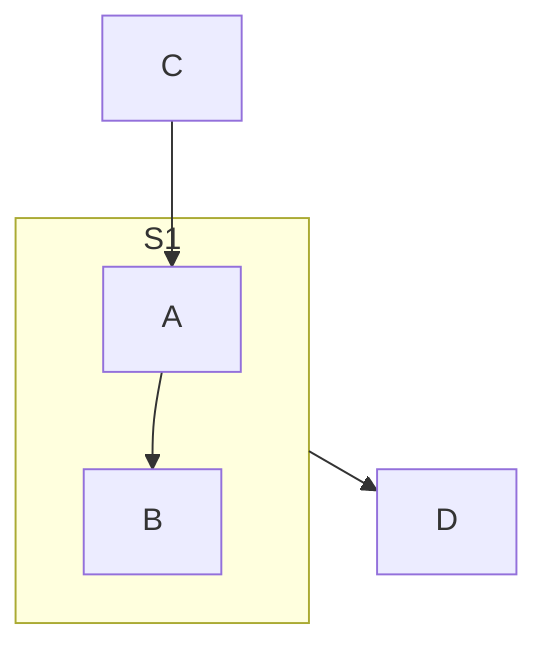
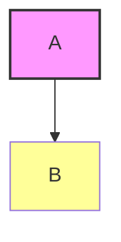

# Other Examples

## Diagram Description
This section summarizes special diagram types and tips that don't belong to standard categories, as well as advanced Mermaid usage.

## Syntax Examples

### Gantt Chart with Milestones



### Composite Flowchart



### Sequence Diagram with Loops



### Combined Diagram Display



## Mermaid Configuration and Themes

### Mermaid Theme Settings

````markdown

````

### Common Themes
- `default`: Default theme
- `base`: Base theme
- `dark`: Dark theme
- `forest`: Forest theme
- `neutral`: Neutral theme

## Mermaid Extended Syntax

### Mermaid in Markdown

Mermaid diagrams can be embedded directly in Markdown documents:

````markdown
This is explanatory text.


````

### HTML in Mermaid

Some Mermaid diagram types support HTML-formatted text:



## Common Issues and Tips

### 1. Text Wrapping


### 2. Special Character Escaping
Use quotes to wrap text containing special characters.

### 3. Subgraph References


### 4. CSS Styles


## Reference Resources

- [Mermaid Official Documentation](https://mermaid.js.org/)
- [Mermaid Live Editor](https://mermaid.live/)
- [Mermaid GitHub](https://github.com/mermaid-js/mermaid)

## Notes

- Some diagram types (such as C4, ZenUML, Sankey, Architecture) are experimental features
- Experimental feature syntax may change with version updates
- Recommend validating syntax before using in production environments
- Mermaid version updates may bring new diagram types and syntax
