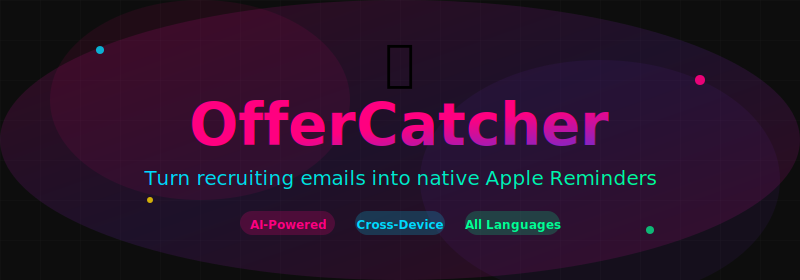

<p align="center">
  
</p>

<p align="center">
  <strong>Never miss an interview again.</strong><br>
  <sub>Turn recruiting emails into native reminders with AI-powered parsing.</sub>
</p>

<p align="center">
  <a href="#features">Features</a> •
  <a href="#quick-start">Quick Start</a> •
  <a href="#installation">Installation</a> •
  <a href="#usage">Usage</a> •
  <a href="#configuration">Configuration</a>
</p>

<p align="center">
  
  
  
  
  <a href="README_CN.md"></a>
</p>

---

## The Problem

You're job hunting. Your inbox is flooded with recruiting emails—interview invites, online assessments, coding challenges, deadlines. The important ones get buried under "application received" receipts and spam.

**You miss an interview.** Or show up at the wrong time. Or forget that coding test deadline.

## The Solution

**OfferCatcher** automatically scans your emails, extracts recruiting events using AI, and creates native reminders on your iPhone/Mac.

```
📧 Email arrives → 🤖 AI parses it → 🔔 Reminder created
```

No regex. No brittle pattern matching. Just intelligent extraction that works across all email formats and languages.

## Features

- **🤖 AI-Powered Parsing** — LLM understands any email format, any language
- **🍎 Native Apple Integration** — Works with Mail.app and Reminders.app
- **📱 Cross-Device Sync** — Reminders appear on iPhone, iPad, Mac via iCloud
- **⚡ Fully Automated** — Set up once, runs via OpenClaw heartbeat
- **🌍 Universal Language Support** — Chinese, English, Japanese, you name it

## Community

- [LINUX DO](https://linux.do) — 中文开发者社区

## Quick Start

```bash
# Install
curl -sSL https://raw.githubusercontent.com/NissonCX/offercatcher/main/install.sh | bash

# Configure
echo 'mail_account: "Gmail"' >> ~/.openclaw/offercatcher.yaml

# Scan
python3 ~/.openclaw/workspace/skills/offercatcher/scripts/recruiting_sync.py --scan-only
```

OpenClaw will automatically parse the results and create reminders.

## Installation

### Requirements

- macOS (Apple Mail & Reminders integration)
- Python 3.11+
- [OpenClaw](https://github.com/NissonCX/openclaw) (optional, for automation)

### Option 1: Install from ClawHub (Recommended)

```bash
# Search for the skill
openclaw skills search offercatcher

# Install to your workspace
openclaw skills install offercatcher
```

### Option 2: One-Line Install

```bash
curl -sSL https://raw.githubusercontent.com/NissonCX/offercatcher/main/install.sh | bash
```

### Option 3: Manual Install

```bash
git clone https://github.com/NissonCX/offercatcher.git
cd offercatcher
```

## Usage

### Step 1: Find Your Mail Account

```bash
python3 scripts/list_mail_sources.py
```

This shows all accounts configured in Apple Mail:

```json
[
  {"account": "Gmail", "mailbox": "INBOX"},
  {"account": "iCloud", "mailbox": "INBOX"}
]
```

### Step 2: Configure

Create `~/.openclaw/offercatcher.yaml`:

```yaml
mail_account: "Gmail"    # Your Apple Mail account name
mailbox: "INBOX"         # Mailbox to scan
days: 2                  # Scan last N days
max_results: 60          # Max emails to process
```

### Step 3: Scan Emails

```bash
python3 scripts/recruiting_sync.py --scan-only
```

Output (JSON for OpenClaw LLM to parse):

```json
{
  "emails": [
    {
      "message_id": "12345",
      "subject": "Interview Invitation - Software Engineer",
      "sender": "recruiting@company.com",
      "received_at": "2026-04-01 10:00",
      "body": "Dear Candidate, Your interview is scheduled for..."
    }
  ]
}
```

### Step 4: AI Parsing + Reminder Creation

OpenClaw automatically:
1. Parses each email with LLM
2. Extracts company, event type, time, link
3. Creates native Apple Reminders

Or manually apply parsed events:

```bash
python3 scripts/recruiting_sync.py --apply-events /tmp/events.json
```

### Manual Event Entry

```bash
python3 scripts/manual_event.py \
  --title "Google Interview" \
  --due "2026-04-15 14:00" \
  --notes "Link: https://meet.google.com/xxx"
```

## How It Works

```
┌─────────────────┐     ┌─────────────────┐     ┌─────────────────┐
│   --scan-only   │ ──▶ │   OpenClaw LLM  │ ──▶ │  --apply-events │
│   Scan emails   │     │   Parse events  │     │ Create reminder │
└─────────────────┘     └─────────────────┘     └─────────────────┘
```

### Why LLM Over Regex?

| Regex | LLM |
|-------|-----|
| Breaks on new formats | Adapts to any format |
| Company-specific rules | Works for any company |
| Manual maintenance | Zero maintenance |
| Language-specific | Universal language support |

## Configuration

### Command Line Options

| Option | Default | Description |
|--------|---------|-------------|
| `--mail-account` | all | Apple Mail account name |
| `--mailbox` | INBOX | Mailbox folder to scan |
| `--days` | 2 | Scan last N days |
| `--max-results` | 60 | Max emails to process |
| `--dry-run` | false | Test without creating reminders |
| `--verbose` | false | Enable debug logging |

### Environment Variables

```bash
OFFERCATCHER_MAIL_ACCOUNT="Gmail"
OFFERCATCHER_DAYS=7
OFFERCATCHER_MAX_RESULTS=100
OFFERCATCHER_LOG_LEVEL=DEBUG
```

### Event JSON Format

The `--apply-events` command accepts:

```json
{
  "events": [
    {
      "id": "unique-id",
      "company": "Google",
      "event_type": "interview",
      "title": "Google SWE Interview",
      "timing": {"start": "2026-04-15 14:00", "end": "2026-04-15 15:00"},
      "role": "Software Engineer",
      "link": "https://meet.google.com/xxx"
    }
  ]
}
```

Event types: `interview`, `ai_interview`, `written_exam`, `assessment`, `authorization`, `deadline`

## Screenshots

<table>
  <tr>
    <td align="center">
      
      <br><sub><b>Reminder List</b></sub>
    </td>
    <td align="center">
      
      <br><sub><b>Reminder Detail</b></sub>
    </td>
  </tr>
</table>

## Project Structure

```
offercatcher/
├── scripts/
│   ├── recruiting_sync.py      # Main script (scan/apply)
│   ├── apple_reminders_bridge.py # Apple Reminders bridge
│   ├── manual_event.py         # Manual event entry
│   └── list_mail_sources.py    # List Mail accounts
├── tests/                      # Unit tests
├── SKILL.md                    # OpenClaw skill definition
└── README.md                   # This file
```

## Contributing

Contributions are welcome! Please feel free to submit a Pull Request.

## License

[MIT License](./LICENSE)

---

<p align="center">
  Made with ❤️ for job seekers everywhere
</p>