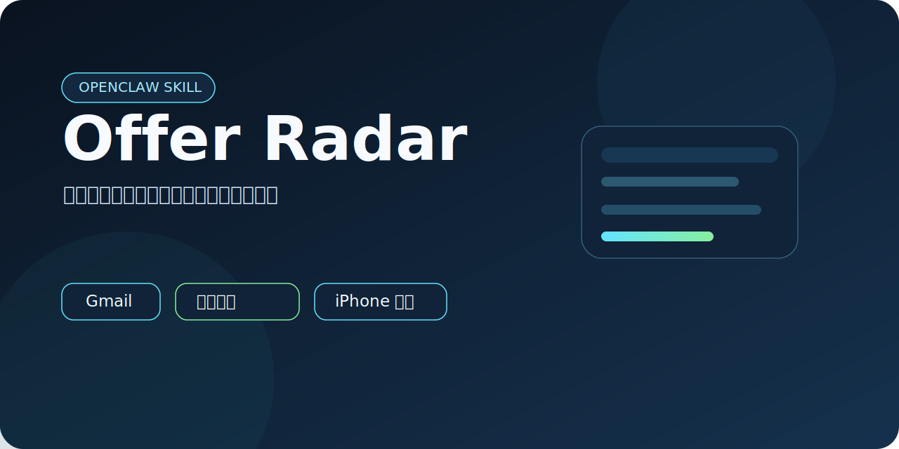

# OpenClaw Offer Radar



> 找工作时最烦的，不是没邮件，是重要邮件淹没在一堆无关邮件里。

[](./SKILL.md)
[](./scripts/recruiting_sync.py)
[](./README.md)
[](./LICENSE)

`OpenClaw Offer Radar` 是一个基于 OpenClaw、Gmail、Apple Mail 和 Apple Reminders 的招聘邮件提醒 skill，用来把面试、笔试、测评、授权、截止时间这类关键信息整理成中文提醒，并同步到 iPhone 的原生提醒事项里。

## 实际效果

<table>
  <tr>
    <td align="center" width="50%">
      
      <br />
      <strong>提醒列表页</strong>
    </td>
    <td align="center" width="50%">
      
      <br />
      <strong>提醒详情页</strong>
    </td>
  </tr>
</table>

## 适用环境

这不是一个“跨平台邮件工具”，它当前就是为苹果生态用户准备的：

- macOS
- Gmail
- Apple Mail
- Apple Reminders
- iPhone / iPad（通过 iCloud 同步提醒时可用）
- OpenClaw（如果你想把它作为 skill 或 heartbeat 自动化来跑）

如果你不是这类用户，这个仓库大概率不适合你。

## 依赖是怎么分工的

当前版本里，每个依赖都不是摆设，而是各自负责一段流程：

- `gog`
  用来搜索 Gmail 里的候选招聘邮件
- Apple Mail
  用来补抓邮件正文，提取时间、链接、岗位等信息
- Apple Reminders
  用来把事件落到 iPhone 原生提醒事项
- OpenClaw
  用来把这套流程变成 skill，或者接进 heartbeat 自动化

所以要明确一点：

- 当前仓库实现里，**Apple Mail 是必需依赖**
- 不是因为 Gmail 读不到，而是因为这版实现的正文解析依赖 Apple Mail

## 部署前你需要准备什么

在开始之前，请先确认本机已经满足这些条件：

1. 安装 `Python 3.11+`
2. 安装 `gog`
   如果你使用 Homebrew，可以直接：

```bash
brew install gogcli
```

3. `gog` 已经完成 Gmail 授权
4. Apple Mail 里已经登录了同一个 Gmail 账号
5. Apple Reminders 正常可用，并且会同步到你的 iCloud
6. Terminal / Python / osascript 首次运行时，如果系统弹出“控制 Mail”或“访问 Reminders”的权限请求，需要点允许

## 部署流程

### 1. 克隆仓库

如果你只是想先本地跑通：

```bash
git clone https://github.com/NissonCX/openclaw-offer-radar.git
cd openclaw-offer-radar
```

### 2. 验证 `gog` 是否可用

确认 `gog` 已经装好，并且 Gmail 授权正常：

```bash
gog gmail --help
gog gmail search -a your@gmail.com -j --results-only 'newer_than:3d in:inbox' --max 5
```

如果第二条命令能正常返回 Gmail 结果，说明 Gmail 这条链路通了。

### 3. 确认 Apple Mail 账号名

脚本需要知道 Apple Mail 里这个 Gmail 账号的名称。

例如我这台机器里账号名就是 `谷歌`，所以命令里会传：

```bash
--mail-account 谷歌
```

如果你机器里的 Mail 账号名不是 `谷歌`，就把参数改成你自己的实际名称。

### 4. 首次运行扫描

先不要急着写提醒事项，先跑一次扫描看结果：

```bash
python3 scripts/recruiting_sync.py \
  --account your@gmail.com \
  --mail-account 谷歌
```

当前默认行为是：

- 扫描最近 `2` 天邮件
- 最多读取 `60` 条候选线程
- 跳过投递成功、问卷、普通流程通知
- 只保留高置信度的招聘事件

### 5. 写入提醒事项

确认结果没有问题后，再同步到系统提醒事项：

```bash
python3 scripts/recruiting_sync.py \
  --account your@gmail.com \
  --mail-account 谷歌 \
  --sync-reminders
```

当前版本会默认：

- 使用 `iCloud` 账户下的 `OpenClaw` 列表
- 如果这个列表不存在，会自动创建
- 同一事件尽量只保留一条提醒
- 已过期和已取消事件不会继续保留为 active 提醒

## OpenClaw 中如何部署

如果你不是只想手动跑脚本，而是想把它作为 OpenClaw skill 使用，最简单的方式是直接把仓库放到 OpenClaw workspace 的 `skills` 目录里：

```bash
git clone https://github.com/NissonCX/openclaw-offer-radar.git \
  ~/.openclaw/workspace/skills/openclaw-offer-radar
```

然后你就可以：

- 手动调用这个 skill
- 或者把脚本接进 `HEARTBEAT.md`
- 让 OpenClaw 定时检查 Gmail 并更新提醒事项

一个最直接的 heartbeat 调用命令就是：

```bash
python3 ~/.openclaw/workspace/skills/openclaw-offer-radar/scripts/recruiting_sync.py \
  --account your@gmail.com \
  --mail-account 谷歌 \
  --sync-reminders
```

## 当前可配项

当前版本最重要的配置主要是这些：

- `--account`
  Gmail 账号，例如 `your@gmail.com`
- `--mail-account`
  Apple Mail 里的账号名，例如 `谷歌`
- `--days`
  扫描最近多少天，默认 `2`
- `--max-results`
  最多读取多少条候选线程，默认 `60`
- `--sync-reminders`
  是否真正写入 Apple Reminders

还有几个环境变量可以覆盖默认行为：

- `GOG_ACCOUNT`
  默认 Gmail 账号
- `OFFER_RADAR_MAIL_ACCOUNT`
  默认 Apple Mail 账号名
- `OFFER_RADAR_STATE_PATH`
  状态文件路径
- `OFFER_RADAR_REMINDERS_SCRIPT`
  自定义提醒桥接脚本路径

当前状态文件默认会写到：

```text
~/.openclaw/workspace/memory/gmail-reminder-state.json
```

## 部署后建议你先做的验证

1. `gog` 搜索是否正常返回 Gmail 结果
2. 首次扫描是否能识别出面试 / 笔试 / 授权事件
3. Apple Mail 首次运行时权限是否放行
4. Apple Reminders 是否成功创建 `OpenClaw` 列表
5. iPhone 上是否能同步看到新增提醒

## 当前定位

这个仓库当前先把一件事做好：

**把 Gmail 里的重要招聘事件，变成 iPhone 上好找、好记、好点开的原生提醒。**

它不是一个全能邮件系统，也不是一个跨平台提醒服务。它就是给使用 macOS、Gmail、iPhone 和 OpenClaw 的中文用户准备的。

## License

[MIT](./LICENSE)
