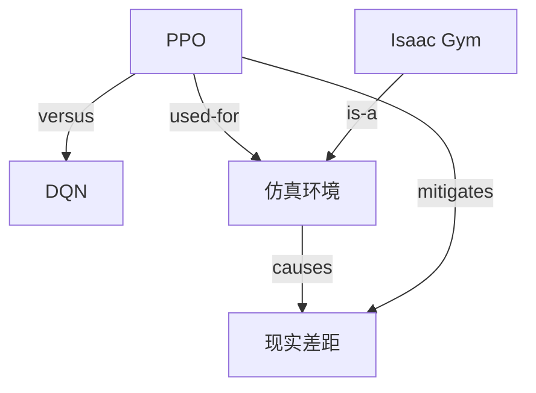

# 知识图谱构建指南

本文档详细说明如何构建高质量的概念-关系知识图谱。

---

## 图谱结构规范

### 基础结构

```json
{
  "knowledge_graph": {
    "domain": "主题领域",
    "version": "1.0",
    "created_at": "ISO日期",
    "entities": [...],
    "relations": [...]
  }
}
```

---

## 实体类型定义

| 类型 | 说明 | 示例 |
|------|------|------|
| `概念` | 抽象概念或术语 | 强化学习、策略梯度 |
| `方法` | 算法或技术方法 | PPO算法、DQN |
| `工具` | 软件或框架 | Isaac Gym、PyBullet |
| `应用` | 应用场景 | 机器人抓取、自动驾驶 |
| `问题` | 待解决的问题 | 现实差距、稀疏奖励 |
| `指标` | 评估指标 | 成功率、收敛速度 |
| `资源` | 学习资源 | Berkeley RL Course |

---

## 关系类型定义

### 基础关系

| 关系类型 | 含义 | 示例 |
|----------|------|------|
| `is-a` | 是...的一种 | PPO is-a 策略梯度算法 |
| `part-of` | 是...的组成部分 | 奖励函数 part-of 强化学习 |
| `has-part` | 包含... | 强化学习 has-part 状态空间 |
| `used-for` | 用于... | Isaac Gym used-for 仿真训练 |
| `uses` | 使用... | PPO uses 神经网络 |

### 对比关系

| 关系类型 | 含义 | 示例 |
|----------|------|------|
| `versus` | 与...对比 | PPO versus DQN |
| `alternative-to` | 是...的替代方案 | SAC alternative-to PPO |
| `improves-on` | 在...基础上改进 | PPO improves-on TRPO |

### 依赖关系

| 关系类型 | 含义 | 示例 |
|----------|------|------|
| `requires` | 需要... | 深度RL requires 大量数据 |
| `enables` | 使...成为可能 | GPU enables 大规模训练 |
| `hinders` | 阻碍... | 现实差距 hinders 实机部署 |

### 因果关系

| 关系类型 | 含义 | 示例 |
|----------|------|------|
| `causes` | 导致... | 稀疏奖励 causes 训练困难 |
| `solves` | 解决... | 好奇心驱动 solves 稀疏奖励 |
| `mitigates` | 缓解... | 领域随机化 mitigates 现实差距 |

---

## 图谱构建流程

### Step 1: 提取核心实体

从学习材料中提取关键概念：

```
方法：提取名词性短语，特别是：
- 大写缩写（PPO, DQN, SAC）
- 专业术语（策略、奖励函数、价值函数）
- 工具名称（Isaac Gym, MuJoCo）
```

### Step 2: 分类实体

将实体分配到合适的类型：

```python
def classify_entity(entity_name, context):
    if entity_name in ALGORITHMS:
        return "方法"
    elif entity_name in TOOLS:
        return "工具"
    elif entity_name in PROBLEMS:
        return "问题"
    # ...
```

### Step 3: 识别关系

从文本中识别实体间的关系：

```
模式匹配：
- "X是一种Y" → X is-a Y
- "X由Y组成" → Y part-of X
- "X用于Y" → X used-for Y
- "X相比Y" → X versus Y
- "X解决了Y" → X solves Y
```

### Step 4: 验证完整性

检查图谱的完整性：

- [ ] 每个实体都有定义
- [ ] 每个实体至少有一个关系
- [ ] 核心实体之间的关系已建立
- [ ] 无孤立实体

---

## 图谱质量指标

### 关系密度

```
关系密度 = 关系数量 / 实体数量
```

- 良好：密度 > 1.5
- 一般：密度 1.0 - 1.5
- 不足：密度 < 1.0

### 覆盖完整性

```
覆盖率 = 有关系的实体数 / 总实体数 × 100%
```

- 良好：覆盖率 > 90%
- 一般：覆盖率 70-90%
- 不足：覆盖率 < 70%

---

## 示例：强化学习知识图谱

```json
{
  "knowledge_graph": {
    "domain": "强化学习在机器人控制中的应用",
    "entities": [
      {
        "id": "e1",
        "name": "PPO",
        "type": "方法",
        "definition": "Proximal Policy Optimization，近端策略优化算法"
      },
      {
        "id": "e2",
        "name": "DQN",
        "type": "方法",
        "definition": "Deep Q-Network，深度Q网络算法"
      },
      {
        "id": "e3",
        "name": "仿真环境",
        "type": "工具",
        "definition": "用于训练强化学习智能体的虚拟环境"
      },
      {
        "id": "e4",
        "name": "现实差距",
        "type": "问题",
        "definition": "仿真训练与真实环境之间的性能差异"
      },
      {
        "id": "e5",
        "name": "Isaac Gym",
        "type": "工具",
        "definition": "NVIDIA开发的高性能机器人仿真平台"
      }
    ],
    "relations": [
      {
        "from": "e1",
        "to": "e2",
        "type": "versus",
        "description": "PPO适合连续动作空间，DQN适合离散动作空间"
      },
      {
        "from": "e1",
        "to": "e3",
        "type": "used-for",
        "description": "PPO常在仿真环境中训练"
      },
      {
        "from": "e5",
        "to": "e3",
        "type": "is-a",
        "description": "Isaac Gym是一种仿真环境"
      },
      {
        "from": "e3",
        "to": "e4",
        "type": "causes",
        "description": "仿真环境与现实差异导致现实差距"
      },
      {
        "from": "e1",
        "to": "e4",
        "type": "mitigates",
        "description": "PPO的稳定训练有助于缓解现实差距影响"
      }
    ]
  }
}
```

---

## 图谱可视化建议

可将JSON图谱转换为Mermaid图：



---

*版本：1.0.0*
