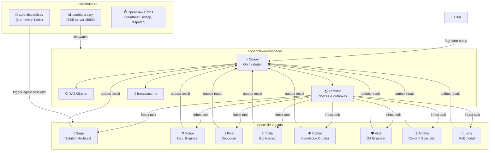
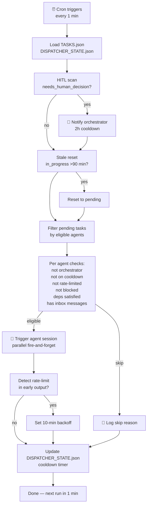
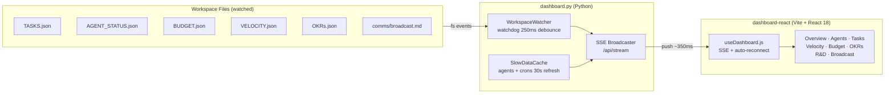
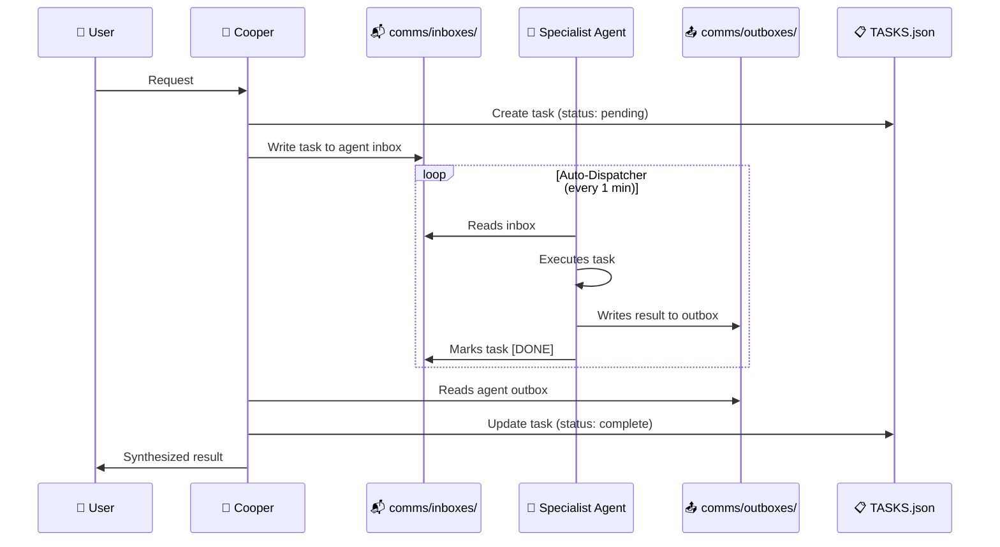

# 🦅 AGI Farm

> One wizard. Full multi-agent AI team. Live in minutes.

**AGI Farm** is an [OpenClaw](https://docs.openclaw.ai) skill that bootstraps a fully operational multi-agent AI system — agents, workspaces, cron jobs, comms infrastructure, live ops dashboard, and a portable GitHub bundle — all from a single interactive wizard.

---

## ✨ What It Does

- 🧙 **Interactive setup wizard** — answers 6 questions, generates everything
- 🤖 **Multi-agent team** — 3, 5, or 11 pre-wired specialist agents
- 📡 **Live ops dashboard** — React + SSE, ~350ms push latency, persistent LaunchAgent
- 🔄 **Auto-dispatcher** — cron-driven task delegation with HITL, rate-limit backoff, dependency checking
- 📦 **Portable bundle** — export your team to GitHub with one command
- 🧩 **Framework support** — autogen, crewai, langgraph out of the box

---

## 🗺️ Architecture

### System Overview



### Setup Wizard Flow

```mermaid
flowchart LR
    S1["Step 1\nTeam Name"] --> S2["Step 2\nOrchestrator Name"]
    S2 --> S3["Step 3\nTeam Size\n3 / 5 / 11"]
    S3 --> S35["Step 3.5\nDomain"]
    S35 --> S36["Step 3.6\nCustom Agents?"]
    S36 --> S4["Step 4\nFrameworks"]
    S4 --> S5["Step 5\nGitHub?"]
    S5 --> S6["Step 6\nConfirm"]
    S6 --> S7["Step 7\nWrite team.json\nassign models"]
    S7 --> S8["Step 8\nGenerate workspace\nfiles via generate.py"]
    S8 --> S9["Step 9\nCreate OpenClaw\nagents"]
    S9 --> S10["Step 10\nRegister cron jobs"]
    S10 --> S11["Step 11\nInstall frameworks"]
    S11 --> S12["Step 12\nGitHub push"]
    S12 --> S13["Step 13\nCommit workspace"]
    S13 --> S14["Step 14\nInit registries\nhealth check"]
    S14 --> DONE["✅ Team is live!"]
```



### Auto-Dispatcher Logic



### Dashboard Architecture



### Agent Communication Protocol



---

## 🚀 Quick Start

```bash
# Install via ClawHub
clawhub install agi-farm

# Run the setup wizard
/agi-farm setup
```

Answer the questions. Your team will be live in ~2 minutes.

---

## 📦 Commands

| Command | What it does |
|---------|-------------|
| `/agi-farm setup` | Full wizard — agents, workspace, crons, bundle, GitHub |
| `/agi-farm status` | Team health: agents, tasks, cron status |
| `/agi-farm rebuild` | Regenerate workspace from existing bundle (preserves edits) |
| `/agi-farm export` | Push bundle to GitHub |
| `/agi-farm dashboard` | Launch live ops room (React + SSE, :8080) |
| `/agi-farm dispatch` | Run auto-dispatcher manually |

---

## 🤖 Team Presets

### 3-agent (Minimal)
```
🦅 Orchestrator  ──►  🔮 Researcher  ──►  ⚒️ Builder
```

### 5-agent (Standard)
```
🦅 Orchestrator  ──►  🔮 Researcher  ──►  ⚒️ Builder
                 ──►  🛡️ QA          ──►  ⚓ Content
```

### 11-agent (Full Stack — Recommended)
```
🦅 Cooper (Orchestrator)
├── 🔮 Sage     Solution Architect
├── ⚒️ Forge    Implementation Engineer
├── 🐛 Pixel    Debugger
├── 🔭 Vista    Business Analyst
├── 🔊 Cipher   Knowledge Curator
├── 🛡️ Vigil    QA Engineer
├── ⚓ Anchor   Content Specialist
├── 📡 Lens     Multimodal Specialist
├── 🔄 Evolve   Process Improvement Lead
└── 🧪 Nova     R&D Lead
```

---

## 🧠 Model Selection Guide

| Role | Recommended tier | Why |
|------|-----------------|-----|
| Orchestrator | High (`sonnet`, `opus`) | Delegation judgment, broad reasoning |
| Architect / Researcher | High | Deep analysis, design decisions |
| Implementation Engineer | Mid (`glm-5`, `sonnet`) | Fast code gen, cost-efficiency |
| Debugger | High (`opus`) | Root-cause analysis |
| Business Analyst / Knowledge | Mid-high (`gemini-2.0-pro-exp`) | Long-context research |
| QA Engineer | Fast (`glm-4.7-flash`) | High-volume pattern checks |
| Content / Multimodal | Multimodal (`gemini-2.0-pro-exp`) | Vision + rich generation |
| R&D / Process Improvement | High | Creative + structured experiments |

---

## 🛟 Troubleshooting

| Symptom | Fix |
|---------|-----|
| `generate.py` fails: `ModuleNotFoundError` | `pip3 install jinja2` |
| `openclaw` not found in cron | Set `OPENCLAW_BIN=/path/to/openclaw` env var |
| Dashboard shows stale data | `launchctl stop ai.coopercorp.dashboard && launchctl start ai.coopercorp.dashboard` |
| Agent stuck >30 min | Check `comms/broadcast.md` for `[BLOCKED]` tags |
| Rate-limit backoff too aggressive | Edit `RATE_LIMIT_BACKOFF_MIN` in `scripts/auto-dispatch.py` |
| `gh repo create` fails | Run `gh auth login` first |

---

## 📁 Structure

```
agi-farm/
├── SKILL.md                     OpenClaw skill entry point
├── generate.py                  Workspace file generator (Jinja2)
├── scripts/
│   ├── auto-dispatch.py         Cron-driven task dispatcher
│   └── register-crons.py        Cron job registration
├── templates/                   30 templates (SOUL.md, CLAUDE.md, TASKS.json, ...)
├── references/
│   └── dashboard.md             Dashboard reference docs
└── dashboard-react/             Vite + React 18 frontend (dist/ served by dashboard.py)
```

---

## 📄 License

MIT — built for [OpenClaw](https://docs.openclaw.ai) · published on [ClawHub](https://clawhub.com)
