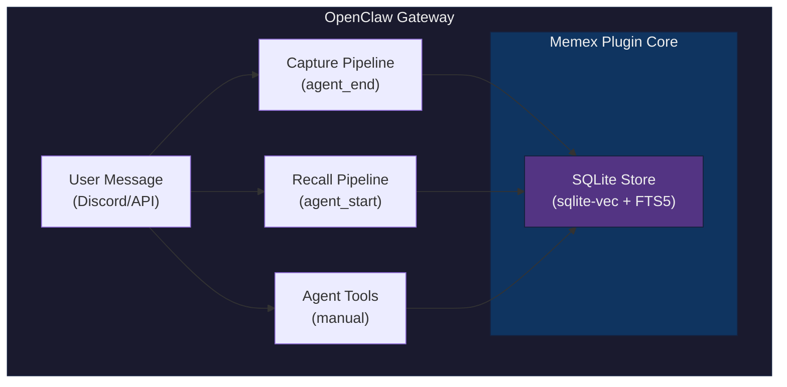
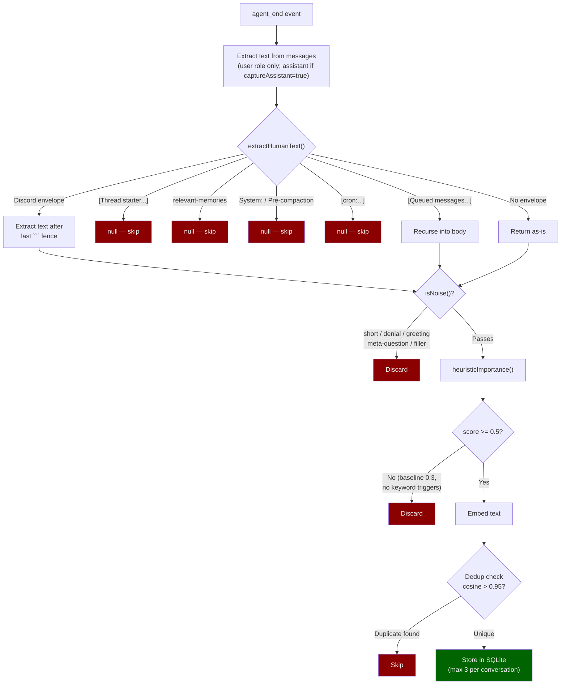
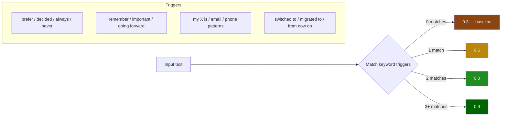
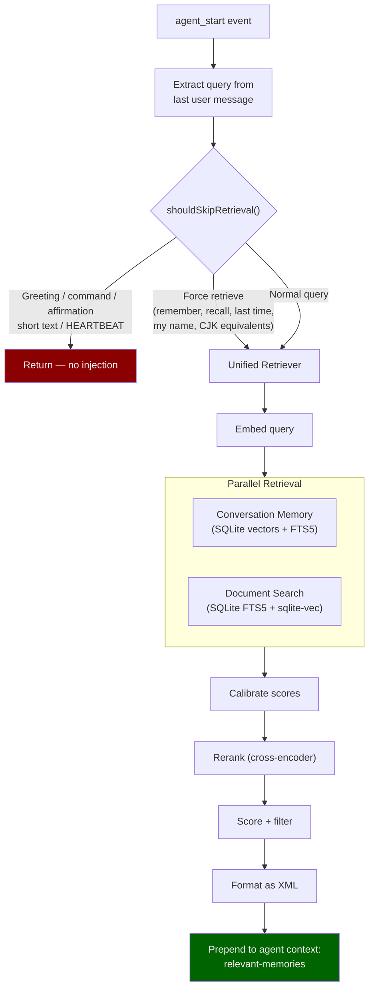
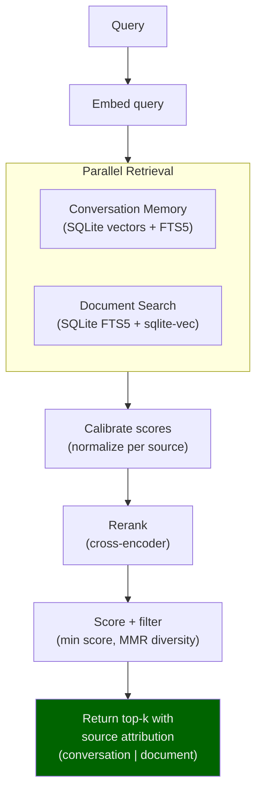
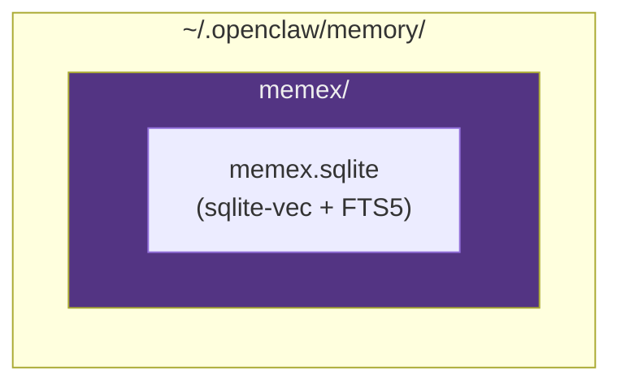
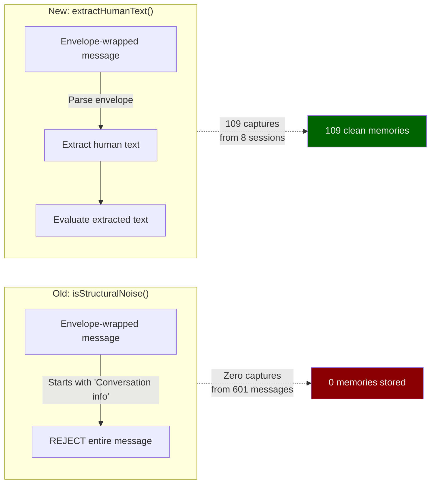
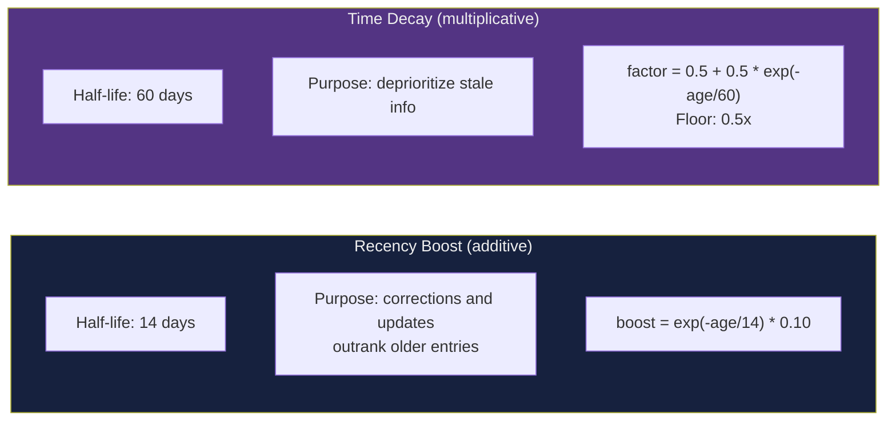

# Memex Pipeline — How It Works

This document traces every path a message takes through memex, from arrival to storage and retrieval. Covers both the **capture pipeline** (writing memories) and the **recall pipeline** (reading memories).

---

## Architecture Overview



---

## 1. Capture Pipeline (Auto-Capture)

**Trigger:** `agent_end` event — fires after every agent conversation turn.



### Heuristic Importance Scoring



### Example: Discord Message Through Capture

**Raw input** (what arrives at `agent_end`):
```
Conversation info (untrusted metadata):
  ```json
  { "conversation_label": "Guild #general", "channel_id": "123" }
  ```
Sender (untrusted metadata):
  ```json
  { "label": "user1", "name": "user1" }
  ```
we don't want to burn tokens on embedding every message
```

| Step | Function | Result |
|------|----------|--------|
| 1 | `extractHumanText()` | `"we don't want to burn tokens on embedding every message"` |
| 2 | `isNoise()` | false (not short, not denial, not greeting) |
| 3 | `heuristicImportance()` | 0.6 (matches "want" trigger) |
| 4 | threshold check | 0.6 >= 0.5 — passes |
| 5 | dedup check | no near-duplicate — passes |
| 6 | store | importance=0.6, category auto-detected |

### Example: Filtered Messages

| Message | Stage | Result |
|---------|-------|--------|
| `[Thread starter by user] topic about CI` | extractHumanText | null (thread preamble) |
| `<relevant-memories>[UNTRUSTED DATA]...</relevant-memories>` | extractHumanText | null (memory injection) |
| `System: exec result: {"exit_code": 0}` | extractHumanText | null (system message) |
| `got it` | isNoise | true (filler) |
| `Hello, how are you?` | isNoise | true (boilerplate greeting) |
| `The API uses REST` | heuristicImportance | 0.3 < 0.5 (no triggers, below threshold) |
| `I prefer dark mode always` | heuristicImportance | 0.8 (2 triggers: "prefer" + "always") passes |

---

## 2. Recall Pipeline (Auto-Recall + Tool-Based)

### 2a. Auto-Recall (Injected Context)

**Trigger:** `agent_start` event — fires before every agent conversation turn.



### 2b. Tool-Based Recall (Agent-Initiated)

| Tool | Description |
|------|-------------|
| `memory_recall` | Search both memories + documents (unified) |
| `memory_store` | Manually store a memory |
| `memory_forget` | Delete by ID or search query |
| `memory_update` | Update text/importance/category in-place |
| `memory_stats` | Storage statistics |
| `memory_list` | List recent memories with filtering |
| `document_search` | Search workspace documents only |

### 2c. The 7-Stage Retrieval Pipeline

This is the core of `MemoryRetriever.hybridRetrieval()`. Every recall query goes through these stages:

```mermaid
flowchart TD
    Q["Query text"] --> S1

    subgraph S1["Stage 1 — Hybrid Search"]
        direction LR
        VS["Vector Search<br/>(cosine similarity)<br/>weight: 0.7"]
        BM["BM25 Search<br/>(keyword FTS5)<br/>weight: 0.3"]
    end

    S1 --> S2["Stage 2 — RRF Fusion<br/>Both hit: vectorScore + 15% BM25 boost<br/>Vector only: vectorScore<br/>BM25 only: bm25Score (validate exists)<br/>Ghost entry detection"]

    S2 --> S3["Stage 3 — Rerank (cross-encoder)<br/>80% reranker + 20% fused score<br/>Timeout: 5s, fallback: cosine sim<br/>Provider: Jina / SiliconFlow / Voyage / Pinecone"]

    S3 --> S4["Stage 4 — Recency Boost<br/>boost = exp(-ageDays / 14) * 0.10<br/>Today: +0.10 | 7d: +0.06 | 14d: +0.04 | 30d: +0.01"]

    S4 --> S5["Stage 5 — Importance Weight<br/>factor = 0.7 + 0.3 * importance<br/>imp=1.0: x1.00 | imp=0.7: x0.91 | imp=0.5: x0.85"]

    S5 --> S6["Stage 6 — Time Decay + Length Norm<br/>Decay: 0.5 + 0.5 * exp(-age/60), floor 0.5x<br/>Length: 1 / (1 + 0.5 * log2(len/500))"]

    S6 --> S7["Stage 7 — Hard Cutoff + Noise + MMR<br/>hardMinScore: 0.40<br/>Noise filter (denials, boilerplate)<br/>MMR: cosine > 0.85 → defer duplicate"]

    S7 --> OUT["Return top-k results"]

    style S1 fill:#1a1a2e,color:#eee
    style S2 fill:#16213e,color:#eee
    style S3 fill:#0f3460,color:#eee
    style S4 fill:#533483,color:#eee
    style S5 fill:#5b2c6f,color:#eee
    style S6 fill:#6c3483,color:#eee
    style S7 fill:#7d3c98,color:#eee
    style OUT fill:#006400,color:#eee
```



### Example: Retrieval Walkthrough

**Query:** `"what embedding model do we use"`

| Stage | Action | Example Result |
|-------|--------|----------------|
| 1. Hybrid | Vector: 8 results, BM25: 5 results | 10 unique candidates |
| 2. Fusion | ID `abc123` in both, score boosted by 15% | 0.72 -> 0.83 |
| 3. Rerank | Cross-encoder confirms top 3, demotes #4 | Scores redistributed |
| 4. Recency | "Switched to Qwen3-Embedding" (2 days old) gets +0.09 | 0.78 -> 0.87 |
| 5. Importance | Same entry has importance=0.8, factor x0.94 | 0.87 -> 0.82 |
| 6. Decay/Len | 3-day old, 45 chars, minimal penalties | 0.82 -> 0.81 |
| 7. Cutoff | All above 0.40 survive; MMR defers duplicate phrasing | 5 results returned |

---

## 3. Unified Retriever (Single-Pass Pipeline)

The unified retriever handles both conversation memory and document search in a single pass:



### Score Calibration

Each source produces scores on different scales. The calibration step normalizes scores per source before the shared reranking pass, ensuring conversation memories and document results are comparable.

---

## 4. Latency Profile

```mermaid
gantt
    title Typical Unified Retriever Timeline
    dateFormat X
    axisFormat %Lms

    section Pre-check
    shouldSkipRetrieval     :done, 0, 1

    section Embedding
    embedQuery (cached)     :done, 1, 2

    section Parallel Retrieval
    vectorSearch (33ms)     :active, vs, 2, 35
    bm25Search (14ms)       :active, bm, 2, 16
    docSearch (~200ms)      :active, 2, 200

    section Pipeline
    calibrate scores        :done, 200, 201
    rerank (53ms)           :active, 201, 254
    score+filter+format     :done, 254, 260
```



| Operation | Latency | Bound |
|-----------|---------|-------|
| extractHumanText() | ~0.001ms | CPU (regex) |
| isNoise() | ~0.001ms | CPU (regex) |
| heuristicImportance() | ~0.001ms | CPU (regex) |
| shouldSkipRetrieval() | ~0.001ms | CPU (regex) |
| Embed (cached, 97%+ hit rate) | <0.03ms | Memory |
| Embed (uncached, batch 5) | ~83ms | Network I/O |
| Vector search (sqlite-vec) | ~33ms | CPU (SIMD) |
| BM25 search (FTS5) | ~14ms | CPU (index) |
| Rerank (5 docs, cross-encoder) | ~53ms | Network I/O |
| Full hybrid+rerank pipeline | ~250ms | Mixed |
| Unified recall (both sources) | ~300-400ms | Mixed |

---

## 5. Storage Layout



### Memory Entry Schema

```typescript
{
  id: string;          // UUID
  text: string;        // The memory content
  vector: number[];    // 1024-dim embedding (Qwen3-Embedding)
  importance: number;  // 0.0-1.0 (set by heuristic at capture)
  category: string;    // "preference" | "fact" | "decision" | "entity" | "other"
  scope: string;       // "global" | "agent:<id>" | "session:<id>"
  timestamp: number;   // Unix epoch ms
}
```

---

## 6. Configuration (openclaw.plugin.json)

Key config knobs that affect the pipeline:

| Config | Default | Effect |
|--------|---------|--------|
| `autoCapture` | true | Enable/disable auto-capture pipeline |
| `captureAssistant` | false | Also capture assistant messages |
| `captureMinImportance` | 0.5 | Heuristic score threshold |
| `retrieval.mode` | "hybrid" | "hybrid" or "vector" only |
| `retrieval.rerank` | "cross-encoder" | "cross-encoder", "lightweight", "none" |
| `retrieval.hardMinScore` | 0.40 | Post-pipeline score cutoff |
| `retrieval.recencyHalfLifeDays` | 14 | Recency boost decay rate |
| `retrieval.timeDecayHalfLifeDays` | 60 | Staleness penalty rate |
| `retrieval.lengthNormAnchor` | 500 | Length penalty reference |
| `unifiedRecall.crossRerank` | false | Cross-source reranking |
| `unifiedRecall.earlyTermination` | false | Skip docs when memories are strong |

---

## 7. Design Decisions

### Why heuristic importance instead of reranker for capture?

Cross-encoders score **query-document relevance** — they answer "how relevant is this document to this query?". But at capture time there is no query. The reranker was being asked "how relevant is 'I prefer dark mode' to 'Important knowledge worth remembering'?" and scoring it 0.0000.

The heuristic scores **standalone importance** by detecting signal words that humans use when stating preferences, decisions, or facts worth remembering. It is crude but effective: a message with "prefer" and "always" in it is almost certainly memory-worthy.

### Why extract envelopes instead of rejecting them?



OpenClaw wraps **every** user message in metadata envelopes. The old approach treated the entire wrapped message as noise and discarded it. The fix inverts the logic: extract the human text from the envelope, then evaluate it.

### Why separate recency boost and time decay?

They serve different purposes:



### Why MMR diversity?

Without it, a query about "coding style" could return 5 near-identical memories about the same style preference. MMR (Maximal Marginal Relevance) detects when two results have cosine similarity > 0.85 and defers the lower-scored one to the end of results, ensuring diverse top-k.
