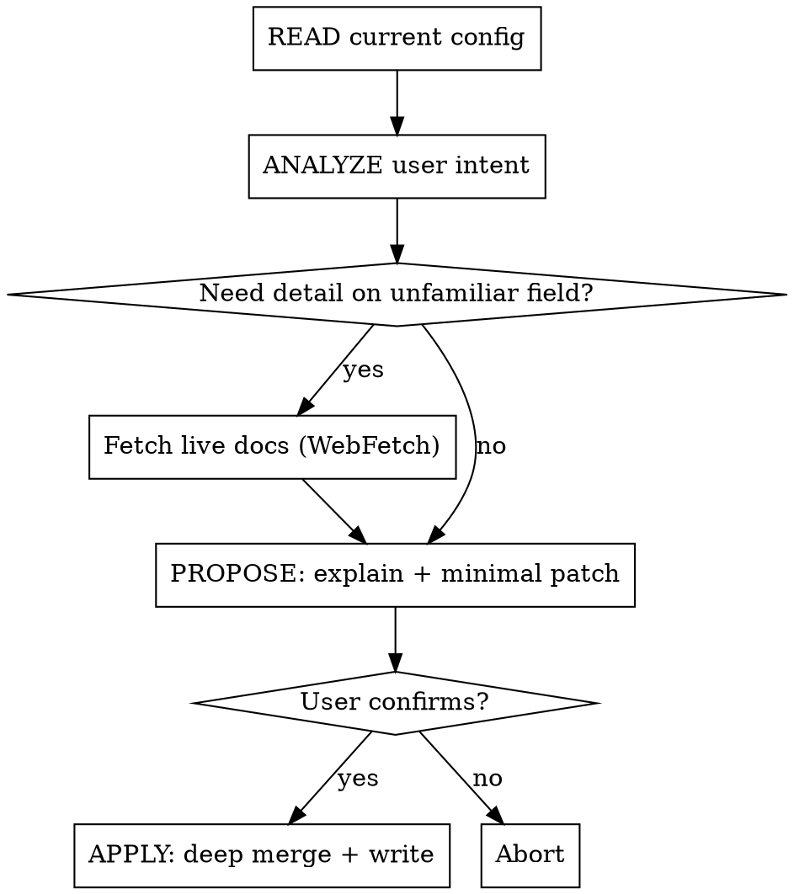

# configure-OpenClaw

## Overview

Safely modify `~/.openclaw/openclaw.json` with minimal, validated patches. OpenClaw uses strict schema validation — unknown fields or malformed values **prevent startup**. Every edit must be correct before writing.

## Safe Edit Process



**Hard Rules — no exceptions:**
- Never write to file before user confirmation
- Never output full config unless user explicitly requests it
- Only change fields the user requested — no bonus edits
- Never guess unknown fields — fetch live docs first
- Config changes are hot-reloaded for most sections — no restart needed
- Restart required only for: gateway server settings (port, bind, auth, TLS), infrastructure (discovery, plugins)
- If startup fails after edit, run `openclaw doctor` to diagnose, `openclaw doctor --fix` to auto-repair

## Output Format

Natural language explanation + minimal JSON5 patch (changed fields only):

```
Changing `agents.defaults.model.primary` from "anthropic/claude-sonnet-4-6" to "anthropic/claude-opus-4-6".

// patch
{
  agents: {
    defaults: {
      model: {
        primary: "anthropic/claude-opus-4-6",
      },
    },
  },
}
```

## Live Docs — Fetch When Needed

When the requested field is not in the quick reference below, or you need to validate allowed values:

- **Configuration overview:** `https://docs.openclaw.ai/gateway/configuration`
- **Field reference:** `https://docs.openclaw.ai/gateway/configuration-reference`
- **Examples:** `https://docs.openclaw.ai/gateway/configuration-examples`

## CLI Alternatives

- `openclaw onboard` — full interactive setup
- `openclaw configure` — config wizard
- `openclaw config get/set/unset` — CLI field access
- Control UI at `http://127.0.0.1:18789` Config tab

## Quick Reference

### Format Rules

| Rule | Example |
|------|---------|
| Duration strings | `"30m"` `"1h"` `"24h"` `"30d"` |
| Size strings | `"2mb"` `"10mb"` `"1g"` |
| File paths | `"~/.openclaw/workspace"` (`~` supported) |
| Model IDs | `"anthropic/claude-sonnet-4-6"` (must include provider prefix) |
| Phone numbers | `"+15555550123"` (E.164 format, array) |
| JSON5 format | `//` comments and trailing commas supported |
| `$include` | `{ $include: "./agents.json5" }` — include external files, supports arrays for deep-merge |
| Secret refs | `{ source: "env", id: "MY_KEY" }` — for credential fields (env/file/exec) |
| Env substitution | `${VAR_NAME}` in strings; missing vars throw load-time error; escape: `$${VAR}` |

### identity

```json5
{
  identity: {
    name: "Clawd",       // bot display name
    theme: "helpful assistant",
    emoji: "🦞",
  }
}
```

### agents.defaults

```json5
{
  agents: {
    defaults: {
      workspace: "~/.openclaw/workspace",  // required
      model: {
        primary: "anthropic/claude-sonnet-4-6",
        fallbacks: ["anthropic/claude-opus-4-6"],
      },
      imageModel: { primary: "anthropic/claude-sonnet-4-6" },
      imageGenerationModel: { primary: "anthropic/claude-sonnet-4-6" },
      pdfModel: { primary: "anthropic/claude-sonnet-4-6" },
      pdfMaxBytesMb: 10,
      pdfMaxPages: 20,
      imageMaxDimensionPx: 1200,
      timeoutSeconds: 600,
      maxConcurrent: 3,
      contextTokens: 200000,
      mediaMaxMb: 5,
      userTimezone: "America/New_York",  // IANA timezone
      timeFormat: "auto",                // "auto" | "12" | "24"
      thinkingDefault: "low",    // "off" | "minimal" | "low" | "medium" | "high" | "xhigh" | "adaptive"
      elevatedDefault: "on",     // "off" | "on" | "ask" | "full"
      verboseDefault: "off",     // "off" | "on" | "full"
      typingMode: "instant",     // "never" | "instant" | "thinking" | "message"
      typingIntervalSeconds: 6,
      sandbox: {
        mode: "off",            // "off" | "non-main" | "all"
        backend: "docker",      // "docker" | "ssh" | "openshell"
        scope: "session",       // "session" | "agent" | "shared"
        workspaceAccess: "none", // "none" | "ro" | "rw"
      },
      heartbeat: {
        every: "30m",           // duration string; "0m" disables
        target: "none",         // "none" | "last" | channel name
        directPolicy: "allow",  // "allow" | "block"
        isolatedSession: false,
        prompt: "",             // custom heartbeat prompt
      },
      compaction: {
        mode: "safeguard",           // "default" | "safeguard"
        timeoutSeconds: 900,
        reserveTokensFloor: 24000,
        identifierPolicy: "strict",  // "strict" | "off" | "custom"
        memoryFlush: { enabled: true, softThresholdTokens: 6000 },
      },
      contextPruning: {
        mode: "cache-ttl",      // "off" | "cache-ttl"
        ttl: "1h",
        keepLastAssistants: 3,
      },
      subagents: {
        maxConcurrent: 8,
        runTimeoutSeconds: 900,
        archiveAfterMinutes: 60,
      },
      blockStreamingDefault: "off",  // "on" | "off"
    },
    list: [                     // multi-agent setup
      {
        id: "default",
        default: true,
        workspace: "~/.openclaw/workspace",
        identity: { name: "Bot", theme: "assistant", emoji: "🤖" },
        groupChat: { mentionPatterns: ["@bot"] },
      },
    ],
  }
}
```

### channels

Supported: WhatsApp, Telegram, Discord, Slack, Signal, iMessage, Google Chat, Mattermost, MS Teams, Matrix, IRC, BlueBubbles.

```json5
{
  channels: {
    whatsapp: {
      allowFrom: ["+15555550123"],
      dmPolicy: "pairing",        // "pairing" | "allowlist" | "open" | "disabled"
      groupPolicy: "allowlist",   // "pairing" | "allowlist" | "open" | "disabled"
      groups: { "*": { requireMention: true } },
      textChunkLimit: 4000,
      chunkMode: "length",        // "length" | "newline"
      mediaMaxMb: 50,
      sendReadReceipts: true,
    },
    telegram: {
      enabled: true,
      botToken: "YOUR_TOKEN",
      allowFrom: ["123456789"],
      historyLimit: 50,
      replyToMode: "off",         // "off" | "first" | "all"
      streaming: "off",           // "off" | "partial" | "block" | "progress"
      linkPreview: true,
      proxy: "",                  // SOCKS5 URL
    },
    discord: {
      enabled: true,
      token: "YOUR_TOKEN",
      dm: { enabled: true, allowFrom: ["USER_ID"] },
      historyLimit: 20,
      textChunkLimit: 2000,
      streaming: "off",           // "off" | "partial" | "block" | "progress"
      voice: { enabled: true },
      threadBindings: { enabled: true, idleHours: 24 },
    },
    slack: {
      enabled: true,
      botToken: "xoxb-...",
      appToken: "xapp-...",
      channels: { "#general": { allow: true, requireMention: true } },
      historyLimit: 50,
      streaming: "partial",       // "off" | "partial" | "block" | "progress"
      nativeStreaming: true,
      slashCommand: { enabled: true, name: "openclaw" },
    },
    signal: {
      enabled: true,
      account: "+15555550123",    // phone number
      dmPolicy: "pairing",
      allowFrom: ["+15555550123"],
      historyLimit: 50,
    },
    imessage: {
      enabled: true,
      dmPolicy: "pairing",
      allowFrom: ["+15555550123"],
      historyLimit: 50,
      includeAttachments: false,
      mediaMaxMb: 16,
    },
    googlechat: {
      enabled: true,
      serviceAccountFile: "path/to/sa.json",
      webhookPath: "/googlechat",
      dm: { enabled: true, policy: "pairing" },
      groupPolicy: "allowlist",
    },
    mattermost: {
      enabled: true,
      botToken: "YOUR_TOKEN",
      baseUrl: "https://your.mattermost.com",
      chatmode: "oncall",         // "oncall" | "onmessage" | "onchar"
    },
    matrix: {
      enabled: true,
      homeserver: "https://matrix.example.com",
      accessToken: "YOUR_TOKEN",
      encryption: true,
    },
    msteams: { enabled: true },
    irc: {
      enabled: true,
      dmPolicy: "pairing",
      nickserv: { enabled: true, password: "PASS" },
    },
  }
}
```

### Channel model overrides

```json5
{
  channels: {
    modelByChannel: {
      discord: { "CHANNEL_ID": "anthropic/claude-opus-4-6" },
      slack: { "#heavy-tasks": "anthropic/claude-opus-4-6" },
    },
  }
}
```

### auth

```json5
{
  auth: {
    profiles: {
      "anthropic:me": {
        provider: "anthropic",
        mode: "oauth",       // "oauth" | "api_key"
        email: "me@example.com",
      },
    },
    order: {
      anthropic: ["anthropic:me"],
    },
  }
}
```

### models.providers (custom/local models)

```json5
{
  models: {
    mode: "merge",   // "merge" | "replace"
    providers: {
      "lmstudio": {
        baseUrl: "http://127.0.0.1:1234/v1",
        apiKey: "lmstudio",
        api: "openai-responses",
        models: [{
          id: "my-model",
          name: "My Model",
          reasoning: false,
          input: ["text"],
          cost: { input: 0, output: 0, cacheRead: 0, cacheWrite: 0 },
          contextWindow: 128000,
          maxTokens: 8192,
        }],
      },
    },
    bedrockDiscovery: { enabled: false, region: "us-east-1" },
  }
}
```

### session

```json5
{
  session: {
    dmScope: "per-peer",   // "main" | "per-peer" | "per-channel-peer" | "per-account-channel-peer"
    threadBindings: {
      enabled: true,
      idleHours: 24,
      maxAgeHours: 168,
    },
    reset: {
      mode: "daily",       // "daily" | "idle" | "never"
      atHour: 4,
      idleMinutes: 60,
    },
    resetTriggers: ["/new", "/reset"],
    mainKey: "main",
    agentToAgent: { maxPingPongTurns: 5 },
    maintenance: {
      mode: "warn",          // "warn" | "enforce"
      pruneAfter: "30d",
      maxEntries: 500,
      rotateBytes: "10mb",
    },
  }
}
```

### messages

```json5
{
  messages: {
    responsePrefix: "🦞",       // emoji/text or "auto"
    ackReaction: "👀",           // emoji or "" to disable
    ackReactionScope: "group-mentions", // "group-mentions" | "group-all" | "direct" | "all"
    removeAckAfterReply: false,
    queue: {
      mode: "collect",          // "steer" | "followup" | "collect" | "steer-backlog" | "queue" | "interrupt"
      debounceMs: 1000,
      cap: 20,
      drop: "summarize",       // "old" | "new" | "summarize"
    },
    inbound: { debounceMs: 2000 },
    tts: {
      auto: "always",          // "off" | "always" | "inbound" | "tagged"
      mode: "final",           // "final" | "all"
      provider: "elevenlabs",  // "elevenlabs" | "openai"
    },
  }
}
```

### commands

```json5
{
  commands: {
    native: "auto",            // "auto" | "true" | "false"
    text: true,                // parse text commands
    bash: false,               // enable !/bash
    bashForegroundMs: 2000,
    config: false,             // enable /config
    debug: false,              // enable /debug
    useAccessGroups: true,
  }
}
```

### gateway

```json5
{
  gateway: {
    mode: "local",              // "local" | "remote"
    port: 18789,
    bind: "loopback",          // IP address or "loopback" | "all"
    auth: {
      mode: "token",           // "none" | "token" | "password" | "trusted-proxy"
      token: "your-token",
    },
    reload: {
      mode: "hybrid",         // "hybrid" | "hot" | "restart" | "off"
      debounceMs: 300,
    },
    controlUi: {
      enabled: true,
      basePath: "/openclaw",
    },
    tailscale: {
      mode: "off",             // "off" | "serve" | "funnel"
    },
    push: {
      apns: { relay: { baseUrl: "", timeoutMs: 10000 } },
    },
  }
}
```

Reload modes: `hybrid` = hot-apply safe + auto-restart critical; `hot` = hot-apply only, warns on restart-needed; `restart` = restart on any change; `off` = no file watching.

### tools

```json5
{
  tools: {
    profile: "coding",         // "minimal" | "coding" | "messaging" | "full"
    allow: ["exec", "read", "write", "edit"],
    deny: ["browser"],
    elevated: {
      enabled: true,
      allowFrom: { whatsapp: ["+15555550123"] },
    },
    exec: {
      backgroundMs: 10000,
      timeoutSec: 1800,
      applyPatch: { enabled: false },
    },
    web: {
      search: { enabled: true, maxResults: 5 },
      fetch: { enabled: true, maxChars: 50000 },
    },
    media: {
      audio: { enabled: true, maxBytes: 20971520 },
      video: { enabled: true, maxBytes: 52428800 },
    },
    loopDetection: {
      enabled: false,
      warningThreshold: 10,
      criticalThreshold: 20,
    },
    agentToAgent: { enabled: false },
    sessions: { visibility: "tree" },  // "self" | "tree" | "agent" | "all"
  }
}
```

### cron

```json5
{
  cron: {
    enabled: true,
    maxConcurrentRuns: 2,
    sessionRetention: "7d",   // duration string or false
    runLog: {
      maxBytes: "2mb",
      keepLines: 500,
    },
  }
}
```

### hooks (webhooks)

```json5
{
  hooks: {
    enabled: true,
    token: "shared-secret",
    path: "/hooks",
    defaultSessionKey: "hook-session",
    allowRequestSessionKey: true,
    allowedSessionKeyPrefixes: ["hook-"],
    mappings: [
      {
        match: { path: "/deploy" },
        action: "agent",
        agentId: "default",
        deliver: true,
        allowUnsafeExternalContent: false,
      },
    ],
  }
}
```

### env

```json5
{
  env: {
    vars: { MY_API_KEY: "value" },
    shellEnv: {
      enabled: true,
      timeoutMs: 5000,
    },
  }
}
```

### skills

```json5
{
  skills: {
    allowBundled: ["gemini", "peekaboo"],
    load: { extraDirs: ["~/my-skills"] },
    install: { preferBrew: true, nodeManager: "npm" },
    entries: {
      "my-skill": {
        enabled: true,
        apiKey: "KEY_HERE",
        env: { MY_API_KEY: "KEY_HERE" },
      },
    },
  }
}
```

### plugins

```json5
{
  plugins: {
    enabled: true,
    allow: ["plugin-name"],
    deny: [],
    load: { paths: ["~/my-plugins"] },
    entries: {
      "my-plugin": { enabled: true, config: {} },
    },
    slots: {
      memory: "",              // active memory plugin
      contextEngine: "legacy", // active context engine
    },
  }
}
```

### browser

```json5
{
  browser: {
    enabled: true,
    evaluateEnabled: true,
    defaultProfile: "user",
    headless: false,
    color: "#FF4500",
    profiles: {
      user: {
        driver: "existing-session",
        cdpPort: 9222,
      },
    },
    ssrfPolicy: {
      dangerouslyAllowPrivateNetwork: true,
      hostnameAllowlist: [],
    },
  }
}
```

### ui

```json5
{
  ui: {
    seamColor: "#FF4500",
    assistant: { name: "Clawd", avatar: "🦞" },
  }
}
```

### talk (voice)

```json5
{
  talk: {
    voiceId: "ELEVENLABS_VOICE_ID",
    modelId: "eleven_v3",
    outputFormat: "mp3_44100_128",
    silenceTimeoutMs: 1500,
    interruptOnSpeech: true,
  }
}
```

### bindings (multi-agent routing)

```json5
{
  bindings: [
    {
      type: "route",           // "route" | "acp"
      agentId: "support-bot",
      match: {
        channel: "discord",
        accountId: "USER_ID",
        peer: { kind: "direct", id: "PEER_ID" },
      },
    },
  ],
}
```

## Common Mistakes

| Mistake | Correct approach |
|---------|-----------------|
| Write full config overwriting existing settings | Output patch only, deep merge |
| Use `agent.workspace` (flat) | Correct path: `agents.defaults.workspace` |
| Model ID `"claude-sonnet-4-6"` | Must include prefix: `"anthropic/claude-sonnet-4-6"` |
| `allowFrom: "+1555..."` as string | `allowFrom: ["+1555..."]` must be array |
| Write to file before user confirms | Propose patch first, wait for explicit confirmation |
| Guess unknown fields | Fetch live docs first, then generate patch |
| Add unknown fields arbitrarily | Schema strictly validated — unknown fields prevent startup |
| Tell user to restart after edit | Config hot-reloads automatically (except gateway/infrastructure/plugins) |
| Use `session.scope` | Correct field: `session.dmScope` |
| Use `thinkingDefault: "on"` | Valid values: `"off"` `"minimal"` `"low"` `"medium"` `"high"` `"xhigh"` `"adaptive"` |
| Use `elevatedDefault: "true"` | Valid values: `"off"` `"on"` `"ask"` `"full"` |
| Omit `models.mode` with custom providers | Set `mode: "merge"` to keep built-in catalog, `"replace"` to override |
| Set `sandbox.mode` without backend | Must also set `sandbox.backend`: `"docker"` `"ssh"` `"openshell"` |
