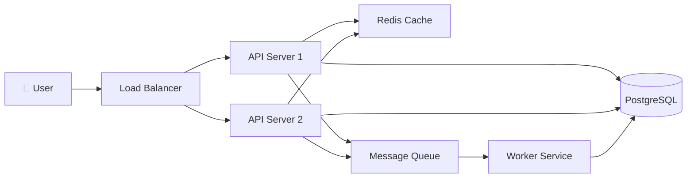
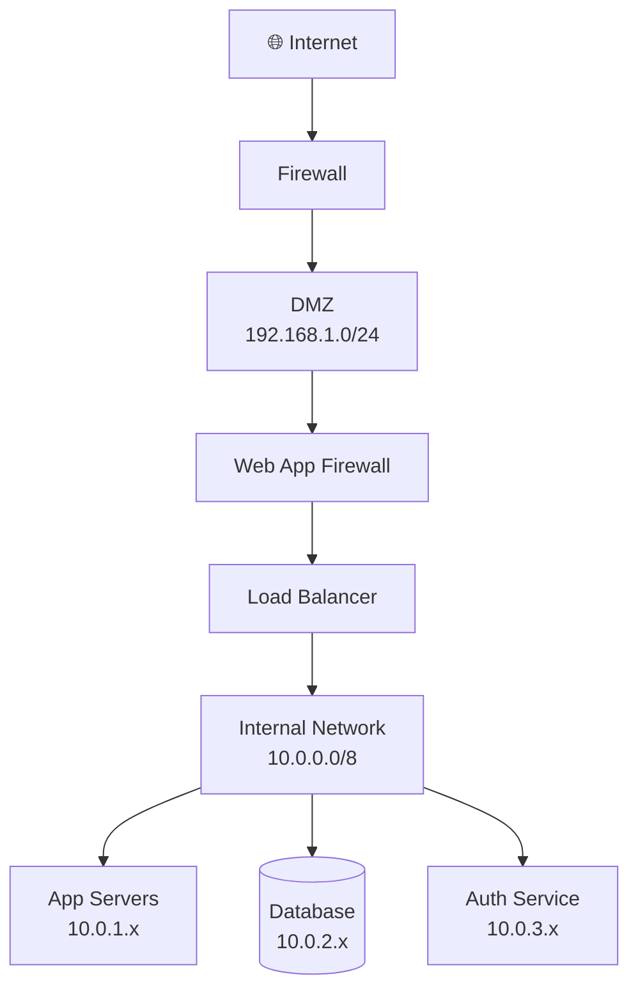
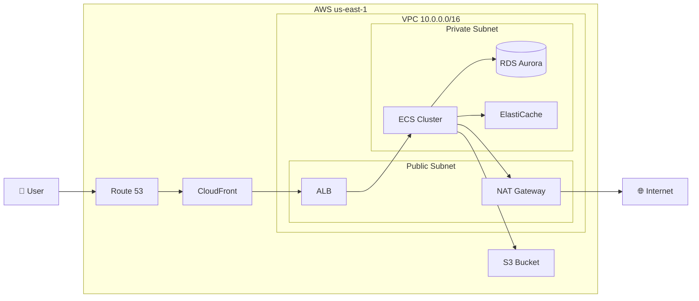
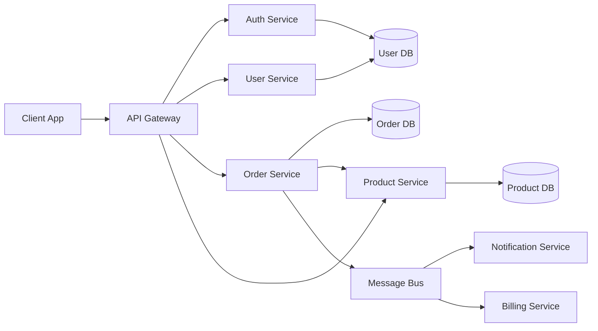

# Mermaid Architecture Diagram Patterns

## System Architecture (flowchart LR/TD)

Use `flowchart` for system and network architecture diagrams.

### Basic System Architecture


### Network Architecture


### Cloud Architecture (AWS style)


### Microservices Architecture


## C4 Architecture Diagrams

Use `C4Context` for high-level system context diagrams.

### C4 Context Diagram
```
C4Context
    title System Context — ISAI Platform

    Person(user, "ISAI Analyst", "Security analyst reviewing AI usage")
    Person(admin, "ISAI Admin", "Configures rules and policies")

    System(openclaw, "OpenClaw", "AI security agent and reporting platform")
    System(webhook, "Webhook Ingest", "Captures AI tool usage events firm-wide")

    System_Ext(ai_tools, "AI Tools", "Perplexity, ChatGPT, Copilot, etc.")
    System_Ext(llm, "Anthropic Claude API", "LLM provider for OpenClaw")
    System_Ext(lms, "LMS", "Training completion records")
    System_Ext(iam, "IAM / Active Directory", "User identity and access")

    Rel(user, openclaw, "Queries, reviews reports")
    Rel(admin, openclaw, "Configures rules")
    Rel(ai_tools, webhook, "Sends usage events via browser extension")
    Rel(openclaw, webhook, "Reads telemetry data")
    Rel(openclaw, llm, "Sends prompts, receives responses")
    Rel(openclaw, lms, "Reads training completions")
    Rel(openclaw, iam, "Reads user directory")
```

## Subgraph Styling Tips
- Use `subgraph` to group related components (VPCs, networks, services)
- Use `[(name)]` for databases
- Use `[/name/]` for processes/tasks
- Use `{{name}}` for decision points
- Icons: 👤 🌐 🔒 ☁️ 🗄️ can be embedded in node labels
- Direction: `LR` (left-right) for pipelines, `TD` (top-down) for hierarchies

## Node Shapes Quick Reference
| Shape | Syntax | Use for |
|---|---|---|
| Rectangle | `[text]` | Services, components |
| Rounded | `(text)` | Start/end, soft components |
| Stadium | `([text])` | Terminals |
| Cylinder | `[(text)]` | Databases |
| Diamond | `{text}` | Decisions |
| Parallelogram | `[/text/]` | I/O, processes |
| Hexagon | `{{text}}` | Preparation steps |
| Circle | `((text))` | Events |
