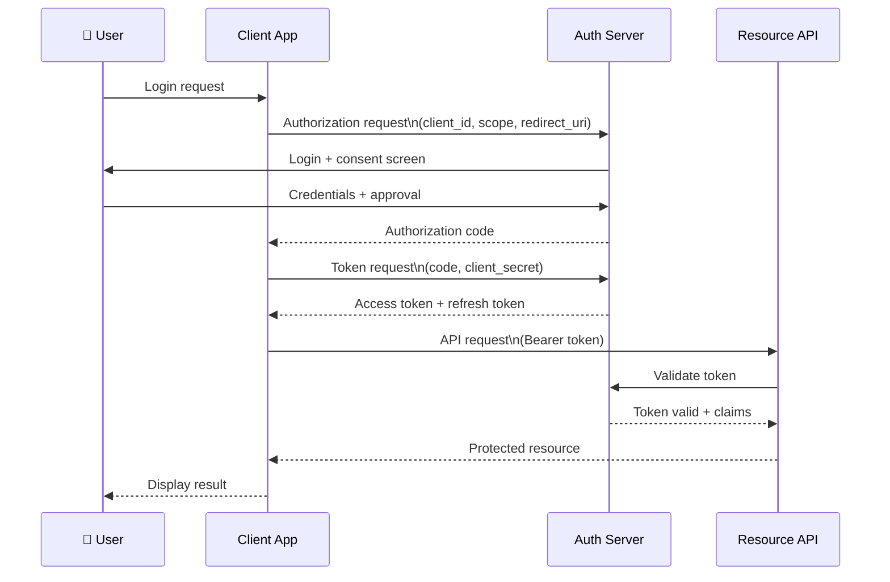
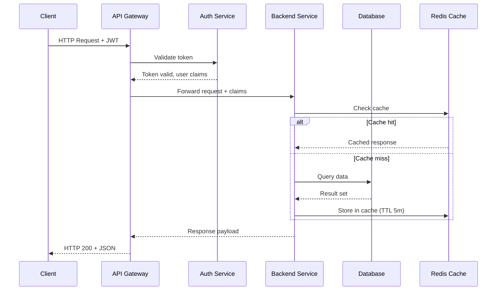
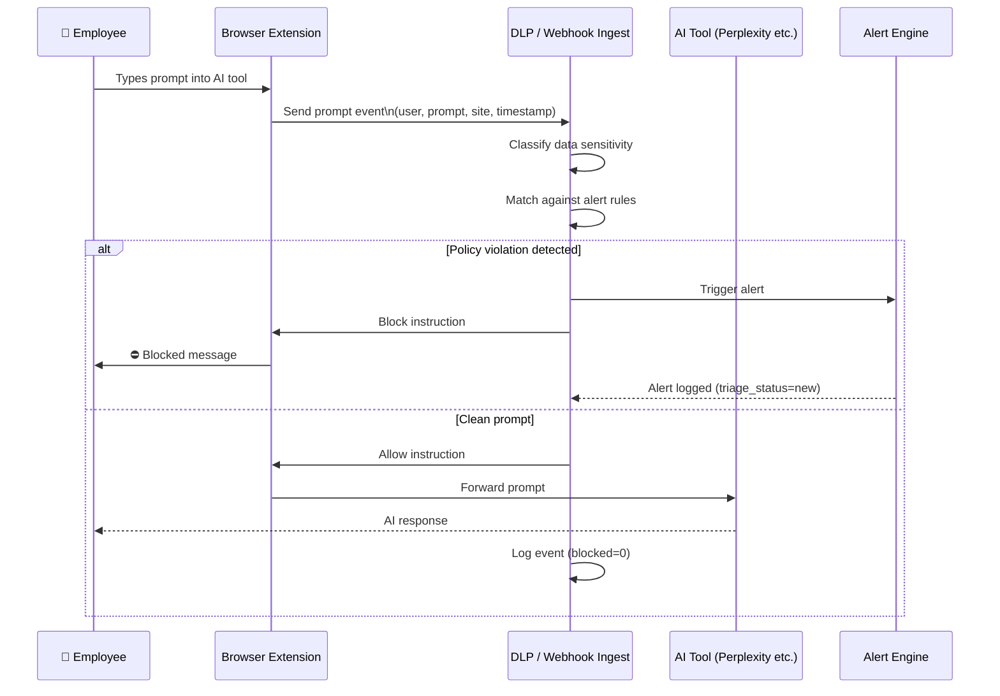
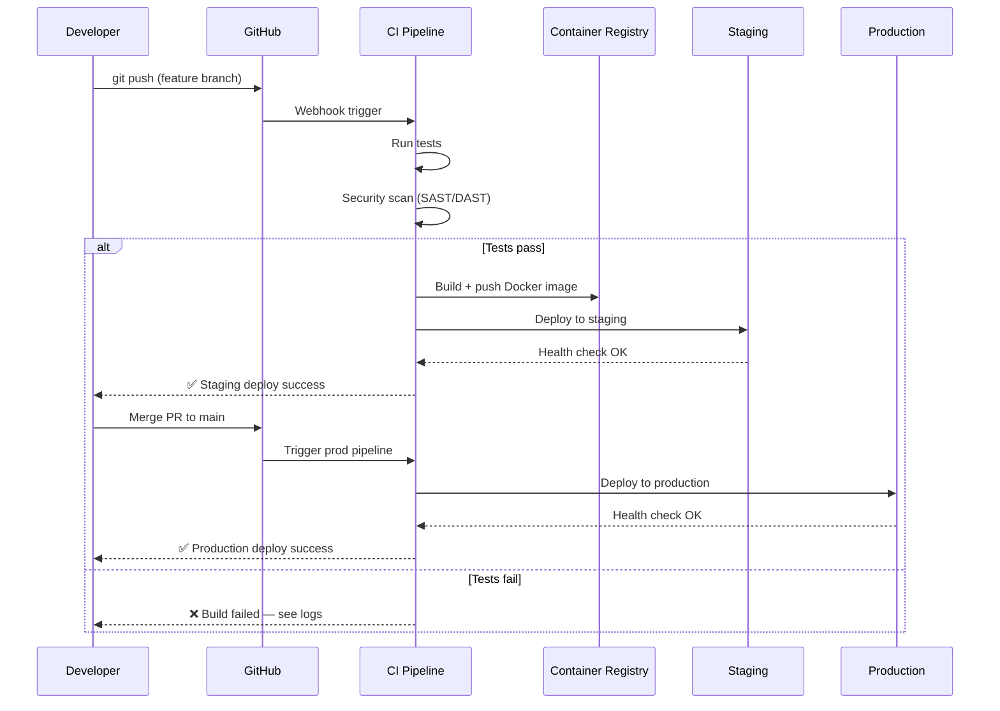
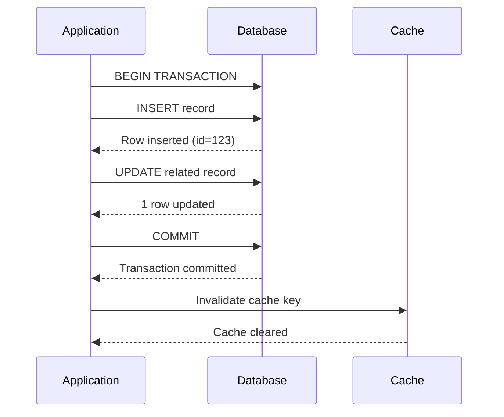

# Mermaid Sequence Diagram Patterns

## Basic Syntax

```
sequenceDiagram
    participant A as Label A
    participant B as Label B
    A->>B: Message
    B-->>A: Response
    Note over A,B: Note text
```

Arrow types:
- `->>`  solid arrow (request/call)
- `-->>`  dashed arrow (response/return)
- `->`  solid line no arrowhead
- `-->`  dashed line no arrowhead
- `-x`  solid with X (async/fire-and-forget)
- `--x`  dashed with X

## OAuth 2.0 / Authentication Flow


## API Request Flow


## AI Prompt Processing Flow (DLP/Proxy)


## CI/CD Pipeline Flow


## Database Transaction Flow


## Useful Sequence Features

### Activation bars (show when participant is processing)
```
activate ServiceA
ServiceA->>ServiceB: call
deactivate ServiceA
```

### Loops
```
loop Every 30 seconds
    Monitor->>API: Health check
    API-->>Monitor: 200 OK
end
```

### Alt/Else blocks
```
alt Success
    API-->>Client: 200 OK
else Error
    API-->>Client: 500 Error
end
```

### Notes
```
Note right of Service: Processing takes\n~200ms average
Note over Client,Server: TLS 1.3 encrypted
```
