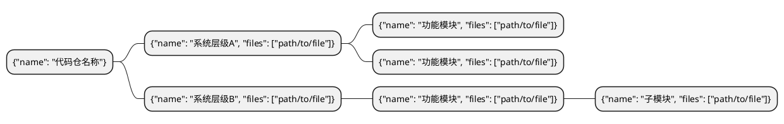
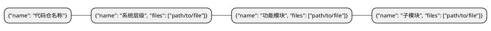

# Arch Diagram — Prompt 模板参考

这里存放 Stage 1/2/3 所需的所有 prompt 模板，供 SKILL.md 引用。
每个模板中的变量占位符用 `$VAR` 表示，使用时替换为实际内容。

---

## Stage 1：批量文件摘要 prompt

将所有代码文件的路径和内容一次性喂给以下 prompt，让 Claude 生成 JSON 格式的摘要字典。

```
你是一名资深软件工程师。请阅读以下代码文件列表，为每个文件生成一句话摘要（不超过30字），概括其业务功能。
只输出一个 JSON 对象，格式为 {"文件路径": "一句话摘要", ...}，不要任何多余内容。

注意：
- 摘要要体现业务语义（如"处理用户登录逻辑"），而非技术细节（如"定义了3个类"）
- 最多提及关键类名或方法名
- 不要超过30字

$FILES
```

其中 `$FILES` 替换为如下格式的文件列表（每个文件用分隔符隔开）：

```
=== 文件: path/to/file1.py ===
<文件内容>

=== 文件: path/to/file2.java ===
<文件内容>
```

**批量大小建议**：每批最多 30 个文件，或总内容不超过 60k tokens。如果文件数量超过上限，分批处理并将结果合并。

---

## Stage 2：生成主架构图 prompt（直接模式）

代码文件总摘要在上下文窗口 60% 以内时使用此 prompt。

```
## 角色:
软件系统首席架构专家，技术栈：$LANG，使用中文。

## 目标:
依据[代码仓描述]，提炼代码仓的 High-level 业务功能架构，输出为层次思维导图与节点间调用关系。
忽略测试、日志、监控等非功能性辅助代码，聚焦核心业务逻辑。

## 推理步骤:
1. 理解代码仓的整体业务目标和技术栈。
2. 识别代码仓遵循的架构模式（如 MVC、分层架构、微服务等），据此确定 3～5 个系统层级。
   层级命名遵循业界规范，严格按"用户侧 → 业务侧 → 数据侧"顺序排列，mindmap 中靠前的 `**` 节点
   代表更靠近用户侧的层级（前者调用后者）。
3. 在每个层级内，按照业务职责聚合文件，提炼出功能模块节点。
   节点命名要反映业务语义（如"播放控制"、"数据聚合"），而非照搬文件名或技术术语。
4. 分析层级间的调用关系：调用方向只能从上层（靠近用户侧）节点指向下层（靠近数据侧）节点，
   即 mindmap 中层级编号更小（更靠前、星号更少）的节点 → 层级编号更大（更靠后、星号更多）的节点。
   禁止同层节点互连，禁止下层指向上层的反向连接。
   **每条边必须对应一种明确的关系类型**，如：同步调用、异步消息、鉴权依赖、数据读取、数据写入、配置下发等；
   标签直接写关系类型，不超过6字。

## 约束:
- 嵌套深度最多 3 层（`**` 系统层级 → `***` 功能模块 → `****` 子模块），禁止出现 `*****` 及更深层
- **每个 `**` 系统层级下必须至少有 2 个 `***` 功能模块子节点**，禁止 `**` 直接挂叶子（无 `***` 子节点）
- 每个层级下的直接子节点数量控制在 2～6 个，避免过于扁平或过于繁杂
- 节点名称用中文，5 个字以内，简洁且具有业务含义，不出现重复命名
- files 列表只填写与该节点业务职责直接相关的文件，路径须与[代码仓描述]中完全一致
- edges 中的 from/to 必须与 mindmap 中的节点 name 完全一致
- edges 中 from 节点在 mindmap 中的星号层级（`**`/`***`/`****`）必须严格少于 to 节点的星号层级，
  或 from 是同星号层级但排列更靠前（更靠近用户侧）的 `**` 节点——总之确保调用方向严格自上而下
- **禁止**画无语义的装饰边（如仅为"看起来丰富"而加的连线）
- **禁止**用多条平行边重复表达同一关系（A→B 只能有一条边，选最主要的关系类型）
- **禁止**父节点到其直接子节点的边（父子包含关系已由 mindmap 层级结构表达）
- edges 总数控制在 **3～10 条**；能用图例+少量代表边说清楚的，不要为丰富性而堆砌边

## 输出格式:
先输出 mindmap 代码块（标记为 plantuml），再紧接输出 edges 代码块（标记为 json）：



```json
[
  {"from": "功能模块名A", "to": "功能模块名B", "label": "调用"},
  {"from": "系统层级A",   "to": "功能模块名C", "label": "依赖"}
]
```

[代码仓描述]: $REPO
```

---

## Stage 2：生成子架构理解 prompt（分块模式，大型项目用）

当摘要总量超过上下文窗口 60% 时，先对每块分别生成局部子架构，再合并。

### 2a. 理解子代码仓

```
## 角色:
软件系统首席架构专家，技术栈：$LANG，使用中文。

## 目标:
依据[子代码仓描述]，提炼该部分代码的局部业务功能架构，输出为层次思维导图。
忽略测试、日志、监控等非功能性辅助代码，聚焦核心业务逻辑。

## 推理步骤:
1. 理解该子代码仓负责的业务范围和技术职责。
2. 识别其内部的分层或模块划分，确定 2～4 个局部层级。
   层级按"用户侧 → 业务侧 → 数据侧"顺序排列（前者调用后者）。
3. 在每个层级内，按业务职责聚合文件，提炼功能模块节点。
   节点命名要反映业务语义，而非照搬文件名或技术术语。

## 约束:
- 嵌套深度最多 3 层，禁止出现 `*****` 及更深层
- 每个层级下的直接子节点数量控制在 2～6 个
- 节点名称用中文，5 个字以内，简洁且具有业务含义，不出现重复命名
- files 列表路径须与[子代码仓描述]中完全一致

## 输出格式:
用代码块包裹，标记为 plantuml：
@startmindmap
* {"name": "代码仓名称"}
** {"name": "系统层级", "files": ["path/to/file"]}
*** {"name": "功能模块", "files": ["path/to/file"]}
@endmindmap

[子代码仓描述]: $REPO
```

### 2b. 合并子架构

```
## 角色:
软件系统首席架构专家，技术栈：$LANG，使用中文。

## 目标:
依据[代码仓各子架构描述]，合并整合为一份完整的 High-level 业务功能架构思维导图与节点间调用关系。
忽略测试、日志、监控等非功能性辅助代码，聚焦核心业务逻辑。

## 推理步骤:
1. 通读各子架构描述，理解整体业务目标。
2. 归纳统一的架构模式，确定 3～5 个顶层系统层级，消除子架构间的重复与冲突。
   层级按"用户侧 → 业务侧 → 数据侧"顺序排列（前者调用后者）。
3. 在每个层级内，按业务职责聚合来自各子架构的功能模块，提炼出统一的节点命名。
   节点命名要反映业务语义，而非照搬文件名或技术术语。
4. 分析层级间的调用关系：调用方向只能从上层（靠近用户侧、mindmap 中更靠前）节点指向下层（靠近数据侧、mindmap 中更靠后）节点。
   禁止同层节点互连，禁止下层指向上层的反向连接。
   **每条边必须对应一种明确的关系类型**，如：同步调用、异步消息、鉴权依赖、数据读取、数据写入、配置下发等；
   标签直接写关系类型，不超过6字。

## 约束:
- 嵌套深度最多 3 层，禁止出现 `*****` 及更深层
- 每个层级下的直接子节点数量控制在 2～6 个，避免过于扁平或过于繁杂
- 节点名称用中文，5 个字以内，简洁且具有业务含义，不出现重复命名
- files 列表路径须与原始描述中完全一致
- edges 中的 from/to 必须与 mindmap 中的节点 name 完全一致
- edges 中 from 节点在 mindmap 中必须比 to 节点更靠近用户侧（星号更少或同层但排序更靠前），确保调用方向严格自上而下
- **禁止**画无语义的装饰边（如仅为"看起来丰富"而加的连线）
- **禁止**用多条平行边重复表达同一关系（A→B 只能有一条边，选最主要的关系类型）
- **禁止**父节点到其直接子节点的边（父子包含关系已由 mindmap 层级结构表达）
- edges 总数控制在 **3～10 条**；能用图例+少量代表边说清楚的，不要为丰富性而堆砌边

## 输出格式:
先输出 mindmap 代码块（标记为 plantuml），再紧接输出 edges 代码块（标记为 json）：



```json
[
  {"from": "功能模块名A", "to": "功能模块名B", "label": "调用"},
  {"from": "系统层级A",   "to": "功能模块名C", "label": "依赖"}
]
```

[代码仓各子架构描述]: $REPO
```

---

## Stage 3：生成节点子流程图 prompt

对每个带 files 的节点，用此 prompt 生成 Mermaid flowchart。

```
## 角色:
软件系统架构专家，使用简体中文。

## 任务:
根据给出的文件描述，生成一张 Mermaid flowchart，呈现模块间的核心依赖与调用关系。

## 语法规则（必须严格遵守，否则渲染失败）:
1. 节点 ID 只能由英文字母和数字组成，不能含中文、空格、括号、引号、斜杠或特殊符号
   - ✅ 正确：A、nodeAuth、subUI
   - ❌ 错误：用户认证、node-auth、A(1)
2. 节点显示文字放在方括号内：A[用户认证]，文字不超过 8 个字
3. 边标签放在竖线内：A -->|调用| B，标签不超过 6 个字，不能含引号
4. subgraph 的名称只能用英文或数字，显示文字用方括号：subgraph SG1[展示层]
5. 每个 subgraph 必须有对应的 end，不能嵌套超过 2 层
6. 节点总数（含 subgraph 内的节点）不超过 15 个
7. 只输出 mermaid 代码块，不要任何解释文字

## 输出格式:
用代码块包裹，标记为 mermaid：
flowchart TB
subgraph SG1[模块组]
    A[节点A] -->|关系| B[节点B]
end
B -->|依赖| C[节点C]

[文件描述]: $FILES
```

其中 `$FILES` 替换为该节点关联文件的摘要列表，格式如下：

```
path/to/file1.py: 一句话摘要
path/to/file2.java: 一句话摘要
```
