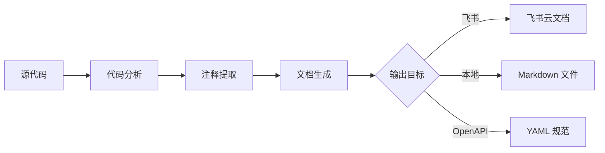
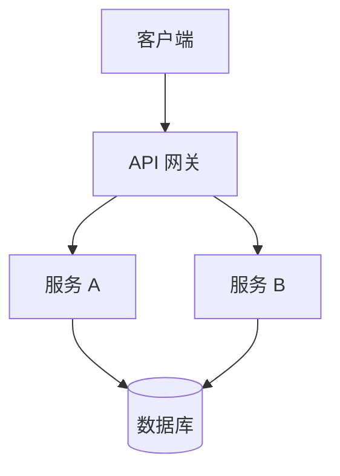

# 文档生成器 (Doc Generator)

从源代码自动生成结构化技术文档，支持飞书云文档输出。

## 核心能力

| 能力 | 说明 |
|------|------|
| API 文档生成 | 从代码提取端点、参数、返回值 |
| 代码注释提取 | 解析 JSDoc / Python docstring / Go doc |
| 飞书文档输出 | 直接创建飞书云文档 |
| 中文模板 | 预置中文技术文档模板 |
| OpenAPI 规范 | 生成 OpenAPI 3.0 YAML/JSON |

## 工作流程



## 使用方式

### 1. 提取代码注释（Python）

使用内置脚本从 Python 代码提取 API 信息：

```bash
python3 <skill_dir>/scripts/extract_api.py <source_file_or_dir> [--lang python|js|go] [--format markdown|json|openapi]
```

**参数说明**：
- `<source_file_or_dir>`：源文件或目录路径
- `--lang`：代码语言（python/js/go），默认自动检测
- `--format`：输出格式（markdown/json/openapi），默认 markdown
- `--output`：输出文件路径（可选，不指定则输出到 stdout）
- `--chinese`：使用中文模板（默认中文）
- `--title`：文档标题

**示例**：
```bash
# 从单个文件提取
python3 scripts/extract_api.py app/routes.py --format markdown

# 从目录递归提取，输出 OpenAPI 格式
python3 scripts/extract_api.py ./src/api --format openapi --title "用户服务 API"

# 提取并保存为文件
python3 scripts/extract_api.py app.py --output docs/api.md --chinese
```

### 2. 通用文档分析（任意语言）

对于非 Python 代码，Agent 直接读取源文件，按以下规则提取：

#### JavaScript/TypeScript
```javascript
/**
 * 获取用户信息
 * @param {string} userId - 用户ID
 * @returns {Promise<User>} 用户对象
 * @throws {NotFoundError} 用户不存在时抛出
 */
async function getUser(userId) { ... }
```

提取规则：
- `@param {type} name - description` → 参数表
- `@returns {type} description` → 返回值
- `@throws {ErrorType} description` → 错误码
- 路由装饰器 `app.get('/path')` → 端点信息

#### Go
```go
// GetUser godoc
// @Summary 获取用户
// @Param id path string true "用户ID"
// @Success 200 {object} User
// @Router /users/{id} [get]
func GetUser(c *gin.Context) { ... }
```

提取规则：
- `// @Summary` → 描述
- `// @Param` → 参数
- `// @Success` / `// @Failure` → 响应
- `// @Router` → 端点路径

#### Python (FastAPI / Flask / Django)
```python
@app.get("/users/{user_id}")
async def get_user(user_id: str) -> User:
    """获取用户信息
    
    Args:
        user_id: 用户唯一标识
        
    Returns:
        User: 用户对象
        
    Raises:
        HTTPException: 用户不存在
    """
```

提取规则：
- 路由装饰器 → 端点路径和方法
- 函数签名 type hints → 参数/返回类型
- docstring (Google/NumPy/Sphinx 格式) → 描述、参数、返回值、异常

### 3. 输出到飞书文档

提取内容后，使用飞书文档工具创建云文档：

**步骤**：
1. 运行 `extract_api.py` 生成 Markdown 内容（或 Agent 直接生成）
2. 调用飞书文档创建工具（`feishu-create-doc` skill）将内容写入飞书

**飞书输出要求**（遵循 Lark-flavored Markdown 规范）：
- 使用 `<callout>` 高亮重要警告和提示
- 使用 `<lark-table>` 展示参数/返回值（复杂内容时）
- 使用 `mermaid` 代码块生成流程图/架构图
- 使用 `<grid>` 分栏对比不同方案
- 代码块必须标注语言类型

**飞书文档结构模板**：

```markdown
<callout emoji="📋" background-color="light-blue">
文档版本：v1.0 | 最后更新：{date} | 维护人：{author}
</callout>

## 概述

{项目简介，2-3 句话说明 API 的核心功能}

## 认证方式

<callout emoji="🔑" background-color="light-yellow">
所有接口需要在 Header 中携带 Token：
`Authorization: Bearer {your_token}`
</callout>

{认证说明}

## 接口列表

### {METHOD} {path}

**接口说明**：{description}

<lark-table header-row="true">
<lark-tr>
<lark-td>**参数名**</lark-td>
<lark-td>**类型**</lark-td>
<lark-td>**必填**</lark-td>
<lark-td>**说明**</lark-td>
</lark-tr>
{lar参数行}
</lark-table>

**请求示例**：

```{lang}
{code example}
```

**响应示例**：

```json
{response example}
```

<callout emoji="⚠️" background-color="light-red">
**错误码**：{error codes}
</callout>

---
```

### 4. 中文文档模板

#### API 接口文档模板

```markdown
# {项目名称} API 接口文档

## 文档信息

| 项目 | 内容 |
|------|------|
| 版本 | v1.0.0 |
| 更新日期 | {date} |
| 维护团队 | {team} |
| Base URL | `https://api.example.com/v1` |

## 快速开始

<callout emoji="🚀" background-color="light-green">
3 步接入：
1. 获取 API Key
2. 携带 Token 调用接口
3. 解析返回结果
</callout>

## 接口鉴权

所有请求需在 Header 中携带：

```
Authorization: Bearer <your_api_key>
Content-Type: application/json
```

## 接口详情

### 1. {接口名称}

**{METHOD}** `{path}`

{接口描述}

**请求参数**

| 参数名 | 位置 | 类型 | 必填 | 说明 |
|--------|------|------|------|------|
| {name} | {query/path/body} | {type} | 是/否 | {desc} |

**请求示例**

```bash
curl -X {METHOD} "{base_url}{path}" \
  -H "Authorization: Bearer YOUR_TOKEN" \
  -H "Content-Type: application/json" \
  -d '{request_body}'
```

**响应示例**

```json
{
  "code": 0,
  "message": "success",
  "data": { }
}
```

**错误码**

| 错误码 | 说明 | 处理建议 |
|--------|------|----------|
| 400 | 参数错误 | 检查请求参数 |
| 401 | 未授权 | 检查 Token 是否有效 |
| 404 | 资源不存在 | 检查资源 ID |
| 500 | 服务异常 | 联系技术支持 |
```

#### 技术方案文档模板

```markdown
# {方案名称} 技术方案

## 背景

{描述问题背景和需求来源}

## 目标

- 目标 1
- 目标 2

## 方案设计

### 整体架构



### 核心流程

1. **步骤一**：{说明}
2. **步骤二**：{说明}
3. **步骤三**：{说明}

### 数据模型

| 字段 | 类型 | 说明 |
|------|------|------|
| id | bigint | 主键 |
| name | varchar | 名称 |

## 影响范围

- 模块 A：{影响说明}
- 模块 B：{影响说明}

## 排期

| 阶段 | 时间 | 负责人 |
|------|------|--------|
| 设计评审 | {date} | {person} |
| 开发 | {date} | {person} |
| 测试 | {date} | {person} |
| 上线 | {date} | {person} |
```

## 输出格式选择

| 格式 | 适用场景 | 工具 |
|------|----------|------|
| 飞书文档 | 团队协作、项目文档 | `feishu-create-doc` |
| 本地 Markdown | Git 版本管理、README | `write` |
| OpenAPI YAML | API 规范、代码生成 | `write` + 格式化 |

## 注意事项

- **代码优先**：从代码实际实现提取，不臆造接口
- **类型准确**：参数和返回值类型必须与代码一致
- **示例真实**：使用真实可运行的示例数据
- **错误完整**：列出所有可能的错误码和处理建议
- **版本标注**：标注 API 版本和文档更新时间
- **飞书格式**：输出到飞书时使用 Lark-flavored Markdown，不使用标准 Markdown 表格替代 `<lark-table>`
