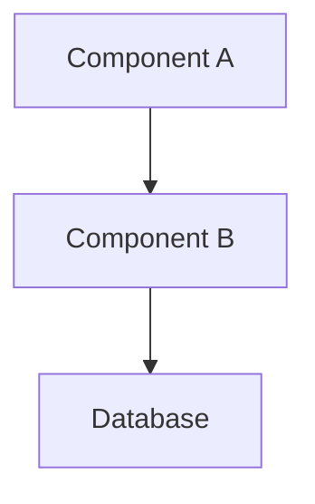

# [Feature Name] Design Brief
# Aegis ID: AEGIS-{project}-{seq}

## Problem Statement
<!-- What problem does this solve? Why now? (1-3 sentences) -->

## Architecture Overview
<!-- Mermaid or ASCII diagram. A newcomer should be able to sketch the system after reading this. -->

## Key Design Decisions

| Decision | Choice | Rationale | Alternatives Considered |
|----------|--------|-----------|------------------------|
| | | | |

## Module Boundaries

### Module A
- **Responsibility:**
- **Exposed Interface:**
- **Dependencies:**

### Module B
- **Responsibility:**
- **Exposed Interface:**
- **Dependencies:**

**Communication Rules:** Modules communicate only through defined interfaces.

## API Surface (Summary)
<!-- Key endpoints — detailed definitions go in contracts/ -->

- `POST /api/xxx` — Description, input/output summary
- `GET /api/yyy` — Description, input/output summary

## Known Gaps & Open Questions

- [ ] **[blocking]** Gap 1: Description + impact
- [ ] **[non-blocking]** Gap 2: Description + impact

## Debugging Guide

- **Logs:** Location, key log keywords
- **State inspection:** How to check system state
- **Common failures:** Failure mode → diagnosis path

## Testing Strategy

<!-- ⚠️ Design Review Gate: Full-stack features CANNOT be approved without a complete testing strategy -->

### Frontend Tests
<!-- Required when feature touches frontend. Skip section if backend-only. -->
- **API clients to test:** <!-- list each API function that needs tests -->
- **Hooks to test:** <!-- list each data-fetching hook -->
- **Key components:** <!-- list components needing render tests (with states: data/loading/error) -->
- **MSW coverage:** <!-- list endpoints to mock, note any special error scenarios -->

### Backend Integration Tests (HTTP E2E)
<!-- Required for every API endpoint this feature adds or modifies -->

| Endpoint | Happy (200) | Bad Request (400) | Not Found (404) | Auth (401) | Mutation Verify | Notes |
|----------|-------------|-------------------|-----------------|------------|-----------------|-------|
| | | | | | | |

- **Database setup:** <!-- what seed data / migrations needed for tests -->

### E2E Flows
<!-- Critical user journeys that need browser-level verification -->
- [ ] Flow 1: description
- [ ] Flow 2: description
