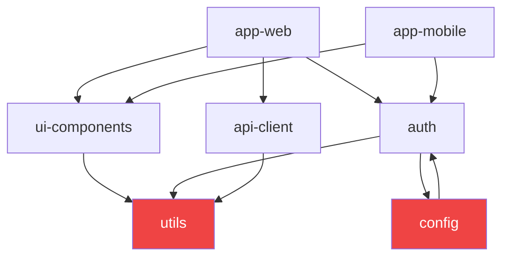

# Monorepo Dependency Graph

Your monorepo has 15 packages. You refactor `@org/utils`. Three CI pipelines fail. You didn't know `@org/auth` imported `@org/utils` which imported `@org/config` which imported `@org/auth`.

This skill maps every internal dependency edge, detects circular imports, finds orphaned packages nobody uses, and flags packages that have too many dependents — the ones that become a bottleneck for every team.

**Works by reading package.json/Cargo.toml/go.mod — no install required. Zero external API.**

---

## Trigger Phrases

- "monorepo deps", "workspace dependencies"
- "which packages depend on X", "impact of changing X"
- "circular dependency in monorepo"
- "orphaned package", "unused internal package"
- "coupling analysis", "dependency graph"
- "pnpm workspace", "yarn workspaces", "cargo workspace"
- "/mono-deps"

---

## How to Provide Input

```bash
# Option 1: Auto-detect workspace root and map all deps
/mono-deps

# Option 2: Explicit root
/mono-deps /path/to/monorepo

# Option 3: Find dependents of a specific package
/mono-deps --dependents @org/utils

# Option 4: Find all packages a specific package needs
/mono-deps --dependencies @org/auth

# Option 5: Check impact before refactoring
/mono-deps --impact-of @org/database

# Option 6: Output as Mermaid diagram
/mono-deps --mermaid

# Option 7: Detect only circular deps
/mono-deps --cycles-only
```

---

## Step 1: Discover Workspace Packages

```python
import json
import os
import re
import glob
from pathlib import Path
from dataclasses import dataclass, field
from collections import defaultdict, deque
from typing import Optional


@dataclass
class WorkspacePackage:
    name: str                      # e.g. "@org/utils"
    path: str                      # relative path in monorepo
    manifest_file: str             # package.json / Cargo.toml / go.mod
    ecosystem: str                 # npm / cargo / go
    version: str
    internal_deps: list[str]       # direct internal dependencies (names)
    external_deps: dict[str, str]  # external package → version


def detect_workspace_type(root: str) -> str:
    """Detect monorepo ecosystem from root config files."""
    if os.path.exists(f'{root}/pnpm-workspace.yaml'):
        return 'npm-pnpm'
    if os.path.exists(f'{root}/package.json'):
        pkg = json.loads(Path(f'{root}/package.json').read_text())
        if 'workspaces' in pkg:
            return 'npm-yarn'
    if os.path.exists(f'{root}/Cargo.toml'):
        if '[workspace]' in Path(f'{root}/Cargo.toml').read_text():
            return 'cargo'
    if os.path.exists(f'{root}/go.work'):
        return 'go-work'
    return 'unknown'


def discover_npm_packages(root: str) -> list[WorkspacePackage]:
    """Find all workspace packages by scanning package.json files."""
    packages = []
    root_pkg_path = f'{root}/package.json'

    if not os.path.exists(root_pkg_path):
        return packages

    root_pkg = json.loads(Path(root_pkg_path).read_text())
    workspace_patterns = root_pkg.get('workspaces', [])

    # pnpm-workspace.yaml format
    pnpm_cfg = f'{root}/pnpm-workspace.yaml'
    if os.path.exists(pnpm_cfg):
        import yaml  # pyyaml
        cfg = yaml.safe_load(Path(pnpm_cfg).read_text())
        workspace_patterns = cfg.get('packages', [])

    # Expand glob patterns to actual directories
    pkg_dirs = []
    for pattern in workspace_patterns:
        matched = glob.glob(f'{root}/{pattern}', recursive=True)
        pkg_dirs.extend([d for d in matched if os.path.isdir(d)])

    # Also scan common monorepo structures
    for scan_dir in ['packages', 'apps', 'libs', 'services']:
        scan_path = f'{root}/{scan_dir}'
        if os.path.isdir(scan_path):
            for sub in os.scandir(scan_path):
                if sub.is_dir() and sub.path not in pkg_dirs:
                    pkg_dirs.append(sub.path)

    for pkg_dir in pkg_dirs:
        pkg_json_path = f'{pkg_dir}/package.json'
        if not os.path.exists(pkg_json_path):
            continue
        try:
            pkg = json.loads(Path(pkg_json_path).read_text())
        except json.JSONDecodeError:
            continue

        name = pkg.get('name', os.path.basename(pkg_dir))
        version = pkg.get('version', '0.0.0')
        all_deps = {
            **pkg.get('dependencies', {}),
            **pkg.get('devDependencies', {}),
            **pkg.get('peerDependencies', {}),
        }
        packages.append(WorkspacePackage(
            name=name,
            path=os.path.relpath(pkg_dir, root),
            manifest_file=os.path.relpath(pkg_json_path, root),
            ecosystem='npm',
            version=version,
            internal_deps=[],   # filled in next step
            external_deps=all_deps,
        ))

    return packages


def discover_cargo_packages(root: str) -> list[WorkspacePackage]:
    """Find all Cargo workspace members."""
    packages = []
    workspace_toml = Path(f'{root}/Cargo.toml').read_text()

    # Extract workspace members
    member_match = re.search(r'members\s*=\s*\[(.*?)\]', workspace_toml, re.DOTALL)
    if not member_match:
        return packages

    members = re.findall(r'"([^"]+)"', member_match.group(1))
    for pattern in members:
        for pkg_dir in glob.glob(f'{root}/{pattern}'):
            toml_path = f'{pkg_dir}/Cargo.toml'
            if not os.path.exists(toml_path):
                continue
            content = Path(toml_path).read_text()
            name_match = re.search(r'\[package\].*?name\s*=\s*"([^"]+)"', content, re.DOTALL)
            version_match = re.search(r'\[package\].*?version\s*=\s*"([^"]+)"', content, re.DOTALL)
            name = name_match.group(1) if name_match else os.path.basename(pkg_dir)
            version = version_match.group(1) if version_match else '0.0.0'

            # Find internal path dependencies
            path_deps = re.findall(r'\[dependencies\].*?(\w[\w-]*)\s*=.*?path\s*=', content, re.DOTALL)

            packages.append(WorkspacePackage(
                name=name,
                path=os.path.relpath(pkg_dir, root),
                manifest_file=os.path.relpath(toml_path, root),
                ecosystem='cargo',
                version=version,
                internal_deps=[],
                external_deps={},
            ))

    return packages
```

---

## Step 2: Build Internal Dependency Graph

```python
def build_internal_dep_graph(packages: list[WorkspacePackage]) -> dict[str, list[str]]:
    """
    For each package, identify which other workspace packages it depends on.
    Returns: { package_name: [list of internal dep names] }
    """
    # Build name set for fast lookup
    known_names = {pkg.name for pkg in packages}

    graph: dict[str, list[str]] = {pkg.name: [] for pkg in packages}

    for pkg in packages:
        for dep_name in pkg.external_deps.keys():
            if dep_name in known_names and dep_name != pkg.name:
                graph[pkg.name].append(dep_name)
                pkg.internal_deps.append(dep_name)

    return graph


def find_cycles(graph: dict[str, list[str]]) -> list[list[str]]:
    """Detect all cycles in dependency graph using DFS."""
    visited = set()
    rec_stack = set()
    cycles = []

    def dfs(node: str, path: list[str]) -> None:
        visited.add(node)
        rec_stack.add(node)
        path.append(node)

        for neighbor in graph.get(node, []):
            if neighbor not in visited:
                dfs(neighbor, path)
            elif neighbor in rec_stack:
                # Found cycle — extract the cycle portion
                cycle_start = path.index(neighbor)
                cycles.append(path[cycle_start:] + [neighbor])

        path.pop()
        rec_stack.discard(node)

    for node in graph:
        if node not in visited:
            dfs(node, [])

    # Deduplicate cycles
    unique_cycles = []
    seen = set()
    for cycle in cycles:
        key = frozenset(cycle)
        if key not in seen:
            seen.add(key)
            unique_cycles.append(cycle)

    return unique_cycles


def compute_metrics(graph: dict[str, list[str]]) -> dict[str, dict]:
    """
    Compute fan-in (dependents) and fan-out (dependencies) for each package.
    High fan-in = widely depended on (bottleneck risk)
    High fan-out = depends on many others (fragile)
    """
    fan_in = defaultdict(int)   # how many packages depend on this one
    fan_out = defaultdict(int)  # how many packages this one depends on

    for pkg_name, deps in graph.items():
        fan_out[pkg_name] = len(deps)
        for dep in deps:
            fan_in[dep] += 1

    metrics = {}
    all_names = set(graph.keys())
    for name in all_names:
        metrics[name] = {
            'fan_in': fan_in[name],
            'fan_out': fan_out[name],
            'is_orphaned': fan_in[name] == 0 and fan_out[name] == 0,
            'is_leaf': fan_in[name] == 0,        # nothing depends on this
            'is_shared': fan_in[name] >= 3,       # depended on by 3+ packages
            'is_unstable': fan_out[name] >= 5,    # depends on 5+ packages
        }

    return metrics


def find_version_mismatches(packages: list[WorkspacePackage]) -> dict[str, list[tuple]]:
    """
    Find external packages that appear at different versions across the monorepo.
    Returns: { package_name: [(consumer_name, version), ...] }
    """
    version_map = defaultdict(list)
    for pkg in packages:
        for dep_name, dep_version in pkg.external_deps.items():
            if dep_name not in {p.name for p in packages}:  # external only
                version_map[dep_name].append((pkg.name, dep_version))

    mismatches = {}
    for dep_name, consumers in version_map.items():
        versions = {v for _, v in consumers}
        if len(versions) > 1:
            mismatches[dep_name] = consumers

    return mismatches
```

---

## Step 3: Generate Mermaid Diagram

```python
def generate_mermaid(graph: dict[str, list[str]], metrics: dict) -> str:
    """Generate Mermaid flowchart of internal dependencies."""
    lines = ["graph TD"]

    # Style nodes
    for name, m in metrics.items():
        short = name.split('/')[-1]
        if m['is_orphaned']:
            lines.append(f'    {short}:::orphan')
        elif m['is_shared']:
            lines.append(f'    {short}:::shared')
        elif m['is_unstable']:
            lines.append(f'    {short}:::unstable')

    # Add edges
    for pkg_name, deps in graph.items():
        short_pkg = pkg_name.split('/')[-1]
        for dep in deps:
            short_dep = dep.split('/')[-1]
            lines.append(f'    {short_pkg} --> {short_dep}')

    # Add style classes
    lines.extend([
        "    classDef orphan fill:#888,color:#fff",
        "    classDef shared fill:#ef4444,color:#fff",
        "    classDef unstable fill:#f97316,color:#fff",
    ])

    return '\n'.join(lines)
```

---

## Step 4: Output Report

```markdown
## Monorepo Dependency Graph
Root: /my-org/monorepo | Packages: 12 | Ecosystem: npm (pnpm workspaces)

---

### Dependency Graph (ASCII)

```
@org/app-web
  ├── @org/ui-components
  │     └── @org/utils ⚠️ (fan-in: 8)
  ├── @org/auth
  │     ├── @org/utils ⚠️
  │     └── @org/config
  └── @org/api-client
        └── @org/utils ⚠️

@org/app-mobile
  ├── @org/ui-components
  └── @org/auth

@org/scripts (ORPHAN — no dependents, no dependencies)
@org/old-analytics (ORPHAN — no dependents)
```

---

### 🔴 Circular Dependencies (1 cycle found)

```
@org/auth → @org/config → @org/auth
```

**This cycle means:**
- You cannot build `@org/auth` without `@org/config` being built first
- You cannot build `@org/config` without `@org/auth` being built first
- Bundlers and TypeScript project references will fail or silently produce wrong output

**Fix options:**
1. Extract the shared interface to a new `@org/auth-types` package (preferred)
2. Move the config values that `@org/config` needs from auth → into `@org/config` itself
3. Use dependency injection to break the runtime cycle

---

### ⚠️ High Fan-In Packages (change risk)

| Package | Dependents | Risk |
|---------|-----------|------|
| @org/utils | 8 | 🔴 Any change breaks 8 packages |
| @org/config | 4 | 🟠 Moderate coupling |
| @org/ui-components | 3 | 🟡 Watch changes |

**For @org/utils (8 dependents):** Any refactor requires testing all 8 consumers.
Consider splitting into `@org/string-utils`, `@org/date-utils`, `@org/array-utils` to reduce blast radius.

---

### 🟡 Orphaned Packages (2 found)

| Package | Issue |
|---------|-------|
| @org/scripts | Nothing depends on it — safe to delete if unused |
| @org/old-analytics | Nothing depends on it — verify before deletion |

**Check actual usage first:**
```bash
grep -r "@org/scripts" . --include="*.json" --include="*.ts" --include="*.js"
```

---

### 🟠 Version Mismatches (3 external packages)

| Package | Versions in use | Consumers |
|---------|----------------|-----------|
| `zod` | `3.20.0`, `3.22.4` | app-web@3.20.0, auth@3.22.4 |
| `axios` | `1.4.0`, `1.6.2` | api-client@1.4.0, scripts@1.6.2 |
| `typescript` | `5.1.0`, `5.3.0` | (4 packages) |

**Fix:** Use pnpm `overrides` or yarn `resolutions` to pin to a single version:
```json
// root package.json
{
  "pnpm": {
    "overrides": {
      "zod": "3.22.4",
      "axios": "1.6.2"
    }
  }
}
```

---

### Mermaid Diagram



---

### Impact Analysis: @org/utils

If you modify `@org/utils`, these packages must be retested:
```
Direct dependents (3): @org/ui-components, @org/auth, @org/api-client
Transitive dependents (5): @org/app-web, @org/app-mobile, @org/app-admin, @org/storybook, @org/e2e-tests
```

**Before refactoring `@org/utils`:**
```bash
# Run tests for all dependents
pnpm --filter "@org/ui-components..." test
pnpm --filter "@org/auth..." test
pnpm --filter "@org/api-client..." test
```
```

---

## Quick Mode Output

```
Monorepo Deps: /my-org/monorepo (12 packages, pnpm)

🔴 1 circular dep: @org/auth → @org/config → @org/auth
⚠️  @org/utils has 8 dependents (high change blast radius)
🟡 2 orphaned packages: @org/scripts, @org/old-analytics
🟠 3 external version mismatches: zod, axios, typescript

To fix circular dep: extract shared types to @org/auth-types
To reduce utils coupling: split by domain (string-utils, date-utils)
```
