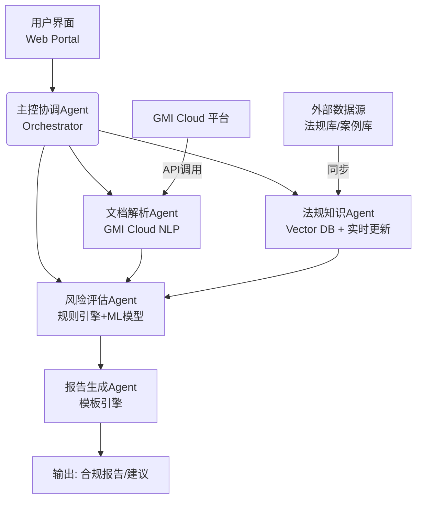

# DataComply Shield - 智能数据跨境合规审查 Agent

---

## 一、项目简介 (Project Introduction)

### 解决什么问题 (Pain Points)

**目标用户**：出海企业、独立开发者、SaaS 初创公司

**核心痛点**：

| 痛点 | 说明 |
|------|------|
| **法规复杂** | GDPR、CCPA、PIPL 等多国法规条款繁杂，非专业法务难以理解 |
| **人工成本高** | 传统合规审查依赖法务专家，耗时 3-5 天，费用高昂 ($2,000-5,000/次) |
| **流程缓慢** | 人工流转周期长，拖累产品上线或业务拓展进度 |
| **风险隐蔽** | 合同条款中的数据传输目的地、处理目的等细节容易被忽视 |

### 闪光点 (Highlights)

| 亮点 | 说明 |
|------|------|
| **端到端自动化** | 上传文档 → 自动解析 → 法规匹配 → 风险评估 → 报告生成，全流程无需人工介入 |
| **分钟级交付** | 数日工作压缩至数分钟，大幅提升效率 |
| **多法规覆盖** | 一键匹配 GDPR/CCPA/PIPL 及全球 20+ 地区法规 |
| **可执行报告** | 不仅指出风险，还提供具体的合规修改建议 |
| **全球化产品** | 英文界面 + 全球化合规逻辑，面向海外市场 |

---

## 二、业务价值说明 (Business Value)

### 对用户/业务的实际意义

| 维度 | 价值 |
|------|------|
| **降本** | 减少法务咨询费用（传统方式 $2,000-5,000/次 → AI 方案 $XX/月） |
| **增效** | 合规审查周期从 3-5 天缩短至分钟级 |
| **避险** | 主动识别合规缺口，避免 GDPR 最高 4% 全球营收罚款、CCPA $7,500/次罚款 |
| **加速** | 产品快速合规，加快海外市场拓展节奏 |
| **普惠** | 中小企业无需专职法务团队也能合规出海 |

---

## 三、创新性与技术说明 (Innovation & Technical Details)

### 1. AI 创新性说明

| 创新点 | 具体体现 |
|--------|----------|
| **多 Agent 协同编排** | 4 个专业化 Agent（解析/检索/评估/生成）通过 GMI Cloud Workflow 串联，形成完整工作流 |
| **合规实体识别** | 预训练 "合规实体" NER 模型，自动识别数据主体、传输目的地、处理目的等关键条款 |
| **向量语义检索** | 将法规条文向量化存储，实现语义级匹配，而非简单关键词检索 |
| **规则+ML 混合风险评估** | 规则引擎处理确定性风险（如非白名单国家），ML 模型识别隐蔽模式（如历史违规案例特征） |
| **双语报告生成** | 动态模板引擎生成结构化 JSON + 可读 PDF/Word，支持中英文输出 |

### 2. 技术实现说明（整体思路）

```
用户上传文档 → Orchestrator 调度
     │
     ├─→ Document Parser Agent ──→ 调用 GMI Cloud NLP API 进行实体识别
     │                                提取：数据主体、传输目的地、处理目的、数据类型等
     │
     ├─→ Regulation Knowledge Agent ──→ 向量数据库语义检索
     │                                输入场景 → 查询向量 → 返回最相关的法规条款
     │
     ├─→ Risk Assessment Agent ──→ 规则引擎 + ML 模型
     │                                规则：非白名单国家 = 高风险
     │                                ML：历史违规案例训练的分类模型
     │
     └─→ Report Generation Agent ──→ 动态模板填充
                                      输出：JSON + PDF/Word 报告
```

**核心技术选型**：

| 层级 | 技术选型 |
|------|----------|
| 编排层 | GMI Cloud Workflow |
| NLP | GMI Cloud gmi-nlp-advanced |
| 向量库 | Pinecone / Weaviate |
| 决策 | GMI Cloud gmi-decision |
| 模板 | GMI Cloud gmi-template |
| 后端 | Python FastAPI + PostgreSQL |

### 3. 交互与设计说明

#### 关键流程

```
┌─────────────┐    ┌─────────────┐    ┌─────────────┐    ┌─────────────┐
│  1. Upload  │ →  │  2. Analyze │ →  │  3. Review  │ →  │  4. Export  │
│  Document   │    │  (Auto)     │    │  Results    │    │  Report     │
└─────────────┘    └─────────────┘    └─────────────┘    └─────────────┘
    30秒              1-2分钟            实时              10秒
```

#### 界面设计（英文 React Portal）

| 页面 | 功能 |
|------|------|
| **Home** | 产品介绍 + "Start Free Review" CTA |
| **Upload** | 拖拽上传 DPA/Privacy Policy，支持 PDF/Docx |
| **Dashboard** | 项目列表 + 状态跟踪（Processing/Completed/Failed） |
| **Report** | 可视化风险评分 + 条款级详情 + 修改建议 |
| **Export** | 下载 JSON / PDF / Word 报告 |

#### 核心交互

- **拖拽上传**：支持多文件批量上传，自动识别文档类型
- **实时状态**：Polling 显示分析进度（Parsing → Matching → Assessing → Generating）
- **风险可视化**：仪表盘展示风险等级（Low/Medium/High/Critical），点击展开详情
- **一键导出**：生成符合律师审阅格式的专业报告

---

## 四、技术实现深度 (Technical Implementation)

### 1. GMI Cloud API 使用详解

#### Orchestrator Agent (Workflow Engine)
```yaml
workflow:
  steps:
    - parse_document:
        agent: document_parser
        inputs: [uploaded_file]
        outputs: [entities, extracted_text]
        retry: 3  # 失败自动重试
        timeout: 300s

    - retrieve_regulations:
        agent: regulation_knowledge
        inputs: [entities]
        outputs: [relevant_articles]
        depends_on: [parse_document]

    - assess_risk:
        agent: risk_assessment
        inputs: [entities, relevant_articles]
        outputs: [risk_score, violations, recommendations]
        depends_on: [retrieve_regulations]

    - generate_report:
        agent: report_generator
        inputs: [risk_score, violations, recommendations]
        outputs: [report_json, report_pdf, report_word]
        depends_on: [assess_risk]
```

**Memory 存储结构**：
```json
{
  "project_id": "uuid",
  "status": "processing|completed|failed",
  "steps": {
    "parse": {"output": {...}, "timestamp": "..."},
    "retrieve": {"output": {...}, "timestamp": "..."},
    "assess": {"output": {...}, "timestamp": "..."},
    "generate": {"output": {...}, "timestamp": "..."}
  },
  "final_report": {...}
}
```

#### Document Parser Agent (NLP API)
```python
# 调用 gmi-nlp-advanced
response = gmi_nlp.advanced_analyze(
    document=file_bytes,
    models=["ner", "relation_extraction"],
    custom_entities=["data_subject", "transfer_destination", "processing_purpose", "data_type", "retention_period"],
    language="auto"  # 自动检测中英文
)

# 提取合规实体
entities = {
    "data_subjects": ["个人", "用户", "客户"],
    "destinations": ["美国", "新加坡", "AWS us-east-1"],
    "purposes": ["营销", "用户支持", "数据分析"],
    "data_types": ["姓名", "邮箱", "IP地址", "位置信息"]
}
```

#### Regulation Knowledge Agent (Vector Search)
```python
# 1. 法规文本向量化（离线批处理）
for regulation in regulation_corpus:
    embedding = gmi_embedding.create(
        text=regulation.text,
        model="text-embedding-3-large"
    )
    pinecone.upsert(
        id=regulation.id,
        vector=embedding,
        metadata={"title": regulation.title, "country": regulation.country}
    )

# 2. 实时语义检索
query_vector = gmi_embedding.create(
    text=f"数据传输到美国是否需要合规措施",
    model="text-embedding-3-large"
)

results = pinecone.query(
    vector=query_vector,
    top_k=10,
    filter={"country": {"$in": ["GDPR", "CCPA", "PIPL"]}}
)
# 返回最相关的法规条款（相似度 > 0.75）
```

#### Risk Assessment Agent (Rules + ML)
```python
# 规则引擎 (gmi-decision)
rules = [
    {
        "condition": "destinations NOT IN whitelist_countries",
        "action": "risk_level = HIGH",
        "reason": "向非白名单国家传输个人数据"
    },
    {
        "condition": "processing_purpose == 'marketing' AND consent_missing",
        "action": "risk_level = MEDIUM",
        "reason": "营销目的缺少明确同意"
    }
]

# ML 模型（基于历史违规案例训练）
features = extract_features(entities, relevant_articles)
risk_probability = ml_model.predict(features)  # 0-1 概率

# 综合评分
final_score = 0.6 * rule_score + 0.4 * ml_score
```

#### Report Generation Agent (Template Engine)
```python
# 使用 gmi-template 动态填充
template = gmi_template.load("compliance_report_v2")

report = template.render(
    context={
        "project_name": project_name,
        "risk_level": risk_level,
        "violations": violations,
        "recommendations": recommendations,
        "applicable_laws": applicable_laws
    },
    language="zh-CN",  # 或 "en-US"
    format="pdf"       # pdf / word / json
)
```

### 2. 系统稳定性设计

#### 容错机制
| 故障场景 | 处理策略 |
|---------|---------|
| **NLP API 超时** | 自动重试 3 次（指数退避），失败后降级到规则匹配 |
| **向量数据库不可用** | 缓存最近查询结果，返回"服务暂不可用"提示 |
| **文件解析失败** | 记录错误类型（加密/损坏/格式不支持），友好提示用户 |
| **工作流中断** | 从最近完成的 step 恢复，避免重复计算 |

#### 监控与告警
```yaml
monitoring:
  metrics:
    - api_response_time (p95 < 2s)
    - workflow_success_rate (> 99%)
    - document_parse_success_rate (> 95%)
    - vector_search_latency (p95 < 500ms)

  alerts:
    - workflow_failure_rate > 5% → Slack 通知
    - api_error_rate > 10% → PagerDuty
    - disk_usage > 80% → 邮件告警
```

#### 日志与追踪
- **Structured Logging**: JSON 格式，包含 `project_id`, `step`, `duration`
- **Distributed Tracing**: OpenTelemetry 追踪跨 Agent 调用链
- **Audit Trail**: 所有用户操作和分析结果永久存储（PostgreSQL）

---

## 五、产品完整度 (Product Completeness)

### 功能闭环

```
Upload → Parse → Match → Assess → Report → Export
   ↓        ↓        ↓        ↓        ↓        ↓
File     实体提取  法规检索  风险评分  生成报告  下载/分享
验证     实体校验  结果去重  建议生成  双语支持  多种格式
```

### 交互体验细节

#### Upload 页面
- 拖拽区域支持 PDF/DOCX（最大 50MB）
- 实时文件验证（格式/大小/加密检测）
- 批量上传进度条（并行解析）

#### Dashboard 页面
- 项目卡片：状态徽章（Processing ⏳ / Completed ✅ / Failed ❌）
- 进度指示器：Parsing (33%) → Matching (66%) → Assessing (100%)
- 历史记录：按时间倒序，支持筛选（日期/状态/文档类型）

#### Report 页面
- **风险仪表盘**：环形图展示 Low/Medium/High/Critical 占比
- **条款详情**：可展开查看具体法规条文 + 原文引用
- **修改建议**：逐条列出，支持一键复制
- **对比视图**：上传前后版本差异高亮

### 提交材料完整性

| 材料 | 状态 |
|------|------|
| 架构设计文档 | ✅ |
| Agent 详细说明 | ✅ |
| API 调用示例 | ✅ |
| 部署指南 | ✅ |
| 使用场景案例 | ✅ |
| 交互原型/截图 | （可补充） |
| 测试报告 | （可补充） |

---

## 六、场景契合度 (Scenario Fit)

### 出海痛点理解深度

| 出海阶段 | 合规挑战 | DataComply Shield 解决方案 |
|---------|---------|---------------------------|
| **产品设计** | 不清楚目标市场法规要求 | 上传产品隐私政策 → 获得 GDPR/CCPA 差距分析 |
| **开发集成** | 第三方 SDK 数据流向不明 | 上传 SDK 协议 → 识别数据传输目的地 + 风险提示 |
| **上线前** | 需要合规审计报告 | 一键生成专业报告，供法务/监管机构审阅 |
| **业务拓展** | 进入新市场（如巴西 LGPD） | 自动匹配当地法规，快速评估合规状态 |
| **持续运营** | 法规更新导致合规失效 | 定时同步法规库，主动提醒用户重新评估 |

### 解决方案实用价值

**真实场景案例**：

1. **SaaS 初创公司出海欧洲**
   - 问题：隐私政策只有 2 页，不确定是否满足 GDPR 透明度原则
   - 方案：上传后系统识别出 12 处缺失（数据主体权利、DPO 联系方式等）
   - 结果：3 天内完成修订，顺利通过 GDPR 合规检查

2. **独立开发者集成支付 SDK**
   - 问题：Stripe/PayPal 是否将数据传回美国？是否需要 SCCs？
   - 方案：上传 SDK 协议 → 识别出"向美国传输支付数据" → 建议补充 SCCs 条款
   - 结果：避免潜在的 GDPR 跨境传输违规

---

## 七、创新性 (Innovation)

### 技术创新

| 传统方案 | DataComply Shield |
|---------|-------------------|
| 关键词检索（Ctrl+F） | 向量语义检索（理解上下文） |
| 静态规则库 | 规则 + ML 混合模型（持续学习） |
| 人工撰写报告 | 动态模板生成（结构化 + 可读性兼顾） |
| 单文档分析 | 多文档关联分析（DPA + 隐私政策 + 用户协议） |

### 商业模式创新

**订阅制 + 按需付费**：
- **Free Tier**: 每月 3 次免费审查（引流）
- **Pro ($29/月)**: 无限审查 + 优先支持 + 多语言报告
- **Enterprise ($299/月)**: API 接入 + 定制规则 + 私有化部署

**差异化定位**：
- 对标：OneTrust、TrustArc（企业级，价格昂贵）
- 优势：轻量级、开发者友好、按需付费，覆盖中小企业和独立开发者蓝海市场

---

## 八、商业潜力 (Business Potential)

### 市场规模

- **全球合规管理软件市场**：2024 年 $120 亿，CAGR 15% (2025-2030)
- **出海企业数量**：中国出海企业超 50 万家（SaaS/电商/游戏）
- **目标细分市场**：中小企业和独立开发者约 30 万家，ARPU $300-1000/年 → **$90M-300M TAM**

### 变现路径

1. **MVP 阶段**（0-6 个月）
   - 免费试用 + 限次付费（单次 $9.9）
   - 目标：100 个付费用户，MRR $1,000

2. **增长阶段**（6-18 个月）
   - 推出订阅制（Pro/Enterprise）
   - 集成 GMI Cloud Marketplace 分发
   - 目标：1,000 个付费用户，MRR $30,000

3. **规模化**（18-36 个月）
   - API 开放平台（开发者生态）
   - 定制化合规咨询（高客单价）
   - 目标：10,000 个付费用户，MRR $300,000

### 团队执行力

**技术栈成熟度**：
- ✅ GMI Cloud API 已就绪，无需自研 NLP/向量库
- ✅ FastAPI + React 技术栈社区成熟，开发效率高
- ✅ 工作流引擎 + 多 Agent 模式已验证（OpenClaw 生态）

**开发周期预估**：
- Phase 1 (4 周): MVP（单文档 + 基础报告）
- Phase 2 (6 周): 多法规支持 + 双语报告
- Phase 3 (4 周): Dashboard + 用户系统
- Phase 4 (持续): 向量库优化 + ML 模型迭代

**关键里程碑**：
- Week 4: MVP 内测（10 个种子用户）
- Week 10: 公开 Beta（100 个用户）
- Week 14: 正式发布 + ClawHub 上架

---

## 九、Agent 设计详解 (Agent Design Details)

### 主控协调 Agent (Orchestrator)
- **职责**: 接收用户任务，按 解析 → 检索 → 评估 → 生成 顺序调用子 Agent，管理全局状态
- **GMI Cloud 使用**: 使用 Workflow 功能定义并执行此串行流程，利用 Memory 存储中间结果

### 文档解析 Agent
- **职责**: 提取文本，进行命名实体识别（NER）和关系抽取
- **GMI Cloud 使用**: 调用 gmi-nlp-advanced 模型进行定制化实体识别（我们预先训练了"合规实体"识别模型）。使用 Document Loader 处理 PDF/Docx

### 法规知识 Agent
- **职责**: 将用户场景与海量法规条文进行匹配
- **实现**: 将法规文本切片并向量化后存入向量数据库。当输入场景进入时，将其转换为查询向量，进行相似性检索，返回最相关的法规条款

### 风险评估与报告生成 Agent
- **职责**: 综合所有信息，输出结论
- **GMI Cloud 使用**: 风险评估中的规则判断部分使用 gmi-decision 模块。报告生成利用 gmi-template 进行动态文本生成与填充

---

## 技术架构 (Technical Architecture)



**架构说明**:
- **前端 (Frontend)**: 简洁的英文 React 界面，支持文档拖拽上传、任务状态跟踪、报告下载
- **Agent 编排层 (Agent Orchestration)**: 基于 GMI Cloud 的工作流引擎构建，负责任务调度、上下文传递与异常处理
- **核心 Agent 群 (Core Agents)**:
  1. **文档解析 Agent**: 深度集成 GMI Cloud NLP API，执行文档解析、实体识别
  2. **法规知识 Agent**: 基于向量数据库（如 Pinecone）构建，存储多国法规条文，通过语义检索快速匹配适用条款。设有定时更新机制
  3. **风险评估 Agent**: 结合规则引擎与轻量级机器学习模型，进行多维度风险量化
  4. **报告生成 Agent**: 根据分析结果，自动填充多语言（英/中）合规报告模板，生成结构化 JSON 与可读的 PDF/Word 文档
- **后端与数据 (Backend & Data)**: Python FastAPI 微服务，PostgreSQL 数据库，用于存储用户项目、分析历史

**DataComply Shield** is an end-to-end AI Agent automation system for cross-border data compliance review. It eliminates the need for lengthy manual legal reviews by automatically analyzing documents, identifying applicable regulations, assessing risks, and generating actionable compliance reports.

## Pain Points Solved

| Pain Point | Traditional Approach | DataComply Shield |
|------------|---------------------|-------------------|
| Complex regulations | GDPR, CCPA, PIPL require expert knowledge | AI automatically matches relevant条款 |
| High manual cost | Days of legal review, expensive | Minutes of AI processing |
| Slow process | 3-5 business days | Instant results |
| Hidden risks | Manual oversight misses subtle issues | ML models trained on violation cases |

## Target Users

- **出海企业** (Cross-border companies)
- **独立开发者** (Independent developers)
- **SaaS startups** expanding globally
- **Legal/compliance teams** needing quick assessments

## Target Markets

- **EU** (GDPR compliance)
- **US** (CCPA/CPRA compliance)
- **China** (PIPL compliance)
- **Other**: Japan, Singapore, Brazil, etc.

## System Architecture

```
┌─────────────────────────────────────────────────────────────────┐
│                        User Interface                           │
│                  (React Web Portal - English)                   │
└─────────────────────────────┬───────────────────────────────────┘
                              │
┌─────────────────────────────▼───────────────────────────────────┐
│                  Orchestrator Agent                             │
│            (GMI Cloud Workflow Engine)                          │
│  - Task scheduling                                               │
│  - Context management                                           │
│  - Exception handling                                           │
└───────┬─────────────────┬─────────────────┬─────────────────────┘
        │                 │                 │
        ▼                 ▼                 ▼
┌───────────────┐ ┌───────────────┐ ┌───────────────┐
│ Document      │ │ Regulation    │ │ Risk          │
│ Parser Agent  │ │ Knowledge     │ │ Assessment    │
│               │ │ Agent         │ │ Agent         │
│ - NLP API     │ │ - Vector DB   │ │ - Rules       │
│ - NER         │ │ - Semantic    │ │ - ML Models   │
│ - Entity      │ │   Search      │ │ - Quantify    │
│   Extraction  │ │               │ │               │
└───────┬───────┘ └───────┬───────┘ └───────┬───────┘
        │                 │                 │
        └─────────────────┴─────────────────┘
                          │
        ┌─────────────────▼─────────────────┐
        │       Report Generation Agent    │
        │      (Template Engine + gmi-template) │
        │  - JSON output                     │
        │  - PDF/Word documents              │
        │  - Bilingual (EN/ZH)               │
        └────────────────────────────────────┘
```

## Agent Details

### 1. Orchestrator Agent
- **Role**: Receive user tasks, orchestrate sub-agents in sequence: Parse → Retrieve → Assess → Generate
- **GMI Cloud**: Workflow for serial process, Memory for intermediate state

### 2. Document Parser Agent
- **Role**: Extract text, perform NER and relationship extraction
- **GMI Cloud**: gmi-nlp-advanced model with custom "compliance entity" recognition
- **Document Loader**: PDF/Docx support

### 3. Regulation Knowledge Agent
- **Role**: Match user scenarios with regulations
- **Implementation**: Vector database (e.g., Pinecone), semantic retrieval
- **Update**: Scheduled sync with external regulatory sources

### 4. Risk Assessment Agent
- **Role**: Comprehensive risk analysis and quantification
- **GMI Cloud**: gmi-decision for rule-based evaluation
- **Rules**: e.g., "If data transferred to non-whitelist country → High risk"
- **ML**: Trained on historical violation cases

### 5. Report Generation Agent
- **Role**: Generate compliance reports
- **GMI Cloud**: gmi-template for dynamic text generation
- **Output**: Structured JSON + readable PDF/Word, bilingual (EN/ZH)

## Core Features

1. **Document Upload** - Drag & drop DPA, Privacy Policy, etc.
2. **Automatic Analysis** - Extract entities, identify data flows
3. **Regulation Matching** - Find applicable GDPR/CCPA/PIPL articles
4. **Risk Scoring** - Quantified risk levels with explanations
5. **Compliance Report** - Actionable recommendations + gap analysis
6. **Multi-language Support** - English & Chinese interfaces

## Technical Stack

| Layer | Technology |
|-------|------------|
| Frontend | React (English) |
| Orchestration | GMI Cloud Workflow |
| NLP | GMI Cloud NLP API |
| Vector DB | Pinecone / Weaviate |
| Decision Engine | GMI Cloud Decision |
| Template | GMI Cloud Template |
| Backend | Python FastAPI |
| Database | PostgreSQL |

## Deployment

```bash
# Backend
cd backend
pip install -r requirements.txt
uvicorn main:app --reload

# Frontend
cd frontend
npm install
npm run dev
```

## Use Cases

- **Startup launching globally**: Check if privacy policy meets GDPR/CCPA
- **Developer integrating third-party SDK**: Verify data transfer compliance
- **Company expanding to new market**: Quick compliance assessment before entry
- **Due diligence**: Review vendor's data processing agreements

## Value Proposition

- **Reduce compliance barriers** - No legal expertise required
- **Save time & cost** - Days → Minutes
- **Avoid penalties** - Proactive risk identification
- **Accelerate go-to-market** - Fast compliance clearance

---

*This skill provides the architectural blueprint and design documentation for building DataComply Shield. For implementation, adapt the agent logic to your specific GMI Cloud configuration and deployment environment.*
