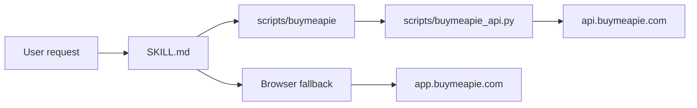

# Buy Me a Pie Skill Architecture

API first. DOM automation is fallback.

## Shape

## Bundle

- root is the skill root
- publish path is `.`
- ClawHub:
  - `clawhub publish . --slug buy-me-a-pie --name "Buy Me a Pie" --version 0.1.0 --tags latest,buymeapie,shopping-list`

## Parts

- `SKILL.md`
  - trigger text
  - OpenClaw metadata
  - `{baseDir}` commands
- `scripts/buymeapie`
  - stable entrypoint
  - requires `python3`
- `scripts/buymeapie_api.py`
  - Basic auth from env
  - list CRUD
  - item CRUD
  - sharing
  - unique-item reads
  - `423` retry
- browser fallback
  - signup
  - PIN reset
  - OAuth
  - print
  - visual verification
  - API drift

## Data

- list: `id`, `name`, `emails`
- item: `id`, `title`, `amount`, `is_purchased`
- unique item: `title`, `group_id`, `use_count`

## Rules

- resolve IDs before writes
- read current list before rename or share
- merge `emails` unless replace was requested
- one mutation per call
- re-read only for confirmation

## Errors

- `401`, `422`: fail fast
- `423`: retry
- `404`: stale ID or drift, re-read state
- `5xx`: stop and surface payload

## Security

- creds only in env or CLI args
- never log auth headers
- never write secrets to repo
