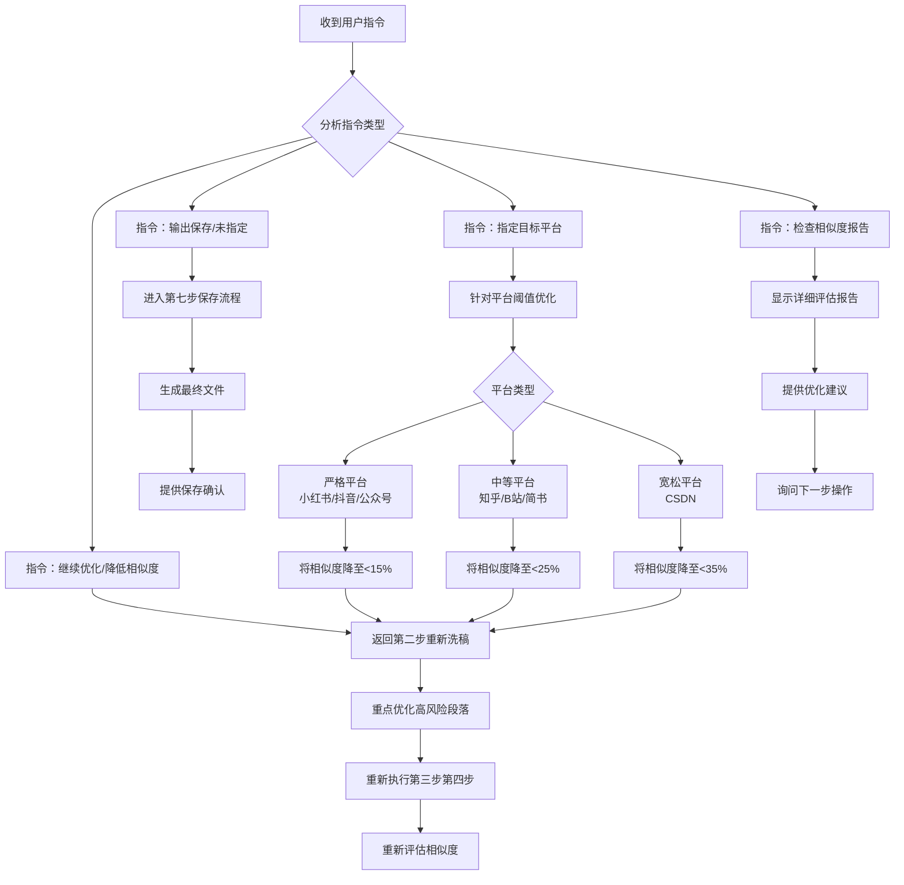

**具体处理规则：**

1. **"继续优化" / "降低相似度" 指令**
   - 返回第二步重新执行洗稿流程
   - 重点优化相似度评估中识别的高风险段落
   - 重新执行第三、四步（措辞替换、逻辑优化、去除AI味、内容润色）
   - 完成后重新评估相似度
   - 循环直到满足用户要求或达到最优效果

2. **"输出保存" / 未指定指令**
   - 直接进入第七步保存流程
   - 生成最终文件并保存
   - 提供文件保存确认和路径信息
   - 可选的相似度报告（如用户未明确要求可省略）

3. **指定目标平台指令**
   - 示例："优化到适合小红书发布"
   - 根据平台阈值设定优化目标
   - 严格平台（小红书/抖音/公众号）：目标相似度<15%
   - 中等平台（知乎/B站/简书）：目标相似度<25%
   - 宽松平台（CSDN）：目标相似度<35%
   - 返回第二步进行针对性优化

4. **"检查相似度报告" 指令**
   - 显示详细的相似度评估报告
   - 提供各平台风险评估
   - 给出具体的优化建议
   - 询问用户下一步操作意向