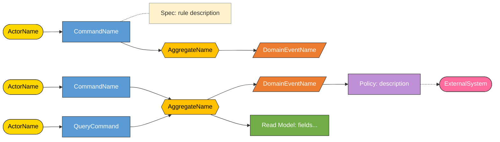
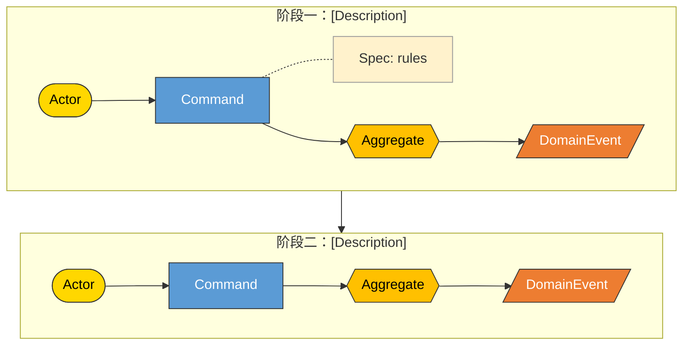
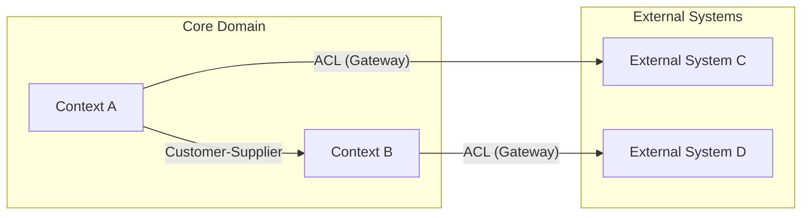
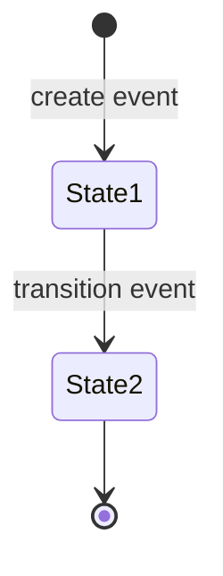
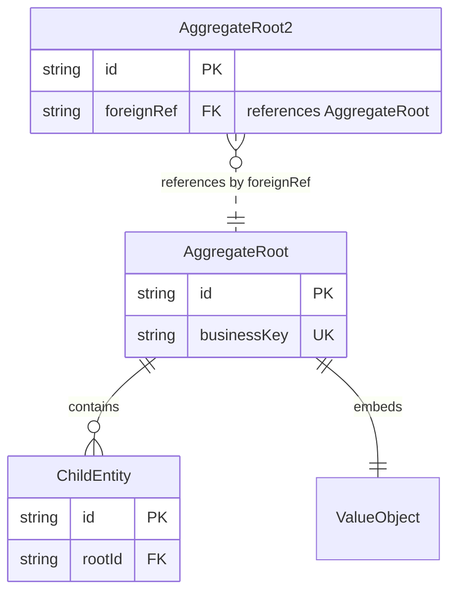
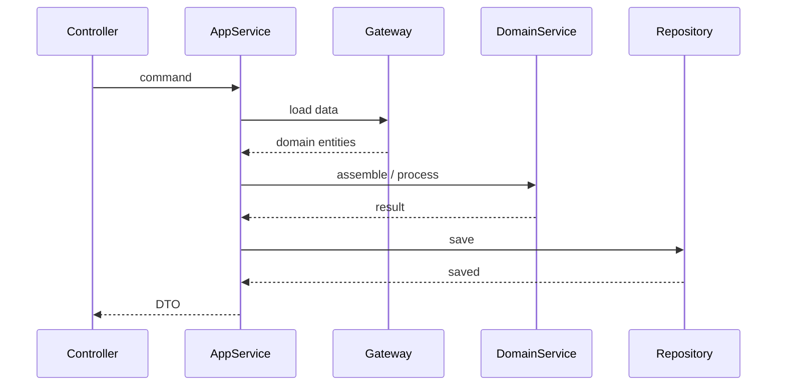
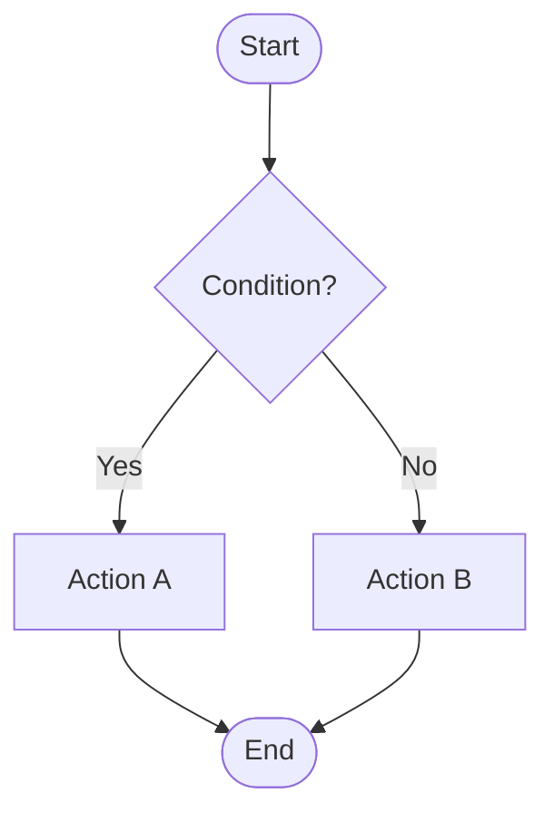
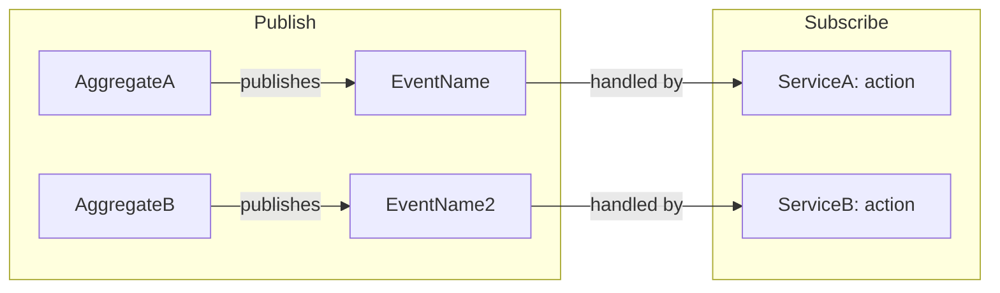

# [Feature Name] - DDD Domain Design

> Generated from: [PRD document name / source]
> Date: YYYY-MM-DD

---

## 0. Event Storming（事件风暴）

> 事件风暴是从业务流程出发，识别**谁**（Actor）要**做什么**（Command），需要满足**什么条件**（Command Specification），
> 由**哪个聚合**（Aggregate）处理，产生**什么结果**（Domain Event），以及事件发生后**触发什么后续动作**（Policy）。

### 0.1 Event Storming 全景图



---

### 0.2 Actor（参与者）

| Actor | 角色描述 | 触发的 Command (Application 层) |
| ----- | -------- | ------------------------------- |
|       |          |                                 |

---

### 0.3 Command（应用命令）

> **Command 定义在 Application 层，不在 Domain 层。** Command 是应用层编排的入口契约，一个 Application API 对应一个 Command。Command 由 Application Service 消费和拆解，Gateway/Repository 只接受 domain 类型（Entity、Value Object、基本类型），不接受 Command 作为入参。
>
> **为什么不放 Domain？** Domain Event 必须放 Domain（因为 Entity 内部要 `new Event(...)`），但 Command 没有任何 Domain 类型需要引用它——Entity 从不感知 Command 的存在。Command 表达的是"用户想做什么"（应用级意图），不是业务规则。

| Command      | 归属层      | Actor | 目标 Aggregate | 产生的 Event | Description |
| ------------ | ----------- | ----- | -------------- | ------------ | ----------- |
| `XxxCommand` | Application |       |                |              |             |

Note: 
a single primitive parameter doesn't warrant a separate command object.

---

### 0.4 Command Specification（命令规约）

每个 Command 执行前必须满足的前置条件和校验规则。

> **注意：Command 规约只校验 Command 自身携带的入参。** 编排过程中通过外部接口查询获得的数据（如三要素），其校验由对应的 Domain 类型（Value Object / Entity）自身不变量保证，不属于 Command 规约范畴。

#### CMD-01: [CommandName] 规约

| 规约项 | 规则 | 校验位置 | 失败处理 |
| ------ | ---- | -------- | -------- |
|        |      |          |          |

---

### 0.5 Domain Event（领域事件）

| Event | 产生时机 | 发布者 (Aggregate) | 事件数据                | 订阅者 / 后续 Policy |
| ----- | -------- | ------------------ | ----------------------- | -------------------- |
|       |          |                    | `{field1, field2, ...}` |                      |

---

### 0.6 Policy（策略/反应式规则）

Policy 描述"当某个事件发生时，自动触发另一个 Command"。

| Policy | 触发事件 | 触发的 Command | 条件 | Description |
| ------ | -------- | -------------- | ---- | ----------- |
|        |          |                |      |             |

---

### 0.7 Read Model（读模型）

Note: 可有可无，仅在存在查询类 Command 时填写。

| Read Model | 对应 Command | 数据字段 | 数据来源 |
| ---------- | ------------ | -------- | -------- |
|            |              |          |          |

---

### 0.8 External System（外部系统）

| External System | 交互方式             | 在哪个 Command 中使用 | 对应 Gateway |
| --------------- | -------------------- | --------------------- | ------------ |
|                 | RPC / HTTP / MQ / S3 |                       |              |

---

### 0.9 Event Storming 时间线（按业务流程排列）



---

### 0.10 Command → Aggregate → Event 映射总表

> Command 定义在 Application 层（`application.command` 包），Command Specification 只校验 Command 自身入参。编排中从外部接口获取的数据由 Domain 类型不变量保证。

| #   | Actor | Command (Application 层) | Command Specification (入参校验) | Aggregate | Domain Event | Policy |
| --- | ----- | ------------------------ | -------------------------------- | --------- | ------------ | ------ |
| 1   |       | `XxxCommand`             |                                  |           |              |        |

---

## 1. Ubiquitous Language Glossary

| Business Term (CN/EN)                     | Domain Name  | Type           | Package                  | Description   |
| ----------------------------------------- | ------------ | -------------- | ------------------------ | ------------- |
| **Aggregate Root**                        |              |                |                          |               |
| _example_                                 | `Report`     | Aggregate Root | `domain.model.entity`    | _description_ |
| **Entity — domain.model.entity**          |              |                |                          |               |
| _example_                                 | `XxxEntity`  | Entity         | `domain.model.entity`    | _description_ |
| **Entity — domain.model.gateway**         |              |                |                          |               |
| _example_                                 | `XxxEntity`  | Entity         | `domain.model.gateway`   | _description_ |
| **Value Object — domain.model.gateway**   |              |                |                          |               |
| _example_                                 | `XxxValue`   | Value Object   | `domain.model.gateway`   | _description_ |
| **Value Object — domain.model.vo.report** |              |                |                          |               |
| _example_                                 | `XxxValue`   | Value Object   | `domain.model.vo.report` | _description_ |
| **Enum**                                  |              |                |                          |               |
| _example_                                 | `XxxEnum`    | Enum           | `domain.model.enums`     | _values_      |
| **Command (Application 层)**              |              |                |                          |               |
| _example_                                 | `XxxCommand` | Command        | `application.command`    | _description_ |
| **Domain Event (Domain 层)**              |              |                |                          |               |
| _example_                                 | `XxxEvent`   | Event          | `domain.event`           | _description_ |

---

## 2. Domain Events

| Event Name | Trigger Condition | Publisher | Subscribers | Description |
| ---------- | ----------------- | --------- | ----------- | ----------- |
|            |                   |           |             |             |

---

## 3. Domain Rules & Constraints

| Rule ID | Description | Scope (Entity/Aggregate/Service) | Type (Invariant/Precondition/Policy) |
| ------- | ----------- | -------------------------------- | ------------------------------------ |
| R01     |             |                                  |                                      |
| R02     |             |                                  |                                      |

---

## 4. Bounded Contexts

### 4.1 Context Identification

| Bounded Context | Core/Supporting/Generic | Key Entities | Description |
| --------------- | ----------------------- | ------------ | ----------- |
|                 |                         |              |             |

### 4.2 Context Map



**Context 关系说明：**
- **Context A → External C**: Anti-Corruption Layer，通过 Gateway 接口隔离外部系统，在 infrastructure 层实现 Adapter
- **Context A → Context B**: Customer-Supplier / Partnership / ...

---

## 5. Entities

Note:
实体属性的唯一权威来源
包含内容: Identity、Attributes（Type/Required/Description）、Behaviors、State Machine

### 5.1 Entity Overview

| Entity | Package              | Identity Field | Key Attributes | Behaviors | Lifecycle States |
| ------ | -------------------- | -------------- | -------------- | --------- | ---------------- |
|        | `entity` / `gateway` |                |                |           |                  |

### 5.2 Inheritance Hierarchy（如有继承关系）

```
AbstractXxxEntity (abstract)
├── ConcreteAEntity     — description
├── ConcreteBEntity     — description
└── ConcreteCEntity     — description
```

**Abstract Methods (由每个子类实现不同的解析逻辑):**

| Method      | ConcreteA | ConcreteB | ConcreteC |
| ----------- | --------- | --------- | --------- |
| `methodA()` | fieldA    | fieldB    | **ZERO**  |
| `methodB()` | fieldC    | fieldC    | fieldD    |

### Entity Detail: [EntityName]

**Identity:** `fieldName` (or composite: `field1` + `field2`)

**Attributes:**

| Attribute | Type | Required | Description |
| --------- | ---- | -------- | ----------- |
|           |      |          |             |

**Behaviors:**

| Method | Parameters | Returns | Business Rule |
| ------ | ---------- | ------- | ------------- |
|        |            |         |               |

**State Machine:**

> **Scope**: State Machine 只关注**实体状态流转**（有限状态机），即 Entity 的生命周期状态变迁。
> 对应 DDD 层：**Entity**。不包含状态内部的具体操作逻辑，只展示状态之间的转换条件。



---

## 6. Value Objects

Note:
Value Object 属性的唯一权威来源(不变量、字段定义)

### 6.1 Gateway Value Objects (`domain.model.gateway`)

| Value Object | Attributes | Behaviors | Description |
| ------------ | ---------- | --------- | ----------- |
|              |            |           |             |

### 6.2 Report Output Value Objects (`domain.model.vo.report`)

按 section 分组展示：

#### 顶层结构

| Value Object | Key Attributes | Description |
| ------------ | -------------- | ----------- |
|              |                |             |

#### [Section Name] (e.g., Summary, Individual, Facility Detail, etc.)

| Value Object | Key Attributes | Description |
| ------------ | -------------- | ----------- |
|              |                |             |

---

## 7. Aggregates

### Aggregate: [AggregateRootName]

| Property       | Value                    |
| -------------- | ------------------------ |
| Aggregate Root | `[EntityName]`           |
| Child Entities | `[Entity1]`, `[Entity2]` |
| Value Objects  | `[VO1]`, `[VO2]`         |
| Repository     | `[RepositoryName]`       |

**Invariants:**

| Rule ID | Description |
| ------- | ----------- |
| R01     |             |

**Access Rules:**
- External access only through `[AggregateRootName]`
- Child entities modified only via root methods or domain service assembly
- Cross-aggregate reference by ID only

---

## 8. Entity Relationships

| From | To  | Relationship                                              | Multiplicity    | Cross-Aggregate |
| ---- | --- | --------------------------------------------------------- | --------------- | --------------- |
|      |     | Composition / Association / Reference by ID / Inheritance | 1:1 / 1:N / N:M | Yes / No        |

---

## 9. ER Diagram

> **职责分工**：ER 图只展示**实体间关系**和**标识字段（PK / FK）**。
> 完整的实体属性信息请参见 **Section 5 Entity Detail** 和 **Section 6 Value Objects**。



---

## 10. Database Schema Design（数据库表设计）

> 本节定义物理数据库表结构，供 AI Agent 生成 DDL、MyBatis Mapper 或 JPA Entity 时直接参照。
> 表设计以 Section 5 (Entities)、Section 6 (Value Objects)、Section 9 (ER Diagram) 为输入，
> 将领域模型映射为关系表。

### 10.1 Entity → Table Mapping（领域模型 → 表映射）

> 一个 Entity 通常对应一张表；Value Object 嵌入所属 Entity 的表（列展开）或独立表。

| Domain Type (Section 5/6) | Type             | Table Name       | Mapping Strategy            |
| ------------------------- | ---------------- | ---------------- | --------------------------- |
| `XxxEntity`               | Aggregate Root   | `t_xxx`          | One-to-one                  |
| `YyyEntity`               | Child Entity     | `t_yyy`          | One-to-one, FK → `t_xxx`   |
| `ZzzValue`                | Value Object     | —（嵌入 `t_xxx`） | Embedded (列展开)           |
| `WwwValue`                | Value Object     | `t_www`          | Separate table (多值 / 复杂结构) |

### 10.2 Table Overview（表总览）

| #   | Table Name   | Description          | Primary Key    | Related Aggregate |
| --- | ------------ | -------------------- | -------------- | ----------------- |
| 1   | `t_xxx`      |                      | `id` (BIGINT)  | XxxAggregate      |
| 2   | `t_yyy`      |                      | `id` (BIGINT)  | XxxAggregate      |

### 10.3 Table Detail（表详情）

> 每张表列出全部字段。`Column` 为数据库列名（snake_case），`Domain Field` 为对应的领域模型字段名（camelCase）。

#### Table: `t_xxx`

| #   | Column           | Type           | Nullable | Default      | Domain Field    | Description |
| --- | ---------------- | -------------- | -------- | ------------ | --------------- | ----------- |
| 1   | `id`             | BIGINT         | NO       | AUTO_INCR    | —               | 主键         |
| 2   | `xxx_no`         | VARCHAR(64)    | NO       |              | `xxxNo`         | 业务编号     |
| 3   | `status`         | VARCHAR(32)    | NO       |              | `status`        | 状态         |
| 4   | `created_at`     | DATETIME       | NO       | CURRENT_TIME |                 | 创建时间     |
| 5   | `updated_at`     | DATETIME       | NO       | CURRENT_TIME |                 | 更新时间     |

**Indexes:**

| Index Name             | Columns              | Type   | Description |
| ---------------------- | -------------------- | ------ | ----------- |
| `uk_xxx_no`            | `xxx_no`             | UNIQUE |             |
| `idx_status`           | `status`             | NORMAL |             |

**Constraints:**

| Constraint              | Type        | Definition                        |
| ----------------------- | ----------- | --------------------------------- |
| `pk_xxx`                | PRIMARY KEY | `id`                              |
| `uk_xxx_no`             | UNIQUE      | `xxx_no`                          |

#### Table: `t_yyy`

| #   | Column           | Type           | Nullable | Default      | Domain Field    | Description |
| --- | ---------------- | -------------- | -------- | ------------ | --------------- | ----------- |
| 1   | `id`             | BIGINT         | NO       | AUTO_INCR    | —               | 主键         |
| 2   | `xxx_id`         | BIGINT         | NO       |              | —               | 外键 → t_xxx |
| 3   | `field1`         | VARCHAR(128)   | YES      |              | `field1`        |             |

**Indexes:**

| Index Name             | Columns              | Type   | Description |
| ---------------------- | -------------------- | ------ | ----------- |
| `idx_xxx_id`           | `xxx_id`             | NORMAL | 外键索引    |

**Foreign Keys:**

| FK Name                | Column     | References          |
| ---------------------- | ---------- | ------------------- |
| `fk_yyy_xxx`           | `xxx_id`   | `t_xxx(id)`         |

### 10.4 Common Column Conventions（通用列规范）

> 以下列在所有业务表中必须包含（审计字段）。在 10.3 Table Detail 中可省略不重复列出。

| Column           | Type           | Nullable | Default      | Description          |
| ---------------- | -------------- | -------- | ------------ | -------------------- |
| `id`             | BIGINT         | NO       | AUTO_INCR    | 自增主键              |
| `created_by`     | VARCHAR(64)    | YES      |              | 创建人                |
| `created_at`     | DATETIME       | NO       | CURRENT_TIME | 创建时间              |
| `updated_by`     | VARCHAR(64)    | YES      |              | 最后修改人            |
| `updated_at`     | DATETIME       | NO       | CURRENT_TIME | 最后修改时间          |
| `is_deleted`     | TINYINT(1)     | NO       | 0            | 逻辑删除 (0=否, 1=是) |

### 10.5 Design Decisions（数据库设计决策）

> 记录关键的建表设计决策，如分表策略、JSON 列 vs 独立表、软删除 vs 硬删除等。

| #   | Decision               | Choice          | Rationale                              | Alternatives Rejected     |
| --- | ---------------------- | --------------- | -------------------------------------- | ------------------------- |
| 1   | Value Object 存储策略  | 列展开 / 独立表  |                                        |                           |
| 2   | 软删除                 | `is_deleted`    | 业务需要审计追溯                        | 硬删除                    |

---

## 11. Domain Logic Placement

> 本表**只列领域逻辑**——即 Entity 不变量、Value Object 行为、Domain Service 逻辑。
> Gateway 接口、Repository 接口、Application Service 编排不是领域逻辑，已在下方独立章节描述。

### 11.1 Entity / Value Object 逻辑

| #   | Logic Description | Placement           | Class                | Method Signature        | Rule Ref |
| --- | ----------------- | ------------------- | -------------------- | ----------------------- | -------- |
| 1   |                   | VO invariant        | `XxxValue`           | `isValid()`             | R01      |
| 2   |                   | Entity invariant    | `XxxEntity`          | `validateXxx()`         | R02      |
| 3   |                   | Entity method       | `XxxEntity` subclass | `resolveXxx()`          | -        |
| 4   |                   | Entity precondition | `XxxEntity`          | `validateProductType()` | R03      |

### Gateway Interfaces (domain layer)

| Gateway Interface | Methods | Purpose | Adapter (infra) |
| ----------------- | ------- | ------- | --------------- |
|                   |         |         |                 |

### Repository Interfaces (domain layer)

| Repository Interface | Methods | Aggregate Root |
| -------------------- | ------- | -------------- |
|                      |         |                |

### 11.2 Domain Services（领域服务）

> Domain Service 承载跨实体/跨值对象的领域逻辑，位于 `domain.service` 包下。
> 对于内部复杂逻辑（如多态转换、聚合算法），使用**设计决策表**和**输入输出契约**来表达，
> 而非时序图（详见 [DDD 时序图设计指南](ddd-sequence-diagram-guideline.md)）。

| Domain Service     | Visibility | Input | Output | Responsibility | Design Pattern              |
| ------------------ | ---------- | ----- | ------ | -------------- | --------------------------- |
| `XxxDomainService` | public     |       |        |                | Facade / Builder / Strategy |

**协作关系：**

```
XxxDomainService (Facade, public)
├── SubServiceA.build()    → OutputA
├── SubServiceB.build()    → OutputB
└── SubServiceC.build()    → OutputC
```

#### 11.2.1 [ComplexServiceName] — 复杂逻辑展开说明

> **文档原则**：设计文档回答"为什么这样设计"和"输入输出契约是什么"，不重复代码已经表达清楚的实现细节
> （如逐字段映射、逐行算法）。代码方法名即文档。

**设计决策：**

| 决策 | 选择 | 原因 | 替代方案及否决理由 |
| ---- | ---- | ---- | ------------------ |
|      |      |      |                    |

**输入输出契约：**

| 方法      | 输入 | 输出 | 契约 |
| --------- | ---- | ---- | ---- |
| `build()` |      |      |      |

**多态行为差异**（如有继承体系，引用 Section 5.2 对照表）：

> 引用 Section 5.2 的多态方法对照表，避免重复。

---

## 12. Cross-Layer Interface Contracts（跨层接口契约）

> 本节描述 Domain 层以外各层的**接口契约**（API 签名、入参、出参），
> 供 AI Agent 或开发者实现时直接参照。只列契约，不含实现细节。

### 12.1 Adapter Layer — REST API Endpoints

> 对应 `adapter` 模块中的 Controller 类。每行 = 一个 REST 端点。

| #   | HTTP Method | URL                | Controller       | Method       | Request Body        | Response Body          | Description |
| --- | ----------- | ------------------ | ---------------- | ------------ | ------------------- | ---------------------- | ----------- |
| 1   | POST        | `/api/v1/xxx`      | `XxxController`  | `create()`   | `XxxCreateRequest`  | `Result<XxxResponse>`  |             |
| 2   | GET         | `/api/v1/xxx/{id}` | `XxxController`  | `getById()`  | Path: `id`          | `Result<XxxResponse>`  |             |

### 12.2 Client Layer — API / Request / Response / DTO

> 对应 `client` 模块。API 接口定义服务契约（由 Adapter 层 Controller 实现），DTO 仅列关键字段，完整字段在实现时补全。

#### API Interfaces（服务契约接口）

> `client.api` 包中的接口，定义对外暴露的服务方法签名。Controller 实现该接口并映射到 HTTP 端点。

| Interface       | Method         | Input                          | Output                 | Description |
| --------------- | -------------- | ------------------------------ | ---------------------- | ----------- |
| `XxxServiceI`   | `create()`     | `XxxCreateRequest`             | `Result<XxxResponse>`  |             |
| `XxxServiceI`   | `getById()`    | `id: String`                   | `Result<XxxResponse>`  |             |

#### Requests

| Class               | Key Fields                               | Validation       | Used By (Controller Method) |
| ------------------- | ---------------------------------------- | ---------------- | --------------------------- |
| `XxxCreateRequest`  | `field1: String`, `field2: Integer`      | field1 NotBlank  | `XxxController.create()`    |

#### Responses

| Class          | Key Fields                                        | Assembled From            | Description |
| -------------- | ------------------------------------------------- | ------------------------- | ----------- |
| `XxxResponse`  | `id: String`, `status: String`, `detail: XxxDTO`  | `XxxEntity` + `YyyValue`  |             |

#### Shared DTOs（跨接口复用的 DTO）

| Class      | Key Fields          | Used By                        |
| ---------- | ------------------- | ------------------------------ |
| `XxxDTO`   | `field1`, `field2`  | `XxxResponse`, `YyyResponse`   |

### 12.3 Application Layer — Application Service API

> 对应 `application.service` 包中的 AppService 类。
> 一个 public 方法 = 一个用例入口。入参为单个基本类型时不需要 Command 对象。

| AppService        | Method         | Input (Command / param) | Output (DTO / void) | Orchestration Summary                                          | Use Case |
| ----------------- | -------------- | ----------------------- | -------------------- | -------------------------------------------------------------- | -------- |
| `XxxAppService`   | `createXxx()`  | `XxxCommand`            | `XxxResponse`        | validate → gateway.load → domainService.process → repo.save    | UC-01    |
| `XxxAppService`   | `queryXxx()`   | `id: String`            | `XxxResponse`        | repo.find → assembler.toDTO                                    | UC-02    |

Note:
- `Orchestration Summary` 用简短步骤描述编排流程，与 Section 13 (Sequence Diagrams) 呼应
- Assembler 负责 Domain ↔ DTO 转换，位于 `application.assembler` 包

### 12.4 Infrastructure Layer — Adapter & Converter Mapping

> 对应 `infrastructure.gateway` 包。每个 Gateway 接口对应一个 Adapter 实现和一个 Converter。

| Gateway Interface (Domain)  | Adapter (Infrastructure)  | Converter        | External Client / Data Source  | Description |
| --------------------------- | ------------------------- | ---------------- | ------------------------------ | ----------- |
| `XxxLoadGateway`            | `XxxLoadAdapter`          | `XxxConverter`   | `XxxProviderClient` (Feign)    |             |
| `YyyRepository`             | `YyyRepositoryImpl`       | —                | MyBatis / JPA                  |             |

---

## 13. Sequence Diagrams

> **Scope**: Sequence Diagram 只关注 **Application Service 编排层**：谁调用谁、调用顺序、有哪些参与者协作。
> 对应 DDD 层：**Application Layer**。
>
> **不包含**：Entity 内部算法、字段计算逻辑、Domain Service 内部的数据转换（这些在 Section 11 中通过
> 设计决策表和输入输出契约表达）。
>
> **粒度原则**：每个时序图中的参与者（participant）应当是不同层或不同职责的类：
> Controller、AppService、DomainService、Repository、Gateway。
> Entity 内部方法调用不出现在时序图中。

### Use Case: [UseCaseName]

**Description:** [Brief description]



---

## 14. Flowcharts

> **Scope**: Flowchart 只关注**复杂分支/决策逻辑**（if/else/switch），即 Entity 或 Domain Service 内部
> 需要分支判断的业务规则。对应 DDD 层：**Entity / Domain Service**。
>
> **不包含**：简单的 CRUD 流程、线性调用链（这些在时序图中表达）。
>
> **适用场景**：当一个方法内部有 2 个以上的分支路径，且分支条件涉及业务规则时，用 Flowchart 来表达，
> 比在时序图中用 `alt/else` 更清晰。

### Business Rule: [RuleName]



---

## 15. Domain Event Flow



---

## 16. Package Structure (Suggested)

```
com.xxx.domain                           # 纯业务逻辑，无框架依赖
├── model
│   ├── entity/                          # Aggregate Root, 核心实体 (XxxEntity.java)
│   ├── vo/report/                       # 报告输出值对象 (XxxValue.java)
│   ├── gateway/                         # 网关相关实体和值对象 (XxxEntity.java, XxxValue.java)
│   └── enums/                           # 领域枚举 (XxxEnum.java)
├── event/                               # Domain Event 类定义（Entity 要引用，必须在 Domain）
│   ├── DomainEventPublisher.java        # 发布接口（Domain 定义，Infrastructure 实现）
│   ├── XxxCreatedEvent.java
│   └── XxxCompletedEvent.java
├── service/                             # Domain Services (XxxDomainService.java, XxxBuilder.java)
├── repository/                          # Repository 接口 (XxxRepository.java)
└── gateway/                             # Gateway 接口 (XxxLoadGateway.java)

com.xxx.application                      # 编排层：消费 Command，发布/订阅 Event
├── command/                             # Command 类定义（AppService 的入口契约，非 Domain 类型）
│   ├── XxxCommand.java
│   └── YyyCommand.java
├── service/                             # Application Services (XxxAppService.java)
├── event/                               # Event Listener（订阅/处理 Domain Event）
│   └── XxxEventListener.java
└── assembler/                           # DTO assemblers

com.xxx.infrastructure                   # 技术实现层
├── event/                               # Event 技术传输（Spring / Kafka）
│   └── SpringDomainEventPublisher.java
├── repository/                          # Repository 实现 (XxxRepositoryImpl.java)
├── gateway/
│   ├── adapter/                         # Gateway 适配器 (XxxLoadAdapter.java)
│   └── converter/                       # DTO-to-domain converters (XxxConverter.java)
└── config/

com.xxx.client
├── dto/                                 # DTOs, Request, Response
└── controller/                          # REST controllers
```

---

## 17. Quality Checklist

- [ ] All business nouns mapped to entities or value objects
- [ ] All business rules captured with rule IDs
- [ ] Every entity has identity + behaviors (no anemic model)
- [ ] Aggregates are small with clear invariants
- [ ] No cross-aggregate direct object references (use ID)
- [ ] Domain logic placement has clear rationale for every item
- [ ] ER diagram only shows PK/FK, consistent with entity/VO/aggregate tables
- [ ] Sequence diagrams cover all core use cases
- [ ] Flowcharts cover complex branching rules (2+ paths)
- [ ] State machines documented for stateful entities
- [ ] Ubiquitous language glossary is complete with Package column
- [ ] Naming follows project DDD conventions (`*Entity`, `*Value`, `*DomainService`, `*Repository`, `*Gateway`)
- [ ] Layer dependencies respected (domain has no external imports)
- [ ] Gateway per concern, adapter per gateway (ISP)
- [ ] Event Storming covers all Actors, Commands, Specs, Events, Policies
- [ ] Command → Aggregate → Event mapping summary is complete
- [ ] Domain Service design decisions documented with alternatives and rationale
- [ ] Entity → Table mapping covers all entities and value objects
- [ ] Table Detail includes all columns with type, nullable, default, domain field mapping
- [ ] Indexes defined for foreign keys, frequent query columns, and unique constraints
- [ ] Common audit columns (created_at, updated_at, is_deleted) applied consistently
- [ ] Database design decisions (JSON vs table, soft delete, etc.) documented with rationale
- [ ] REST API endpoints listed with URL, HTTP method, request/response types
- [ ] Client DTOs (Request/Response) key fields defined
- [ ] Application Service methods listed with Command input and DTO output
- [ ] Infrastructure adapter-to-gateway mapping is complete
